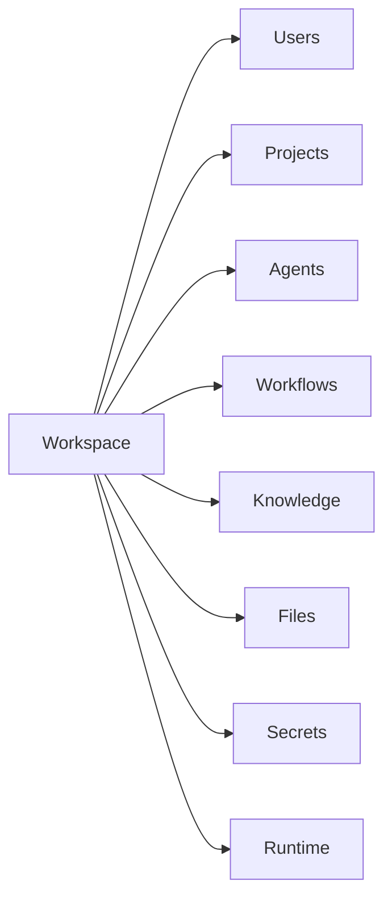
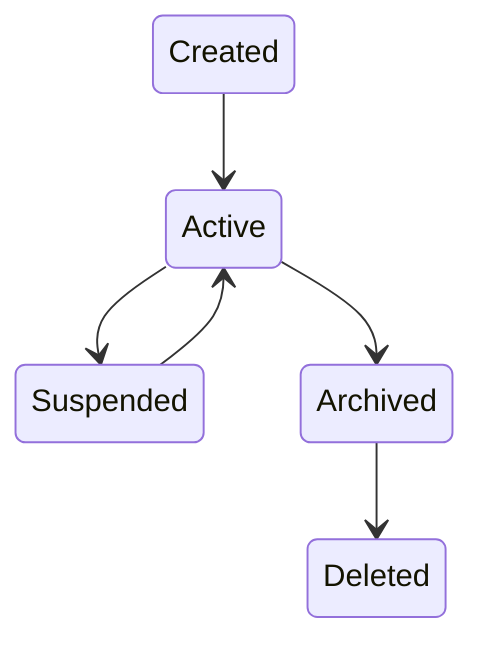
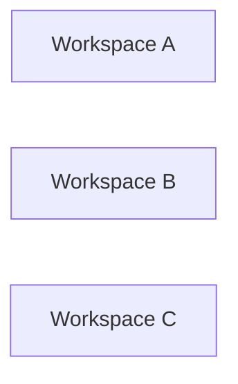
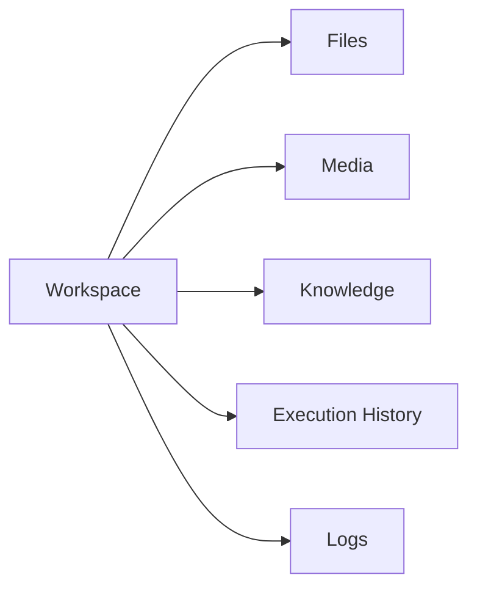

# Workspace Management

> AI Social OS Platform Layer

Version: 2.0.0

Status: Stable

Last Updated: 2026-07-25

---

# Table of Contents

- Overview
- Why Workspace
- Workspace Model
- Workspace Hierarchy
- Workspace Lifecycle
- Workspace Components
- Workspace Isolation
- Workspace Resources
- Membership Model
- Workspace Settings
- Workspace Storage
- Workspace Events
- Design Principles
- Summary

---

# Overview

Workspace là đơn vị làm việc (working boundary) cơ bản của AI Social OS.

Mọi tài nguyên trong hệ thống đều thuộc về một Workspace.

Ví dụ.

- Agents
- Workflows
- Knowledge Bases
- Files
- Secrets
- APIs
- Runtime Executions
- Plugins
- MCP Servers

Workspace đóng vai trò là ranh giới quản trị, bảo mật và dữ liệu.

---

# Why Workspace

Nếu toàn bộ dữ liệu được lưu chung.

```mermaid
flowchart LR
```

sẽ dẫn đến.

- Khó phân quyền
- Dữ liệu lẫn nhau
- Không thể cô lập
- Không hỗ trợ nhiều nhóm
- Không phù hợp Multi-Tenant

Workspace giải quyết vấn đề bằng cách tạo ra một không gian làm việc độc lập.

---

# Workspace Model



Workspace là Owner của toàn bộ tài nguyên bên dưới.

---

# Workspace Hierarchy

```text
Organization

├── Workspace Marketing

├── Workspace Sales

├── Workspace AI Research

└── Workspace Operations
```

Một Organization có thể chứa nhiều Workspace.

Một Workspace chỉ thuộc về một Organization.

---

# Workspace Identity

Mỗi Workspace có các thuộc tính.

```text
Workspace

├── Workspace ID
├── Name
├── Slug
├── Description
├── Organization ID
├── Status
├── Created At
├── Updated At
└── Metadata
```

Workspace ID là định danh duy nhất trong toàn hệ thống.

---

# Workspace Lifecycle



Không xóa trực tiếp Workspace đang hoạt động.

---

# Workspace Components

Workspace quản lý.

```text
Workspace

├── Members
├── Roles
├── Permissions
├── Projects
├── Agents
├── Workflows
├── Runtime
├── Files
├── Media
├── Secrets
├── Configuration
├── APIs
├── Logs
└── Billing Usage
```

---

# Workspace Isolation

Mỗi Workspace được cô lập hoàn toàn.



Các Workspace không thể truy cập dữ liệu của nhau nếu không có cơ chế chia sẻ rõ ràng.

---

# Resource Ownership

Mọi tài nguyên đều thuộc về một Workspace.

```text
Workspace

├── Agent
├── Workflow
├── Knowledge Base
├── Prompt
├── Secret
├── Plugin
├── MCP Server
├── Execution
└── File
```

Không tồn tại tài nguyên "không thuộc Workspace".

---

# Membership Model

Người dùng tham gia Workspace thông qua Membership.

```text
Workspace

├── Owner
├── Admin
├── Developer
├── Operator
├── Viewer
└── Guest
```

Một User có thể là thành viên của nhiều Workspace.

---

# Workspace Settings

Workspace có cấu hình riêng.

Ví dụ.

- Time Zone
- Locale
- Default Language
- AI Providers
- Storage Policy
- Retention Policy
- Notification Policy
- Runtime Configuration

Các cấu hình này chỉ áp dụng trong Workspace tương ứng.

---

# Workspace Storage



Dữ liệu được phân vùng theo Workspace để đảm bảo tính cô lập và khả năng mở rộng.

---

# Workspace Quotas

Workspace có thể được giới hạn tài nguyên.

Ví dụ.

- Number of Users
- Storage Capacity
- Monthly Executions
- API Requests
- AI Tokens
- Plugins
- MCP Servers

Quota được xác định theo Subscription hoặc License.

---

# Workspace Events

Ví dụ.

- WorkspaceCreated
- WorkspaceUpdated
- WorkspaceArchived
- WorkspaceDeleted
- MemberAdded
- MemberRemoved
- RoleChanged
- SettingsUpdated

Các Event được phát lên Event Bus để các Service khác xử lý.

---

# Workspace API

Các thao tác chính.

```text
POST   /workspaces

GET    /workspaces

GET    /workspaces/{id}

PATCH  /workspaces/{id}

DELETE /workspaces/{id}

POST   /workspaces/{id}/members

DELETE /workspaces/{id}/members/{userId}
```

Workspace API là điểm truy cập duy nhất để quản lý Workspace.

---

# Design Principles

Workspace được thiết kế theo các nguyên tắc.

- Workspace First
- Strong Isolation
- Ownership Based
- Multi Tenant
- Configurable
- Auditable
- Event Driven
- API First

---

# Design Decisions

| Decision | Reason |
|-----------|--------|
| Workspace là ranh giới dữ liệu | Đảm bảo cô lập |
| Một Workspace thuộc một Organization | Đơn giản hóa quản trị |
| User có thể tham gia nhiều Workspace | Linh hoạt cộng tác |
| Mọi Resource đều có Workspace Owner | Dễ phân quyền |
| Workspace có Configuration riêng | Tùy biến theo nhóm |
| Workspace Events | Đồng bộ giữa các Service |
| Quota theo Workspace | Hỗ trợ Billing và Subscription |

---

# Summary

Workspace là đơn vị quản lý và cô lập tài nguyên cốt lõi của AI Social OS. Toàn bộ Agent, Workflow, Knowledge, File, Secret và Execution đều thuộc về một Workspace xác định.

Thông qua mô hình Ownership, Membership, Quota và Isolation, Workspace cung cấp nền tảng cho Multi-Tenant Architecture, giúp nhiều nhóm và tổ chức cùng sử dụng hệ thống một cách an toàn, độc lập và có khả năng mở rộng.