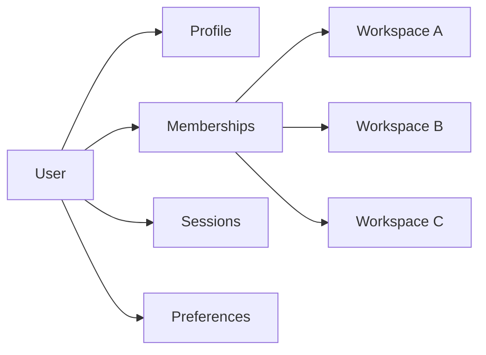
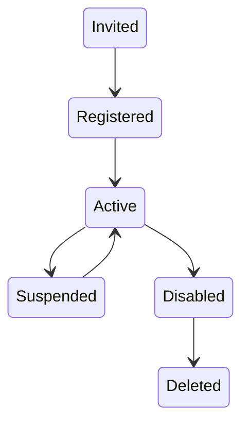
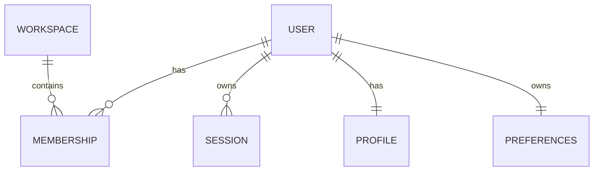

# User Management

> AI Social OS Platform Layer

Version: 2.0.0

Status: Stable

Last Updated: 2026-07-25

---

# Table of Contents

- Overview
- Objectives
- User Model
- User Lifecycle
- Identity
- User Profile
- Membership
- User Preferences
- Account Status
- User Sessions
- User Resources
- User Events
- User API
- Design Principles
- Design Decisions
- Summary

---

# Overview

User Management chịu trách nhiệm quản lý toàn bộ danh tính người dùng trong AI Social OS.

Mỗi User đại diện cho một cá nhân hoặc một Service Account có thể đăng nhập, sử dụng Platform và truy cập các Workspace theo quyền được cấp.

User không trực tiếp sở hữu toàn bộ tài nguyên.

Các tài nguyên thuộc về Workspace, còn User được cấp quyền để sử dụng các tài nguyên đó.

---

# Objectives

User Management hướng tới.

- Centralized Identity
- Secure Authentication
- Multi Workspace
- Flexible Membership
- Consistent User Profile
- Auditable
- Extensible

---

# User Model



---

# User Entity

Mỗi User bao gồm.

```text
User

├── User ID
├── Email
├── Username
├── Full Name
├── Avatar
├── Status
├── Authentication Method
├── Created At
├── Updated At
└── Metadata
```

User ID là định danh duy nhất trong toàn bộ Platform.

---

# User Lifecycle



Mọi thay đổi trạng thái đều được ghi Audit Log.

---

# Identity

Identity đại diện cho danh tính của người dùng.

Một Identity có thể liên kết với nhiều phương thức đăng nhập.

Ví dụ.

- Email & Password
- Google
- Microsoft
- GitHub
- SAML
- OIDC

Identity luôn duy nhất.

---

# User Profile

Thông tin hồ sơ.

```text
Profile

├── Full Name
├── Display Name
├── Avatar
├── Job Title
├── Department
├── Language
├── Time Zone
├── Country
└── Metadata
```

Profile không chứa dữ liệu xác thực.

---

# Membership

User tham gia Workspace thông qua Membership.


Membership xác định.

- Role
- Permissions
- Join Date
- Status

Một User có thể thuộc nhiều Workspace.

---

# User Preferences

Mỗi User có cấu hình riêng.

Ví dụ.

- Theme
- Language
- Time Zone
- Notification Settings
- Default Workspace
- Accessibility
- AI Preferences

Preferences không ảnh hưởng đến User khác.

---

# Account Status

Các trạng thái.

```text
Invited

Registered

Active

Suspended

Disabled

Deleted
```

Ý nghĩa.

| Status | Description |
|----------|-------------|
| Invited | Đã được mời |
| Registered | Đã đăng ký |
| Active | Hoạt động |
| Suspended | Tạm khóa |
| Disabled | Vô hiệu hóa |
| Deleted | Đã xóa |

---

# User Sessions

Một User có thể có nhiều Session.

```text
User

├── Web Session

├── Mobile Session

├── CLI Session

└── SDK Session
```

Mỗi Session có.

- Session ID
- Device
- IP
- Created At
- Expired At
- Last Activity

---

# User Resources

User có thể tạo hoặc sử dụng.

```text
Workspace Membership

Projects

Agents

Prompts

Knowledge

Executions

Files

API Keys
```

Ownership của các tài nguyên vẫn thuộc Workspace.

---

# User Events

Ví dụ.

- UserInvited
- UserRegistered
- UserActivated
- UserSuspended
- UserDeleted
- UserLoggedIn
- UserLoggedOut
- UserProfileUpdated
- UserPasswordChanged

Các Event được phát lên Platform Event Bus.

---

# User API

Các Endpoint chính.

```text
POST   /users

GET    /users

GET    /users/{id}

PATCH  /users/{id}

DELETE /users/{id}

GET    /users/{id}/sessions

GET    /users/{id}/workspaces

PATCH  /users/{id}/profile
```

---

# User Relationships



---

# Security Considerations

Không lưu.

- Plain Password
- Secret Key
- OAuth Token dưới dạng văn bản

Luôn.

- Hash Password
- Rotate Session
- Audit Login
- Verify Email
- MFA Ready

---

# Design Principles

User Management được xây dựng theo các nguyên tắc.

- Identity First
- Workspace Based
- Least Privilege
- Auditable
- Extensible
- API First
- Event Driven

---

# Design Decisions

| Decision | Reason |
|-----------|--------|
| User tách khỏi Workspace | Hỗ trợ Multi-Workspace |
| Membership làm trung gian | Linh hoạt phân quyền |
| Profile tách khỏi Authentication | Dễ mở rộng |
| Preferences riêng | Cá nhân hóa |
| Multiple Sessions | Hỗ trợ nhiều thiết bị |
| Event Driven | Đồng bộ Platform |
| Centralized Identity | Quản lý thống nhất |

---

# Summary

User Management quản lý danh tính, hồ sơ, Membership, Session và Preferences của toàn bộ người dùng trong AI Social OS.

Thông qua mô hình Identity tập trung, Membership theo Workspace và Session độc lập, Platform hỗ trợ người dùng làm việc trên nhiều Workspace, nhiều thiết bị và nhiều phương thức xác thực, đồng thời vẫn đảm bảo bảo mật, khả năng mở rộng và quản trị thống nhất.