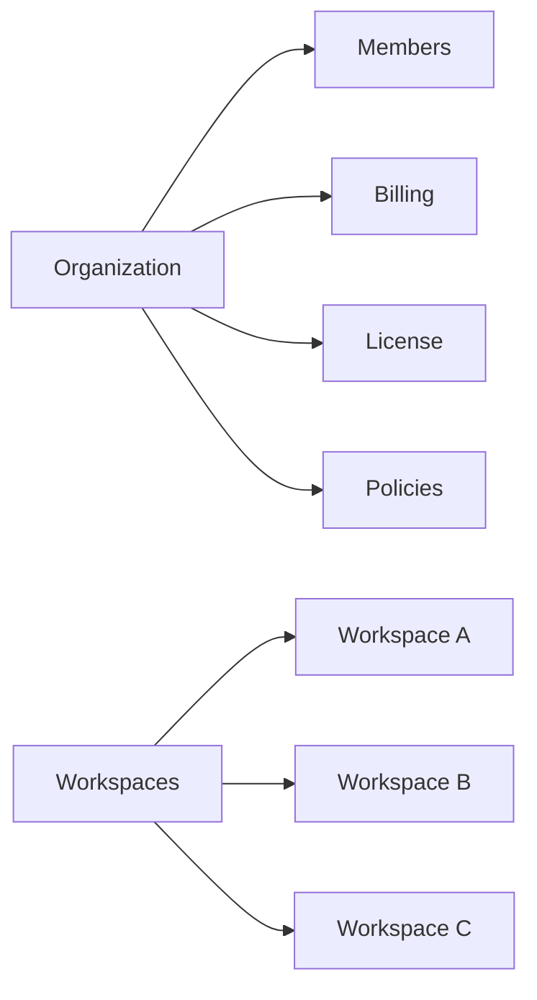
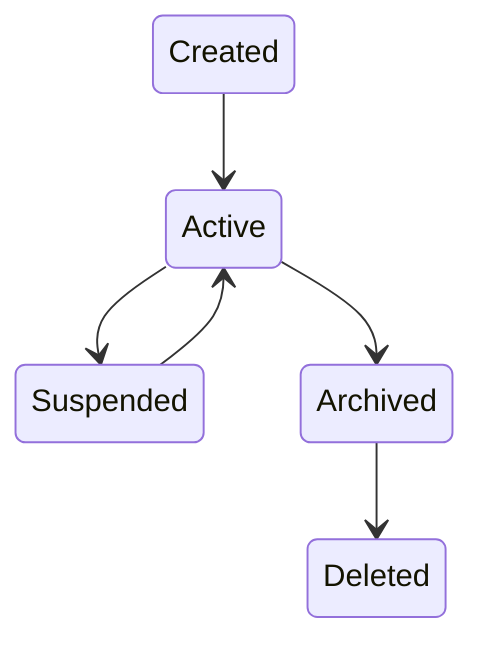
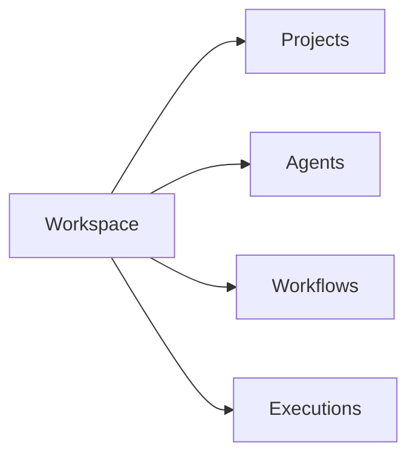
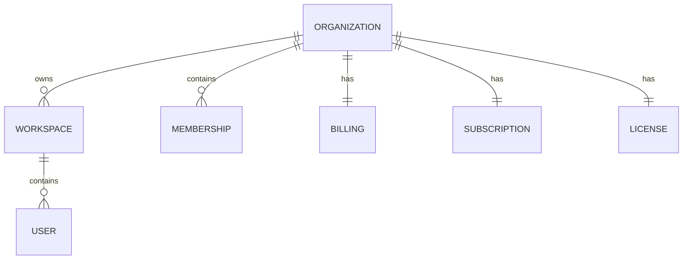

# Organization

> AI Social OS Platform Layer

Version: 2.0.0

Status: Stable

Last Updated: 2026-07-25

---

# Table of Contents

- Overview
- Objectives
- Organization Model
- Organization Hierarchy
- Organization Lifecycle
- Organization Components
- Organization Ownership
- Organization Policies
- Organization Resources
- Organization Administration
- Organization Events
- Organization API
- Design Principles
- Design Decisions
- Summary

---

# Overview

Organization là thực thể quản trị cấp cao nhất trong AI Social OS.

Một Organization đại diện cho một doanh nghiệp, công ty, trường học hoặc nhóm sử dụng nền tảng.

Organization chịu trách nhiệm quản lý.

- Users
- Workspaces
- Billing
- Subscription
- License
- Security Policies
- Organization Settings

Organization không trực tiếp thực thi Workflow.

Mọi hoạt động được thực hiện bên trong các Workspace.

---

# Objectives

Organization hướng tới.

- Multi Tenant
- Centralized Administration
- Shared Billing
- Shared Identity
- Workspace Management
- Policy Enforcement
- Security Governance

---

# Organization Model



Organization là Owner của toàn bộ Workspace bên trong.

---

# Organization Hierarchy

```text
Organization

├── Members
│
├── Workspace Marketing
│
├── Workspace Sales
│
├── Workspace AI Lab
│
├── Workspace Operations
│
├── Billing
│
├── Subscription
│
└── License
```

---

# Organization Entity

Mỗi Organization bao gồm.

```text
Organization

├── Organization ID
├── Name
├── Slug
├── Description
├── Owner
├── Status
├── Created At
├── Updated At
└── Metadata
```

Organization ID là định danh duy nhất trong toàn hệ thống.

---

# Organization Lifecycle



Organization chỉ được xóa khi toàn bộ Workspace đã được xử lý theo chính sách lưu trữ.

---

# Organization Components

Organization quản lý.

```text
Organization

├── Members
├── Roles
├── Workspaces
├── Billing
├── Subscription
├── License
├── Policies
├── Audit Logs
├── Usage
├── API Keys
└── Settings
```

---

# Organization Ownership

Quan hệ sở hữu.



Organization không sở hữu trực tiếp Agent hoặc Workflow.

Các tài nguyên này thuộc Workspace.

---

# Membership Model

Một User có thể tham gia Organization với các vai trò.

```text
Owner

Administrator

Billing Admin

Security Admin

Member

Guest
```

Quyền trong Organization độc lập với quyền trong Workspace.

Ví dụ.

- User có thể là Organization Admin nhưng chỉ là Viewer trong một Workspace.
- User có thể là Workspace Owner nhưng không phải Organization Owner.

---

# Organization Policies

Organization định nghĩa các chính sách dùng chung.

Ví dụ.

- Password Policy
- MFA Policy
- Session Policy
- Data Retention Policy
- IP Allow List
- SSO Policy
- AI Provider Policy
- Plugin Policy

Các Workspace có thể kế thừa hoặc mở rộng các chính sách này.

---

# Organization Settings

Các thiết lập chung.

```text
Settings

├── Name
├── Logo
├── Domain
├── Time Zone
├── Locale
├── Default Language
├── Branding
└── Metadata
```

Các thiết lập này áp dụng mặc định cho toàn bộ Workspace.

---

# Organization Resources

Organization quản lý tài nguyên tổng thể.

```text
Users

Workspaces

Storage

Monthly Executions

API Requests

AI Tokens

Licenses

Billing Usage
```

Thông tin này phục vụ quản trị và thanh toán.

---

# Organization Administration

Các chức năng quản trị.

- Tạo Workspace
- Xóa Workspace
- Mời User
- Quản lý Membership
- Quản lý Billing
- Quản lý License
- Thiết lập Policy
- Theo dõi Usage
- Xem Audit Logs

---

# Organization Events

Ví dụ.

- OrganizationCreated
- OrganizationUpdated
- OrganizationArchived
- OrganizationDeleted
- WorkspaceCreated
- WorkspaceRemoved
- OrganizationPolicyUpdated
- SubscriptionChanged
- LicenseUpdated

Các Event được phát lên Platform Event Bus.

---

# Organization API

Các Endpoint chính.

```text
POST   /organizations

GET    /organizations

GET    /organizations/{id}

PATCH  /organizations/{id}

DELETE /organizations/{id}

GET    /organizations/{id}/members

GET    /organizations/{id}/workspaces

PATCH  /organizations/{id}/settings

PATCH  /organizations/{id}/policies
```

---

# Organization Relationships



---

# Security Considerations

Organization chịu trách nhiệm áp dụng các chính sách bảo mật ở cấp cao nhất.

Bao gồm.

- SSO Enforcement
- MFA Enforcement
- Password Policy
- Audit Policy
- API Governance
- Session Policy
- Domain Verification

Các Workspace không thể vượt quá các giới hạn bảo mật do Organization thiết lập.

---

# Design Principles

Organization được thiết kế theo các nguyên tắc.

- Organization First
- Multi Tenant
- Policy Driven
- Shared Governance
- Strong Isolation
- Auditable
- API First
- Event Driven

---

# Design Decisions

| Decision | Reason |
|-----------|--------|
| Organization là cấp quản trị cao nhất | Quản lý tập trung |
| Workspace thuộc đúng một Organization | Đơn giản hóa Ownership |
| Billing theo Organization | Dễ quản lý chi phí |
| Policy tập trung | Đảm bảo bảo mật thống nhất |
| Membership độc lập với Workspace | Linh hoạt phân quyền |
| Event Driven | Đồng bộ các Platform Services |
| Strong Isolation | Tách biệt giữa các Organization |

---

# Summary

Organization là thực thể quản trị cao nhất trong AI Social OS, chịu trách nhiệm quản lý Workspace, người dùng, Billing, License và các chính sách bảo mật dùng chung.

```mermaid
flowchart LR
```