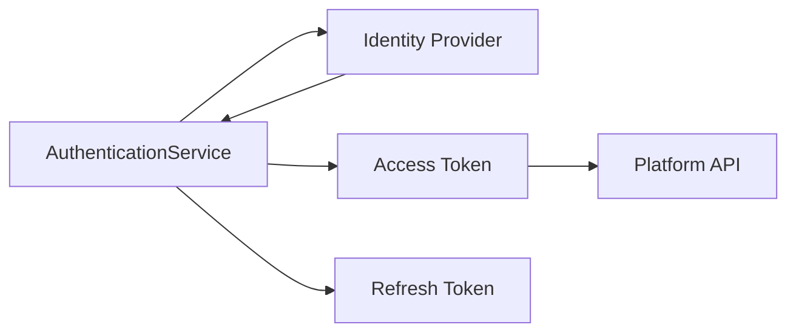
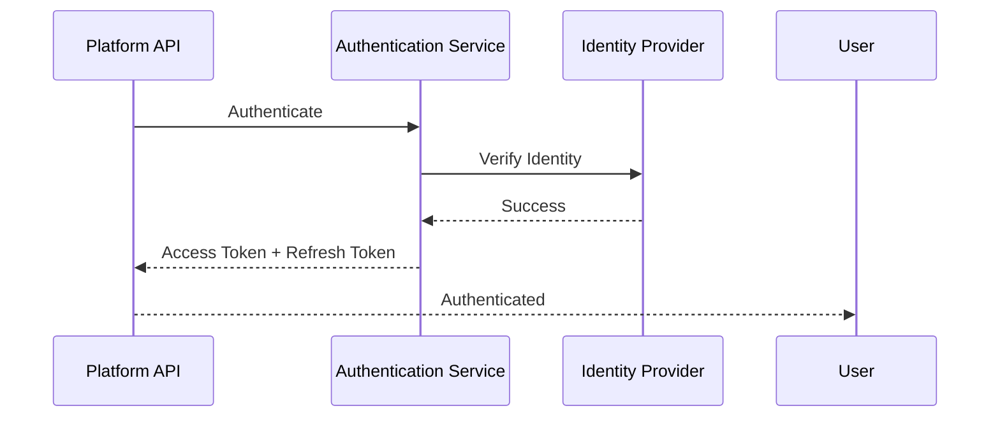
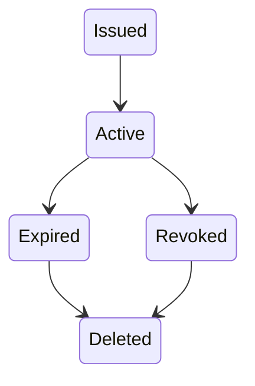
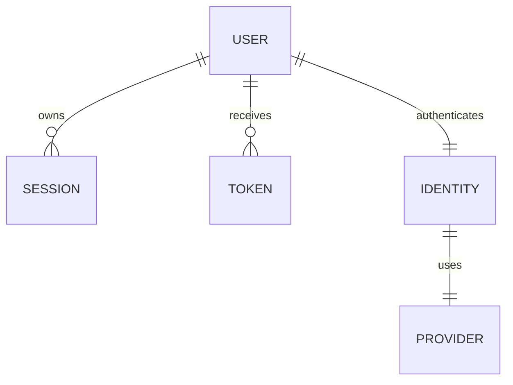

# Authentication

> AI Social OS Platform Layer

Version: 2.0.0

Status: Stable

Last Updated: 2026-07-25

---

# Table of Contents

- Overview
- Objectives
- Authentication Model
- Authentication Flow
- Identity Providers
- Authentication Methods
- Session Management
- Token Management
- Multi-Factor Authentication
- Single Sign-On
- Service Accounts
- Security Policies
- Authentication Events
- Authentication API
- Design Principles
- Design Decisions
- Summary

---

# Overview

Authentication là quá trình xác minh danh tính của người dùng hoặc hệ thống trước khi cho phép truy cập vào AI Social OS.

Authentication chỉ trả lời câu hỏi.

> "Bạn là ai?"

Việc xác định người dùng được phép làm gì sẽ do Authorization đảm nhiệm.

Authentication là điểm vào đầu tiên của toàn bộ Platform.

---

# Objectives

Authentication hướng tới.

- Secure Identity Verification
- Multiple Login Methods
- Enterprise SSO
- MFA Support
- Stateless Authentication
- Session Security
- Token Based Access
- Extensible Identity Providers

---

# Authentication Model



---

# Authentication Flow



---

# Identity Providers

Platform hỗ trợ nhiều Identity Provider.

```text
Local Account

Google

Microsoft

GitHub

GitLab

OIDC

OAuth 2.0

SAML 2.0

LDAP
```

Có thể bổ sung Provider mới thông qua Plugin hoặc Connector.

---

# Authentication Methods

Các phương thức xác thực.

- Email + Password
- OAuth Login
- Enterprise SSO
- API Key
- Personal Access Token
- Service Account
- JWT
- Device Authentication

Mọi phương thức đều sử dụng chung Authentication Service.

---

# Session Management

Sau khi xác thực thành công, hệ thống tạo Session.

```text
Session

├── Session ID
├── User ID
├── Device
├── IP Address
├── User Agent
├── Created At
├── Last Activity
└── Expiration
```

Một User có thể đồng thời sở hữu nhiều Session.

---

# Token Management

Platform sử dụng mô hình.

```text
Access Token

+

Refresh Token
```

Trong đó.

- Access Token có thời gian sống ngắn.
- Refresh Token dùng để cấp Access Token mới.
- Refresh Token có thể bị thu hồi bất kỳ lúc nào.

---

# Token Lifecycle



---

# Multi-Factor Authentication

Platform hỗ trợ MFA.

Ví dụ.

- TOTP
- Authenticator App
- Hardware Security Key
- Email Verification
- SMS OTP

Tùy chọn MFA được cấu hình theo Organization Policy.

---

# Single Sign-On

Enterprise có thể sử dụng.

- SAML 2.0
- OpenID Connect
- Azure AD
- Google Workspace
- Okta
- Auth0

SSO giúp người dùng đăng nhập bằng hệ thống nhận dạng hiện có của tổ chức.

---

# Service Accounts

Ngoài User thông thường, Platform hỗ trợ Service Account.

```text
Service Account

├── Account ID
├── API Key
├── Secret
├── Permissions
└── Expiration
```

Service Account phục vụ.

- Automation
- CI/CD
- SDK
- MCP Servers
- Plugins
- Internal Services

---

# Password Policy

Đối với Local Account.

Khuyến nghị.

- Strong Password
- Password Hashing
- Password Rotation
- Password History
- Password Expiration (tùy chọn)

Không lưu Password dạng văn bản.

---

# Security Policies

Authentication áp dụng các chính sách.

- Account Lockout
- Login Rate Limiting
- Failed Login Detection
- Session Expiration
- Device Verification
- Email Verification
- Password Policy
- MFA Enforcement

---

# Authentication Events

Ví dụ.

- LoginSucceeded
- LoginFailed
- LogoutSucceeded
- SessionCreated
- SessionExpired
- TokenIssued
- TokenRevoked
- PasswordChanged
- MFAEnabled
- MFADisabled

Các Event được phát lên Event Bus để Audit và Monitoring.

---

# Authentication API

Các Endpoint chính.

```text
POST   /auth/login

POST   /auth/logout

POST   /auth/refresh

POST   /auth/register

POST   /auth/forgot-password

POST   /auth/reset-password

POST   /auth/verify-email

POST   /auth/mfa/enable

POST   /auth/mfa/disable

GET    /auth/sessions
```

---

# Authentication Relationships



---

# Security Considerations

Luôn.

- Hash Password bằng thuật toán mạnh.
- Mã hóa Refresh Token khi lưu trữ.
- Thu hồi Token khi Logout.
- Ghi Audit Log cho mọi lần đăng nhập.
- Kiểm tra IP và Device nếu cần.
- Bật MFA cho tài khoản có quyền cao.

Không.

- Lưu Password dạng Plain Text.
- Trả Access Token trong URL.
- Ghi Token vào Log.

---

# Design Principles

Authentication được xây dựng theo các nguyên tắc.

- Identity First
- Zero Trust
- Stateless Authentication
- Token Based Access
- MFA Ready
- Enterprise Ready
- API First
- Event Driven

---

# Design Decisions

| Decision | Reason |
|-----------|--------|
| Access Token + Refresh Token | Cân bằng bảo mật và trải nghiệm |
| Hỗ trợ nhiều Identity Provider | Linh hoạt tích hợp |
| Session tách khỏi User | Quản lý nhiều thiết bị |
| MFA là thành phần mở rộng | Đáp ứng yêu cầu bảo mật cao |
| SSO chuẩn OIDC/SAML | Hỗ trợ doanh nghiệp |
| Service Account riêng | Phục vụ Automation |
| Event Driven | Audit và Monitoring tập trung |

---

# Summary

Authentication là lớp xác minh danh tính của AI Social OS, hỗ trợ nhiều phương thức đăng nhập từ Local Account đến OAuth, SSO và Service Account.

Thông qua cơ chế Access Token, Refresh Token, Session Management và Multi-Factor Authentication, Platform đảm bảo quá trình xác thực an toàn, mở rộng được và đáp ứng nhu cầu của cả người dùng cá nhân lẫn môi trường doanh nghiệp.