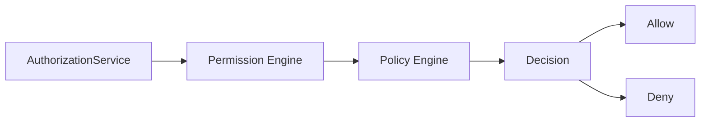
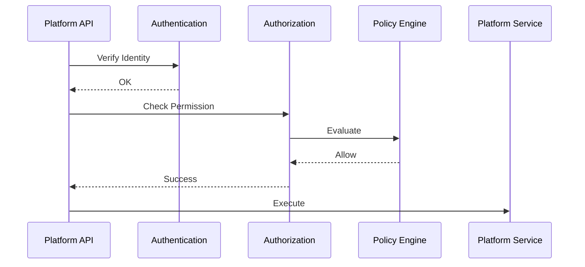
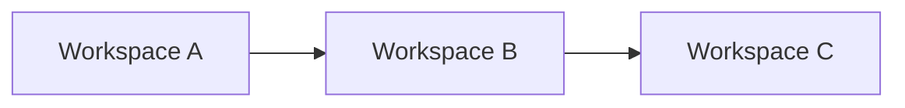
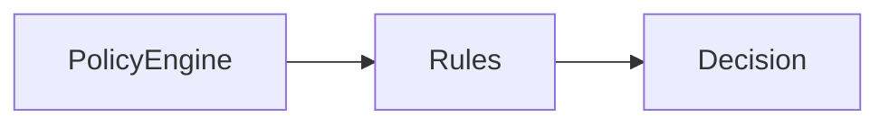
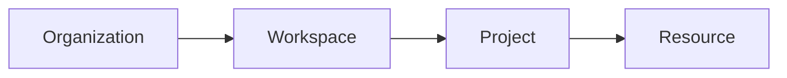
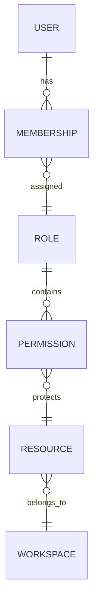

# Authorization

> AI Social OS Platform Layer

Version: 2.0.0

Status: Stable

Last Updated: 2026-07-25

---

# Table of Contents

- Overview
- Objectives
- Authentication vs Authorization
- Authorization Model
- Access Control Flow
- Resource Ownership
- Workspace Isolation
- Permission Evaluation
- Policy Engine
- Resource Scopes
- Permission Inheritance
- Authorization Events
- Authorization API
- Design Principles
- Design Decisions
- Summary

---

# Overview

Authorization là quá trình xác định người dùng hoặc Service Account được phép thực hiện hành động nào trên tài nguyên nào.

Nếu Authentication trả lời câu hỏi.

> "Bạn là ai?"

thì Authorization trả lời.

> "Bạn được phép làm gì?"

Authorization được thực hiện sau Authentication và trước khi yêu cầu được chuyển đến Platform Service hoặc Runtime.

---

# Objectives

Authorization hướng tới.

- Fine-grained Access Control
- Multi-Tenant Isolation
- Workspace-based Permissions
- Least Privilege
- Policy Driven
- Auditable
- Extensible

---

# Authentication vs Authorization

| Authentication | Authorization |
|----------------|---------------|
| Xác minh danh tính | Kiểm tra quyền |
| Login | Access Control |
| Ai là người dùng | Người dùng được phép làm gì |
| Sinh Access Token | Đánh giá Permission |
| Thực hiện đầu tiên | Thực hiện sau Authentication |

---

# Authorization Model



---

# Access Control Flow



Nếu Authorization trả về **Deny**, yêu cầu sẽ bị từ chối ngay lập tức.

---

# Resource Ownership

Mọi tài nguyên đều thuộc về một Workspace.

```text
Workspace

├── Agents

├── Workflows

├── Knowledge

├── Files

├── Secrets

├── Plugins

└── Executions
```

Authorization luôn đánh giá quyền dựa trên Workspace chứa tài nguyên.

---

# Workspace Isolation



Người dùng của Workspace A không thể truy cập tài nguyên của Workspace B nếu không được cấp quyền rõ ràng.

---

# Authorization Levels

Platform hỗ trợ nhiều cấp quyền.

```mermaid
flowchart LR
```

Quyền được đánh giá từ trên xuống dưới.

---

# Permission Evaluation

Một quyết định Authorization được xác định dựa trên.

```text
Subject

+

Resource

+

Action

+

Policy

=

Decision
```

Ví dụ.

```text
User

+

Workflow

+

Execute

+

Workspace Policy

=

Allow
```

---

# Subject

Subject có thể là.

- User
- Service Account
- API Key
- Access Token
- Internal Service

Mọi Subject đều có Identity và Permission tương ứng.

---

# Resource

Ví dụ về Resource.

```text
Workspace

Project

Workflow

Agent

Knowledge Base

Secret

Plugin

Execution

File

Media
```

---

# Actions

Các hành động phổ biến.

```text
Create

Read

Update

Delete

Execute

Share

Export

Import

Manage

Approve
```

Action được kết hợp với Resource để tạo Permission.

---

# Resource Scopes

Permission được giới hạn theo Scope.

```text
Platform

Organization

Workspace

Project

Resource
```

Ví dụ.

```
workspace.workflow.execute
```

chỉ áp dụng trong Workspace hiện tại.

---

# Policy Engine

Policy Engine chịu trách nhiệm đánh giá.



Policy có thể bao gồm.

- Workspace Membership
- Organization Policy
- Resource Ownership
- Time Restrictions
- IP Restrictions
- License Restrictions

---

# Permission Inheritance



Permission có thể được kế thừa từ cấp cao hơn hoặc ghi đè ở cấp thấp hơn theo chính sách của hệ thống.

---

# Authorization Cache

Để giảm độ trễ.

Authorization Service có thể Cache.

- Membership
- Roles
- Policies
- Permission Matrix

Cache phải được làm mới khi có thay đổi về Membership hoặc Policy.

---

# Authorization Events

Ví dụ.

- PermissionGranted
- PermissionRevoked
- AccessDenied
- PolicyUpdated
- RoleAssigned
- RoleRemoved
- OwnershipChanged

Các Event được gửi đến Audit Log và Monitoring.

---

# Authorization API

Các Endpoint chính.

```text
POST   /authz/check

GET    /permissions

GET    /roles

POST   /roles

PATCH  /roles/{id}

DELETE /roles/{id}

POST   /permissions/grant

POST   /permissions/revoke
```

---

# Authorization Relationships



---

# Security Considerations

Authorization phải.

- Kiểm tra mọi Request.
- Không tin tưởng Client.
- Đánh giá Permission phía Server.
- Ghi Audit Log cho các hành động quan trọng.
- Từ chối theo mặc định nếu không xác định được quyền.

Không.

- Kiểm tra Permission ở Frontend.
- Hardcode Permission trong Source Code.
- Bỏ qua Authorization đối với Internal API.

---

# Design Principles

Authorization được xây dựng theo các nguyên tắc.

- Least Privilege
- Deny by Default
- Workspace First
- Policy Driven
- Server-side Enforcement
- Auditable
- API First
- Event Driven

---

# Design Decisions

| Decision | Reason |
|-----------|--------|
| Authorization tách khỏi Authentication | Phân tách trách nhiệm |
| Permission theo Workspace | Hỗ trợ Multi-Tenant |
| Server-side Enforcement | Tăng bảo mật |
| Policy Engine độc lập | Dễ mở rộng |
| Deny by Default | Giảm rủi ro truy cập trái phép |
| Resource Ownership | Quyền rõ ràng |
| Authorization Cache | Tăng hiệu năng |

---

# Summary

Authorization là lớp kiểm soát truy cập của AI Social OS, chịu trách nhiệm xác định người dùng hoặc Service Account có được phép thực hiện một hành động trên một tài nguyên cụ thể hay không.

Thông qua mô hình Workspace-based Access Control, Policy Engine và Resource Ownership, Platform đảm bảo mọi yêu cầu đều được đánh giá quyền một cách nhất quán, an toàn và có khả năng mở rộng cho môi trường Multi-Tenant.