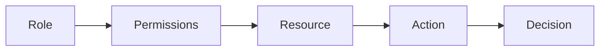
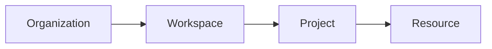
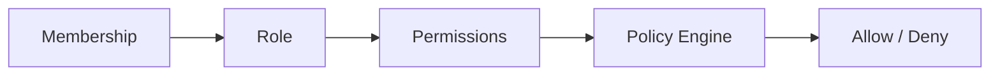
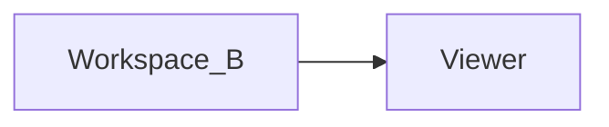

# Permission Model

> AI Social OS Platform Layer

Version: 2.0.0

Status: Stable

Last Updated: 2026-07-25

---

# Table of Contents

- Overview
- Objectives
- Permission Philosophy
- Access Control Model
- Permission Structure
- Permission Hierarchy
- Subjects
- Resources
- Actions
- Roles
- Permission Evaluation
- Inheritance
- Custom Roles
- Permission Matrix
- Events
- API
- Design Principles
- Design Decisions
- Summary

---

# Overview

Permission Model định nghĩa cách AI Social OS quản lý và đánh giá quyền truy cập vào mọi tài nguyên trong hệ thống.

Permission là nền tảng của Authorization và được sử dụng thống nhất trên toàn bộ Platform.

Mọi quyết định truy cập đều dựa trên.

- Subject
- Resource
- Action
- Scope
- Policy

---

# Objectives

Permission Model hướng tới.

- Fine-grained Access Control
- Role-based Authorization
- Workspace Isolation
- Least Privilege
- Multi-Tenant
- Extensible
- Auditable
- Predictable

---

# Permission Philosophy

Permission được xây dựng theo nguyên tắc.

- Deny by Default
- Explicit Grant
- Least Privilege
- Workspace First
- Server-side Enforcement

Không có Permission mặc định cho User mới ngoài những quyền tối thiểu cần thiết.

---

# Access Control Model



---

# Permission Structure

Một Permission được định nghĩa theo cấu trúc.

```text
<scope>.<resource>.<action>
```

Ví dụ.

```text
workspace.workflow.read

workspace.workflow.execute

workspace.agent.create

workspace.agent.update

workspace.secret.read

organization.user.invite

platform.billing.manage
```

Permission được đặt tên thống nhất trên toàn hệ thống.

---

# Permission Hierarchy



Permission được đánh giá theo Scope tương ứng.

---

# Subjects

Subject là thực thể yêu cầu quyền.

Ví dụ.

```text
User

Service Account

API Key

Access Token

Internal Service

CLI

SDK
```

---

# Resources

Permission có thể áp dụng cho.

```text
Workspace

Project

Workflow

Agent

Knowledge Base

Secret

Plugin

Connector

Execution

File

Media

Billing

License
```

---

# Actions

Các Action chuẩn.

```text
Create

Read

Update

Delete

Execute

Manage

Share

Export

Import

Approve

Configure
```

Action luôn được kết hợp với Resource.

---

# Roles

Role là tập hợp Permission.

Ví dụ.

```text
Owner

Administrator

Developer

Operator

Viewer

Guest
```

Một User có thể có nhiều Role thông qua các Membership khác nhau.

---

# Default Role Permissions

| Role | Description |
|------|-------------|
| Owner | Toàn quyền Workspace |
| Administrator | Quản trị Workspace |
| Developer | Tạo và chỉnh sửa tài nguyên |
| Operator | Thực thi và vận hành |
| Viewer | Chỉ xem |
| Guest | Quyền giới hạn |

Các Role mặc định có thể được mở rộng bằng Custom Role.

---

# Permission Evaluation



Quá trình đánh giá luôn diễn ra phía Server.

---

# Permission Inheritance

Permission có thể được kế thừa.

```mermaid
flowchart LR
```

Một Permission ở cấp thấp không thể vượt quá giới hạn của cấp cao hơn.

---

# Custom Roles

Platform cho phép tạo Role tùy chỉnh.

Ví dụ.

```text
AI Engineer

Marketing Manager

Reviewer

Finance

Content Moderator
```

Custom Role chỉ là tập hợp các Permission.

Không thay đổi mô hình Authorization.

---

# Permission Matrix

Ví dụ.

| Permission | Owner | Admin | Developer | Operator | Viewer |
|------------|:-----:|:-----:|:----------:|:---------:|:------:|
| Create Workflow | ✓ | ✓ | ✓ | ✗ | ✗ |
| Execute Workflow | ✓ | ✓ | ✓ | ✓ | ✗ |
| Delete Workflow | ✓ | ✓ | ✗ | ✗ | ✗ |
| Manage Secrets | ✓ | ✓ | ✗ | ✗ | ✗ |
| Read Files | ✓ | ✓ | ✓ | ✓ | ✓ |
| Manage Billing | ✓ | ✗ | ✗ | ✗ | ✗ |

---

# Permission Resolution

Khi một User có nhiều Membership.



Permission chỉ có hiệu lực trong Workspace tương ứng.

Không cộng dồn quyền giữa các Workspace.

---

# Permission Cache

Permission Engine có thể Cache.

- Membership
- Roles
- Permission Matrix
- Policies

Cache cần được làm mới khi.

- Role thay đổi.
- Membership thay đổi.
- Policy thay đổi.

---

# Permission Events

Ví dụ.

- RoleCreated
- RoleUpdated
- RoleDeleted
- PermissionGranted
- PermissionRevoked
- MembershipChanged
- PolicyUpdated

Các Event được phát lên Event Bus.

---

# Permission API

Các Endpoint chính.

```text
GET    /permissions

GET    /roles

POST   /roles

PATCH  /roles/{id}

DELETE /roles/{id}

POST   /roles/{id}/permissions

DELETE /roles/{id}/permissions/{permissionId}

POST   /permissions/check
```

---

# Design Principles

Permission Model được xây dựng theo các nguyên tắc.

- Least Privilege
- Explicit Permission
- Role-based Access
- Workspace Isolation
- Policy Driven
- Auditable
- Extensible
- API First

---

# Design Decisions

| Decision | Reason |
|-----------|--------|
| Permission theo Scope | Dễ mở rộng |
| Role là tập Permission | Đơn giản quản lý |
| Workspace Isolation | Hỗ trợ Multi-Tenant |
| Server-side Evaluation | Tăng bảo mật |
| Custom Roles | Linh hoạt cho doanh nghiệp |
| Deny by Default | An toàn hơn |
| Permission Cache | Cải thiện hiệu năng |

---

# Summary

```mermaid
flowchart LR
```

Bằng việc kết hợp Role-Based Access Control, Workspace Isolation, Policy Engine và Permission Inheritance, hệ thống cung cấp một cơ chế phân quyền nhất quán, linh hoạt và phù hợp cho cả môi trường doanh nghiệp lẫn nền tảng Multi-Tenant quy mô lớn.