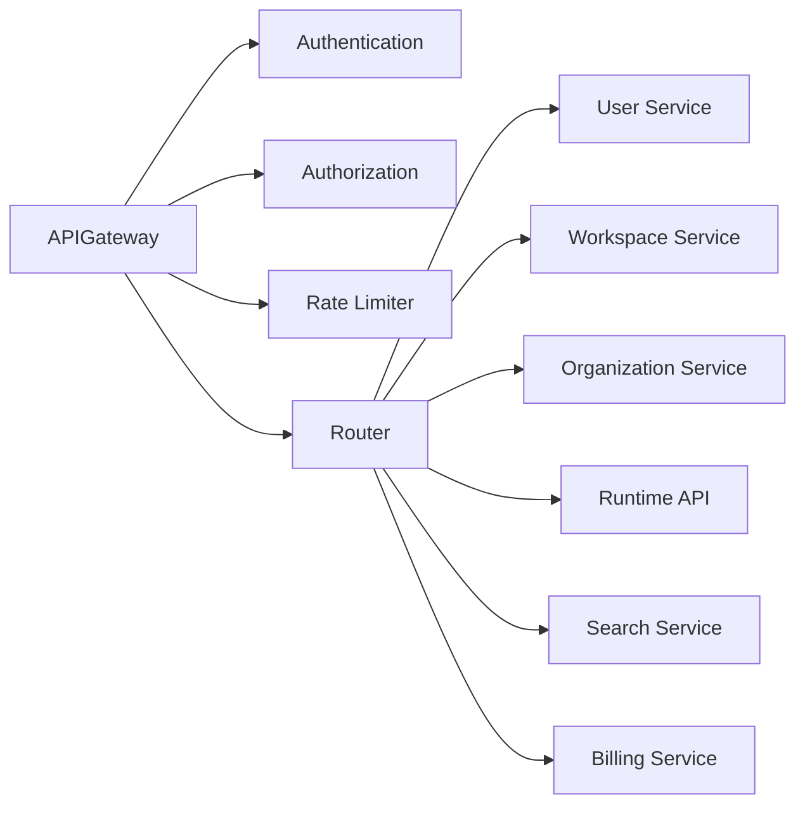
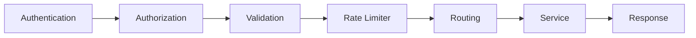
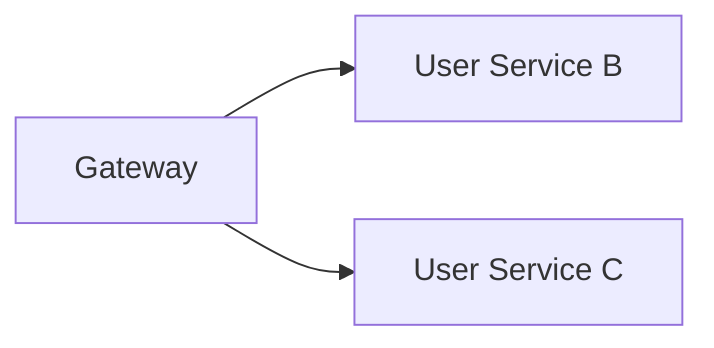
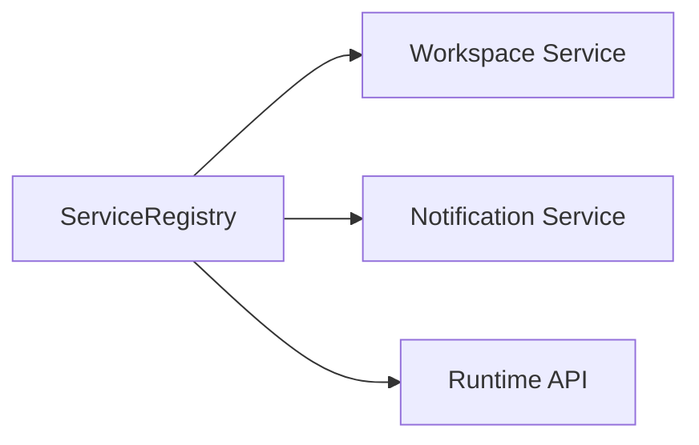
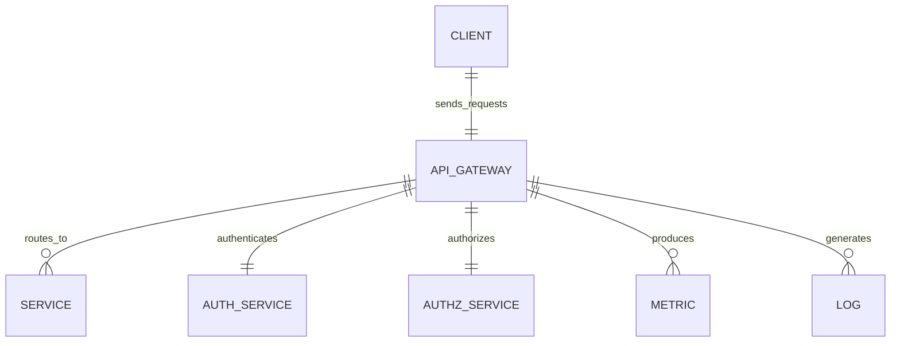
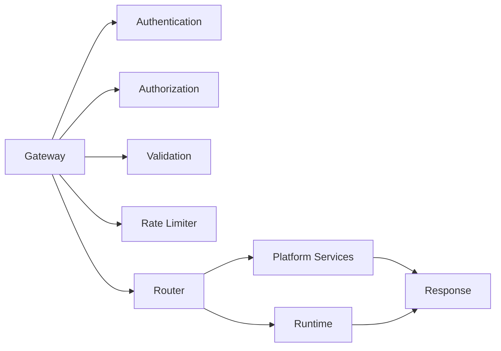

# API Gateway

> AI Social OS Platform Layer

Version: 2.0.0

Status: Stable

Last Updated: 2026-07-25

---

# Table of Contents

- Overview
- Objectives
- Why API Gateway
- Responsibilities
- Architecture
- Request Lifecycle
- Routing
- Authentication
- Authorization
- Rate Limiting
- API Versioning
- Request Validation
- Request Transformation
- Response Transformation
- Load Balancing
- Service Discovery
- Caching
- Observability
- Error Handling
- Security
- Gateway APIs
- Gateway Relationships
- Performance Optimizations
- Design Principles
- Design Decisions
- Summary

---

# Overview

API Gateway là điểm truy cập duy nhất (Single Entry Point) của toàn bộ AI Social OS.

Mọi request từ.

- Web Application
- Mobile Application
- SDK
- CLI
- MCP Client
- External API
- Automation
- Third-party Integration

đều đi qua API Gateway trước khi được chuyển đến các Platform Services hoặc Runtime.

Gateway đóng vai trò điều phối, bảo mật và kiểm soát lưu lượng truy cập.

---

# Objectives

API Gateway hướng tới.

- Single Entry Point
- Secure Access
- Service Routing
- Load Balancing
- Rate Limiting
- Request Validation
- API Versioning
- Observability
- High Availability

---

# Why API Gateway

Nếu Client gọi trực tiếp từng Service.

```mermaid
flowchart LR
```

Client phải biết địa chỉ của mọi Service.

Điều này gây.

- Tight Coupling
- Khó bảo mật
- Khó Versioning
- Khó Scale
- Khó Monitoring

API Gateway cung cấp một điểm truy cập thống nhất, loại bỏ nhu cầu Client phải biết chi tiết hạ tầng phía sau.

---

# Responsibilities

Gateway chịu trách nhiệm.

- Request Routing
- Authentication
- Authorization
- Rate Limiting
- API Versioning
- Request Validation
- Response Transformation
- Logging
- Metrics
- Tracing
- Service Discovery
- Load Balancing

Gateway không chứa Business Logic.

---

# Architecture



---

# Request Lifecycle



---

# Routing

Gateway định tuyến request dựa trên.

- URL Path
- HTTP Method
- API Version
- Workspace Context
- Organization Context
- Service Discovery

Ví dụ.

```mermaid
flowchart LR
```

```mermaid
flowchart LR
```

---

# Authentication

Gateway xác minh.

- JWT
- OAuth Token
- API Key
- Service Token
- Personal Access Token

Nếu xác thực thất bại.

```
401 Unauthorized
```

được trả về ngay lập tức.

---

# Authorization

Sau Authentication.

Gateway kiểm tra.

- Workspace Membership
- Roles
- Permissions
- Policies

Nếu không đủ quyền.

```
403 Forbidden
```

---

# Rate Limiting

Gateway hỗ trợ nhiều chính sách giới hạn.

Ví dụ.

```text
Per User

Per API Key

Per Workspace

Per Organization

Per IP Address
```

Ví dụ cấu hình.

| Scope | Limit |
|---------|------:|
| User | 100 requests/minute |
| Workspace | 10,000 requests/hour |
| API Key | 1,000 requests/minute |

---

# API Versioning

Platform hỗ trợ.

```text
/api/v1/

/api/v2/

/api/v3/
```

Version mới không làm ảnh hưởng đến Client cũ.

---

# Request Validation

Gateway kiểm tra.

- Header
- Query Parameters
- Path Parameters
- Request Body
- Content Type
- Size Limit

Request không hợp lệ sẽ bị từ chối trước khi tới Service.

---

# Request Transformation

Gateway có thể.

- Thêm Header
- Chuẩn hóa Header
- Sinh Correlation ID
- Chuẩn hóa Request Format
- Inject Workspace Context

---

# Response Transformation

Gateway có thể.

- Chuẩn hóa Error Format
- Thêm Metadata
- Nén Response
- Thêm Pagination Metadata
- Thêm Rate Limit Header

---

# Load Balancing

Gateway phân phối Request.



Chiến lược có thể bao gồm.

- Round Robin
- Least Connections
- Weighted Routing
- Consistent Hashing

---

# Service Discovery

Gateway không lưu địa chỉ Service cố định.



Điều này cho phép mở rộng hoặc thay thế Service mà không cần thay đổi Gateway.

---

# Caching

Gateway có thể Cache.

- Public GET Responses
- Configuration
- Permission Metadata
- Discovery Information

Không Cache.

- Access Token
- Secrets
- Sensitive Responses

---

# Observability

Gateway ghi nhận.

- Request Count
- Response Time
- Error Rate
- Throughput
- Authentication Failures
- Authorization Failures
- Rate Limit Violations

Dữ liệu được gửi đến hệ thống Monitoring.

---

# Error Handling

Các mã lỗi phổ biến.

| Status | Meaning |
|---------|----------|
| 400 | Bad Request |
| 401 | Unauthorized |
| 403 | Forbidden |
| 404 | Resource Not Found |
| 409 | Conflict |
| 429 | Too Many Requests |
| 500 | Internal Server Error |
| 503 | Service Unavailable |

Gateway trả về định dạng lỗi thống nhất.

---

# Security

Gateway áp dụng.

- TLS
- CORS
- CSRF Protection
- Request Size Limit
- IP Filtering
- API Key Validation
- JWT Validation
- Header Sanitization
- DDoS Protection

Gateway là tuyến phòng thủ đầu tiên của Platform.

---

# Gateway APIs

Ví dụ.

```text
POST   /auth/login

GET    /users

GET    /workspaces

POST   /workflows

POST   /agents

GET    /search

POST   /runtime/execute

GET    /billing
```

Toàn bộ Endpoint đều đi qua API Gateway.

---

# Gateway Relationships



---

# Performance Optimizations

Các kỹ thuật tối ưu.

- Connection Pooling
- HTTP Keep-Alive
- Response Compression
- Request Batching
- Edge Cache
- Circuit Breaker
- Adaptive Load Balancing

---

# Gateway Architecture



---

# Design Principles

API Gateway được xây dựng theo các nguyên tắc.

- Single Entry Point
- Stateless
- Secure by Default
- API First
- Observable
- Scalable
- Extensible
- High Availability

---

# Design Decisions

| Decision | Reason |
|-----------|--------|
| Single Gateway | Điểm truy cập thống nhất |
| Stateless Gateway | Dễ mở rộng ngang |
| Central Authentication | Bảo mật nhất quán |
| Central Authorization | Kiểm soát truy cập tập trung |
| Service Discovery | Tránh cấu hình tĩnh |
| Versioned API | Duy trì khả năng tương thích |
| Standard Error Format | Trải nghiệm API nhất quán |

---

# Summary

API Gateway là lớp truy cập trung tâm của AI Social OS, chịu trách nhiệm định tuyến yêu cầu, xác thực, phân quyền, giới hạn lưu lượng và chuyển tiếp request tới các Platform Services hoặc Runtime.

Thông qua mô hình Stateless Gateway, Service Discovery và cơ chế bảo mật tập trung, API Gateway cung cấp một điểm truy cập thống nhất, an toàn và có khả năng mở rộng cho toàn bộ hệ sinh thái AI Social OS.