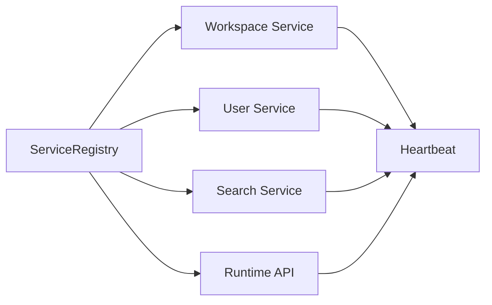
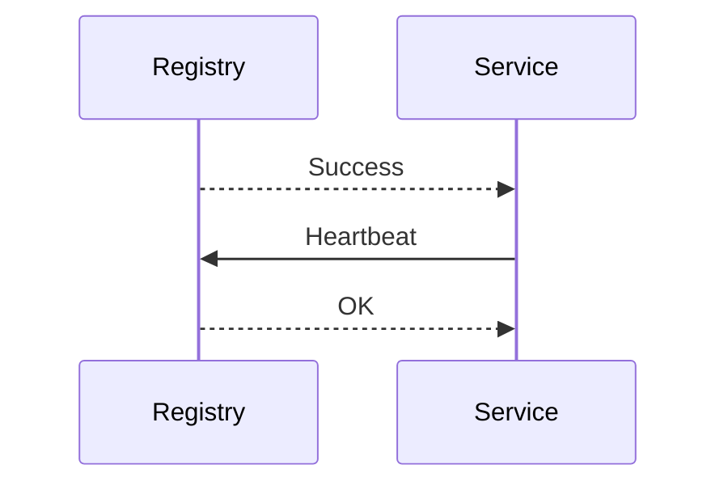
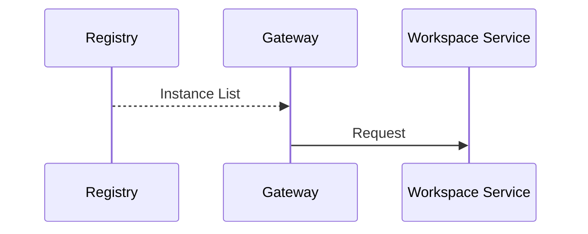
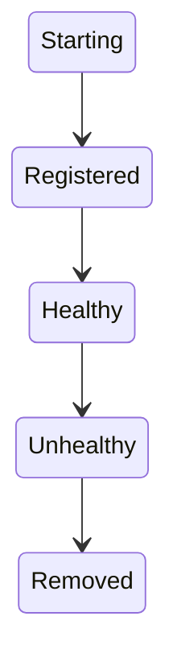
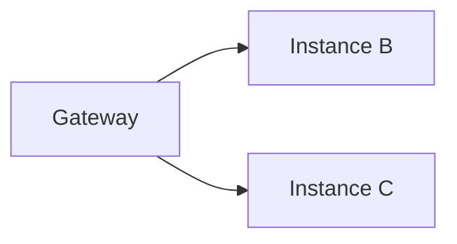
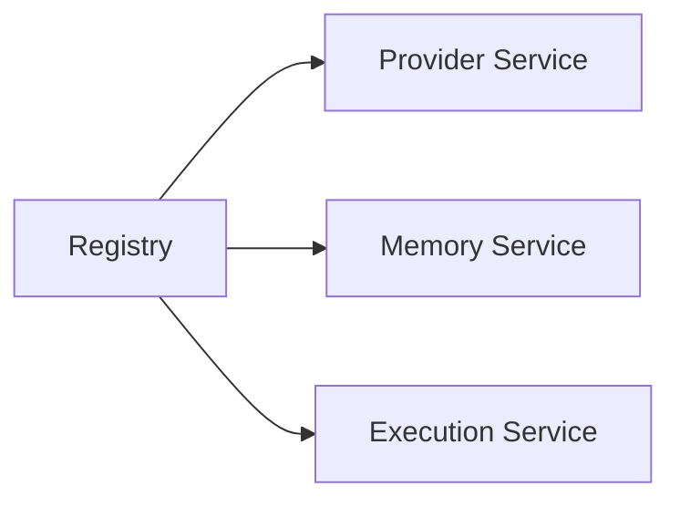
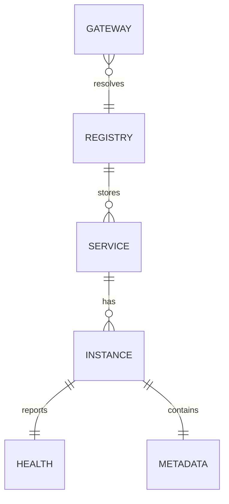

# Service Discovery

> AI Social OS Platform Layer

Version: 2.0.0

Status: Stable

Last Updated: 2026-07-25

---

# Table of Contents

- Overview
- Objectives
- Why Service Discovery
- Architecture
- Service Registration
- Service Registry
- Service Resolution
- Health Check
- Heartbeat
- Service Lifecycle
- Load Balancing
- Service Metadata
- Failure Recovery
- Runtime Integration
- Service Events
- Discovery API
- Performance Optimizations
- Design Principles
- Design Decisions
- Summary

---

# Overview

Service Discovery là cơ chế cho phép các Service trong AI Social OS tự động tìm thấy nhau mà không cần cấu hình địa chỉ IP hoặc URL cố định.

Thay vì gọi trực tiếp.

```
http://10.0.1.15:8080
```

Service chỉ cần yêu cầu.

```
workspace-service
```

Service Discovery sẽ trả về Endpoint phù hợp.

---

# Objectives

Service Discovery hướng tới.

- Dynamic Service Resolution
- Zero Configuration
- Horizontal Scaling
- High Availability
- Service Health Monitoring
- Automatic Failover
- Cloud Native
- Kubernetes Friendly

---

# Why Service Discovery

Nếu sử dụng địa chỉ tĩnh.

```mermaid
flowchart LR
```

Khi Service được Scale hoặc chuyển Node.

- IP thay đổi
- Gateway lỗi
- Service không thể kết nối

Service Discovery giải quyết vấn đề này bằng Registry trung tâm.

---

# Architecture



---

# Service Registration

Khi một Service khởi động.



Service sẽ được thêm vào Registry.

---

# Registration Information

Mỗi Service đăng ký.

```text
Service Name

Instance ID

Host

Port

Protocol

Version

Health Status

Region

Zone

Metadata
```

Ví dụ.

```text
workspace-service

instance-01

10.0.0.15

8080

HTTPS

v2.0.0
```

---

# Service Registry

Registry lưu danh sách.

```text
Workspace Service

├── Instance A

├── Instance B

└── Instance C

User Service

├── Instance A

└── Instance B

Runtime API

├── Instance A

├── Instance B

└── Instance C
```

---

# Service Resolution

Gateway hoặc Service khác thực hiện.



Registry không xử lý Request.

Registry chỉ cung cấp thông tin.

---

# Health Check

Registry định kỳ kiểm tra.

- HTTP Health Endpoint
- TCP Connection
- gRPC Health
- Kubernetes Probe

Ví dụ.

```text
GET /health
```

Nếu Health Check thất bại.

Instance sẽ bị đánh dấu Unhealthy.

---

# Heartbeat

Các Service gửi Heartbeat định kỳ.

```mermaid
flowchart LR
```

Nếu quá thời gian quy định.

Service bị loại khỏi Registry.

---

# Health States

```text
Starting

Healthy

Degraded

Unhealthy

Offline
```

Gateway chỉ định tuyến đến các Instance ở trạng thái Healthy.

---

# Service Lifecycle



---

# Load Balancing

Sau khi nhận danh sách Instance.

Gateway lựa chọn một Instance.



Các chiến lược.

- Round Robin
- Least Connections
- Random
- Weighted
- Consistent Hash

---

# Service Metadata

Registry lưu Metadata.

Ví dụ.

```text
Environment

Version

Region

Availability Zone

Capabilities

Runtime

Tags

Protocol
```

Metadata hỗ trợ định tuyến thông minh.

---

# Failure Recovery

Nếu một Instance gặp lỗi.


Quá trình Failover diễn ra tự động.

---

# Runtime Integration

Runtime Worker cũng sử dụng Service Discovery.



Điều này cho phép Runtime mở rộng linh hoạt.

---

# Multi Region

Registry hỗ trợ nhiều Region.

```text
Region A

├── Workspace Service

├── Runtime

└── Search

Region B

├── Workspace Service

├── Runtime

└── Search
```

Gateway ưu tiên Instance gần nhất.

---

# Discovery Cache

Gateway có thể Cache.

- Service List
- Healthy Instances
- Metadata

Cache phải được cập nhật khi Registry thay đổi.

---

# Service Events

Ví dụ.

- ServiceRegistered
- ServiceUnregistered
- ServiceHealthy
- ServiceUnhealthy
- InstanceStarted
- InstanceStopped
- MetadataUpdated

Các Event được phát lên Event Bus.

---

# Discovery API

Ví dụ.

```text
POST   /registry/register

DELETE /registry/unregister

GET    /registry/services

GET    /registry/services/{name}

POST   /registry/heartbeat

GET    /registry/health
```

---

# Performance Optimizations

Các kỹ thuật tối ưu.

- Registry Replication
- Local Discovery Cache
- Incremental Updates
- Health Check Batching
- Connection Pooling
- Watch-based Synchronization
- Read Replicas

---

# Service Relationships



---

# Security Considerations

Service Discovery phải.

- Chỉ cho phép Service đã xác thực đăng ký.
- Xác minh Heartbeat.
- Mã hóa toàn bộ kết nối.
- Giới hạn quyền truy cập Registry.
- Ghi Audit Log cho mọi thay đổi.

Không cho phép Client bên ngoài truy cập trực tiếp Registry.

---

# Design Principles

Service Discovery được xây dựng theo các nguyên tắc.

- Dynamic Registration
- Stateless
- Health Driven
- Cloud Native
- Highly Available
- Event Driven
- Observable
- Extensible

---

# Design Decisions

| Decision | Reason |
|-----------|--------|
| Registry trung tâm | Quản lý Service thống nhất |
| Dynamic Registration | Không cần cấu hình thủ công |
| Health Check định kỳ | Chỉ định tuyến đến Service khỏe mạnh |
| Heartbeat | Phát hiện Instance lỗi nhanh |
| Metadata Routing | Hỗ trợ định tuyến thông minh |
| Discovery Cache | Giảm độ trễ |
| Automatic Failover | Tăng tính sẵn sàng |

---

# Summary

Service Discovery cung cấp cơ chế đăng ký, khám phá và giám sát các Service trong AI Social OS, giúp Gateway và các Service nội bộ có thể tìm thấy nhau một cách động mà không phụ thuộc vào địa chỉ mạng cố định.

Thông qua Registry, Health Check, Heartbeat và Load Balancing, Platform đạt được khả năng mở rộng ngang, tự động phục hồi và vận hành ổn định trong môi trường Cloud Native và Multi-Instance.