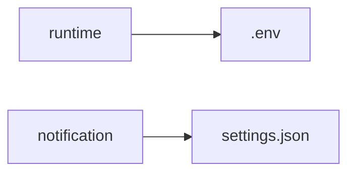
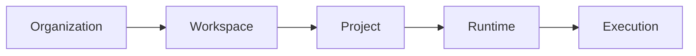
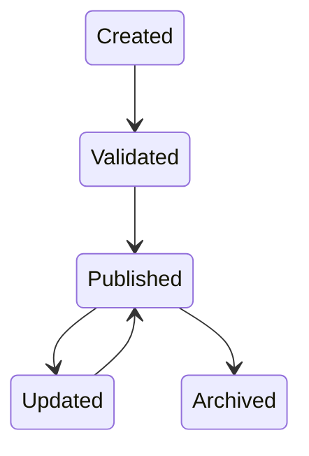
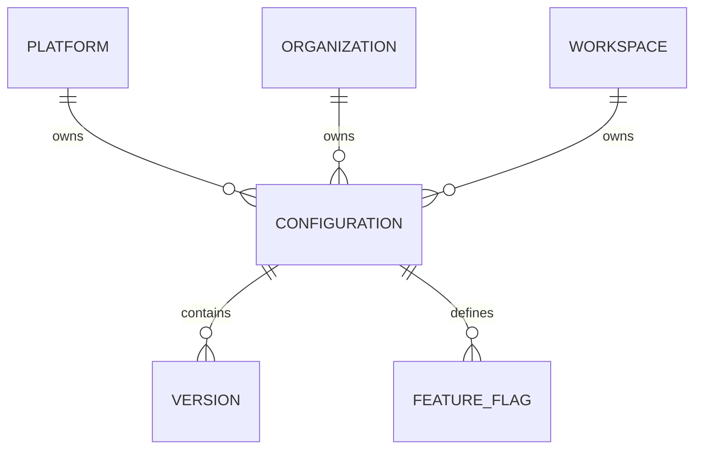

# Configuration Service

> AI Social OS Platform Layer

Version: 2.0.0

Status: Stable

Last Updated: 2026-07-25

---

# Table of Contents

- Overview
- Objectives
- Why Configuration Service
- Configuration Hierarchy
- Configuration Types
- Configuration Sources
- Configuration Resolution
- Configuration Lifecycle
- Dynamic Configuration
- Configuration Versioning
- Configuration Validation
- Secrets Separation
- Configuration Cache
- Configuration Events
- Configuration API
- Design Principles
- Design Decisions
- Summary

---

# Overview

Configuration Service là dịch vụ quản lý toàn bộ cấu hình của AI Social OS.

Mọi thành phần trong hệ thống đều lấy cấu hình thông qua Configuration Service thay vì đọc trực tiếp từ file hoặc Environment Variables.

Configuration bao gồm.

- Runtime Configuration
- Platform Settings
- Workspace Settings
- Feature Flags
- AI Provider Settings
- Plugin Configuration
- Connector Configuration
- System Policies

Secrets không được lưu trong Configuration Service mà được quản lý bởi Secret Manager.

---

# Objectives

Configuration Service hướng tới.

- Centralized Configuration
- Dynamic Updates
- Version Control
- Multi-Tenant
- Validation
- Auditability
- High Availability
- Extensibility

---

# Why Configuration Service

Nếu mỗi Service tự quản lý file cấu hình.



sẽ dẫn đến.

- Khó đồng bộ
- Khó cập nhật
- Không theo dõi lịch sử
- Không hỗ trợ Runtime Update
- Khó quản trị

Configuration Service giải quyết vấn đề bằng một nguồn cấu hình tập trung.

---

# Configuration Hierarchy

Configuration được phân cấp.



Mỗi cấp có thể ghi đè cấu hình của cấp trên nếu được cho phép.

---

# Configuration Types

Ví dụ.

```text
Platform Configuration

Organization Settings

Workspace Settings

Runtime Configuration

Plugin Configuration

Connector Configuration

Feature Flags

AI Provider Configuration

Notification Settings

Storage Settings
```

---

# Configuration Sources

Configuration có thể đến từ.

```mermaid
flowchart LR
```

Giá trị cuối cùng được xác định theo thứ tự ưu tiên.

---

# Configuration Resolution


Consumer luôn nhận được cấu hình đã được hợp nhất.

---

# Configuration Lifecycle



Mọi thay đổi đều được ghi Audit Log.

---

# Dynamic Configuration

Configuration có thể thay đổi trong khi hệ thống đang chạy.

Ví dụ.

- Thay đổi Model AI
- Thay đổi Timeout
- Thay đổi Retry Policy
- Thay đổi API Endpoint
- Bật Feature Flag

Không cần khởi động lại toàn bộ Platform.

---

# Configuration Versioning

Mỗi Configuration có Version.

```mermaid
flowchart LR
```

Có thể.

- Rollback
- Compare
- Audit
- Restore

---

# Configuration Validation

Trước khi Publish.

Configuration phải được kiểm tra.

- Schema
- Data Type
- Required Fields
- Constraints
- References
- Dependencies

Configuration không hợp lệ sẽ bị từ chối.

---

# Secrets Separation

Không lưu.

- API Keys
- Passwords
- Tokens
- Certificates
- Private Keys

trong Configuration Service.

Các dữ liệu này được tham chiếu thông qua Secret Manager.

Ví dụ.

```yaml
provider:
  apiKey: secret://providers/openai
```

---

# Configuration Cache

Để giảm độ trễ.

Service có thể Cache.

- Workspace Configuration
- Runtime Configuration
- Feature Flags
- Policies

Cache được làm mới khi Configuration thay đổi.

---

# Feature Flags

Configuration Service hỗ trợ Feature Flags.

Ví dụ.

```text
Enable New UI

Enable Memory

Enable MCP

Enable Streaming

Enable Agents V2

Enable Experimental Features
```

Feature Flags có thể áp dụng theo.

- Platform
- Organization
- Workspace
- User

---

# Configuration Events

Ví dụ.

- ConfigurationCreated
- ConfigurationUpdated
- ConfigurationPublished
- ConfigurationDeleted
- ConfigurationRolledBack
- FeatureFlagEnabled
- FeatureFlagDisabled

Các Event được phát lên Event Bus để đồng bộ giữa các Service.

---

# Configuration API

Ví dụ.

```text
GET    /config

GET    /config/{scope}

POST   /config

PATCH  /config/{id}

DELETE /config/{id}

POST   /config/publish

POST   /config/rollback

GET    /feature-flags
```

---

# Configuration Relationships



---

# Security Considerations

Configuration Service phải.

- Kiểm tra Permission trước khi cập nhật.
- Ghi Audit Log cho mọi thay đổi.
- Xác thực Schema trước khi Publish.
- Không lưu Secrets.
- Hỗ trợ Rollback khi có lỗi.

Chỉ Administrator hoặc Owner mới có quyền thay đổi cấu hình ở cấp tương ứng.

---

# Design Principles

Configuration Service được xây dựng theo các nguyên tắc.

- Configuration as Data
- Dynamic by Default
- Version Controlled
- Multi-Tenant
- Schema Validated
- API First
- Event Driven
- Observable

---

# Design Decisions

| Decision | Reason |
|-----------|--------|
| Centralized Configuration | Quản lý thống nhất |
| Phân cấp cấu hình | Hỗ trợ Multi-Tenant |
| Versioning | Rollback và Audit |
| Dynamic Updates | Không cần Restart |
| Tách Secrets khỏi Configuration | Tăng bảo mật |
| Feature Flags | Phát hành linh hoạt |
| Event Driven | Đồng bộ toàn hệ thống |

---

# Summary

Configuration Service là trung tâm quản lý cấu hình của AI Social OS, cung cấp cơ chế lưu trữ, phân cấp, hợp nhất và phân phối cấu hình cho toàn bộ Platform và Runtime.

Thông qua Versioning, Dynamic Updates, Feature Flags và cơ chế Validation, hệ thống có thể thay đổi hành vi của các Service một cách an toàn, nhất quán và không cần triển khai lại ứng dụng.