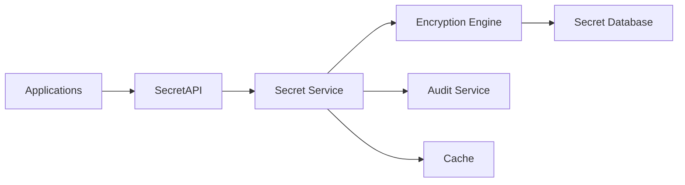
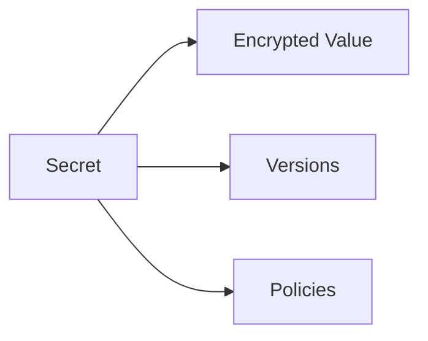
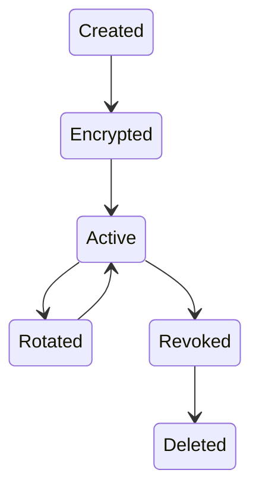
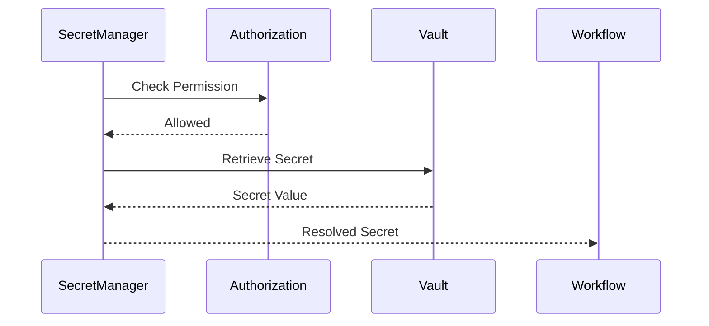
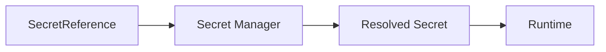
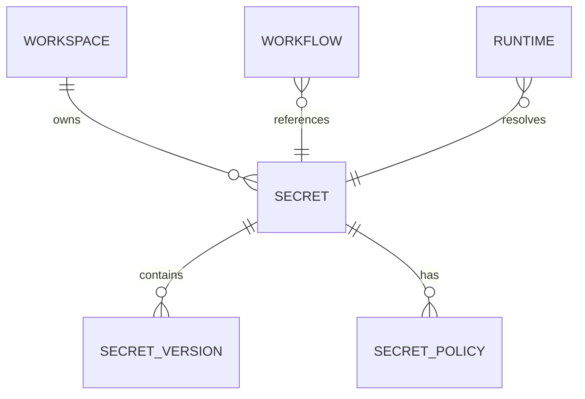

# Secret Manager

> AI Social OS Platform Layer

Version: 2.0.0

Status: Stable

Last Updated: 2026-07-25

---

# Table of Contents

- Overview
- Objectives
- Why Secret Manager
- Architecture
- Secret Model
- Secret Types
- Secret Scopes
- Secret Lifecycle
- Secret Resolution
- Secret Encryption
- Secret Rotation
- Secret Versioning
- Secret Access Control
- Secret Injection
- Audit Logging
- Secret Events
- Secret API
- Performance Optimizations
- Design Principles
- Design Decisions
- Summary

---

# Overview

Secret Manager là dịch vụ chịu trách nhiệm lưu trữ, quản lý và phân phối toàn bộ dữ liệu nhạy cảm trong AI Social OS.

Secret không được lưu trực tiếp trong.

- Configuration
- Workflow
- Agent
- Plugin
- Connector
- Source Code

Thay vào đó, các thành phần chỉ lưu tham chiếu đến Secret.

Ví dụ.

```yaml
provider:
  apiKey: secret://providers/openai
```

---

# Objectives

Secret Manager hướng tới.

- Secure Storage
- Encryption at Rest
- Encryption in Transit
- Access Control
- Secret Rotation
- Versioning
- Auditability
- Multi-Tenant

---

# Why Secret Manager

Nếu API Key được lưu trực tiếp.

```yaml
provider:
  apiKey: sk-xxxxxxxxxxxxxxxx
```

sẽ gây ra.

- Rò rỉ Source Code
- Khó thay đổi
- Không thể Rotate
- Không Audit
- Không kiểm soát truy cập

Secret Manager giải quyết các vấn đề trên bằng một kho lưu trữ tập trung.

---

# Architecture



Có thể sử dụng KMS hoặc HSM để quản lý Master Key.

---

# Secret Model



Secret bao gồm Metadata và giá trị được mã hóa.

---

# Secret Types

Ví dụ.

```text
API Key

Access Token

OAuth Client Secret

Database Password

SSH Key

TLS Certificate

JWT Secret

Webhook Secret

Encryption Key

Private Key
```

---

# Secret Scopes

Secret có thể thuộc nhiều phạm vi.

```text
Platform

Organization

Workspace

Project

Runtime

Connector
```

Workspace chỉ có thể truy cập Secret trong phạm vi được cấp quyền.

---

# Secret Entity

```text
Secret

├── Secret ID
├── Name
├── Scope
├── Description
├── Version
├── Created At
├── Updated At
├── Created By
└── Metadata
```

Giá trị Secret không bao giờ xuất hiện trong Metadata.

---

# Secret Lifecycle



---

# Secret Resolution



```mermaid
flowchart LR
```

```mermaid
flowchart LR
```

Secret chỉ được giải mã khi cần sử dụng.

---

# Secret Encryption

Secret phải được.

- Encrypt at Rest
- Encrypt in Transit
- Encrypt Before Storage

Ví dụ.

```mermaid
flowchart LR
```

Platform không lưu Secret dưới dạng văn bản thuần.

---

# Secret Rotation

Secret có thể được thay đổi định kỳ.

```mermaid
flowchart LR
```

Rotation có thể được thực hiện.

- Thủ công
- Theo lịch
- Theo chính sách
- Theo sự kiện

---

# Secret Versioning

Mỗi Secret có nhiều Version.

```text
Secret

├── v1

├── v2

├── v3

└── v4
```

Chỉ một Version được đánh dấu Active.

---

# Secret Access Control

Quyền truy cập Secret dựa trên.

- Workspace Membership
- Role
- Permission
- Policy
- Scope

Ví dụ.

```text
workspace.secret.read

workspace.secret.update

workspace.secret.delete
```

Không phải mọi Developer đều có quyền đọc Secret.

---

# Secret Injection

Secret không được truyền trực tiếp trong Request.

Thay vào đó.



Runtime nhận Secret tại thời điểm thực thi.

---

# Secret Cache

Secret có thể được Cache trong bộ nhớ tạm của Runtime.

Nguyên tắc.

- Thời gian sống ngắn
- Không ghi xuống đĩa
- Xóa ngay sau khi Execution kết thúc

---

# Secret Audit

Mọi thao tác đều được ghi.

- Secret Created
- Secret Updated
- Secret Read
- Secret Rotated
- Secret Deleted
- Permission Changed

Giá trị Secret không bao giờ được ghi vào Log.

---

# Secret Events

Ví dụ.

- SecretCreated
- SecretUpdated
- SecretRotated
- SecretDeleted
- SecretAccessed
- SecretVersionActivated

Các Event được gửi đến Audit và Monitoring.

---

# Secret API

Ví dụ.

```text
POST   /secrets

GET    /secrets

GET    /secrets/{id}

PATCH  /secrets/{id}

DELETE /secrets/{id}

POST   /secrets/{id}/rotate

POST   /secrets/{id}/versions

GET    /secrets/{id}/versions
```

---

# Performance Optimizations

Các kỹ thuật tối ưu.

- In-memory Cache
- Short-lived Cache
- Connection Pooling
- Lazy Resolution
- Batch Secret Fetch
- Encryption Hardware Acceleration

Cache phải có TTL ngắn và không được ghi ra đĩa.

---

# Secret Relationships



---

# Security Considerations

Secret Manager phải.

- Mã hóa toàn bộ Secret.
- Không ghi Secret vào Log.
- Không trả Secret cho Client.
- Kiểm tra Authorization trước khi Resolve.
- Hỗ trợ Rotation.
- Hỗ trợ Versioning.
- Ghi Audit cho mọi lần truy cập.

Không.

- Hardcode Secret trong Source Code.
- Lưu Secret trong Configuration.
- Gửi Secret qua URL.
- Trả Secret trong thông báo lỗi.

---

# Design Principles

Secret Manager được xây dựng theo các nguyên tắc.

- Zero Trust
- Encryption First
- Least Privilege
- Secret as Reference
- Version Controlled
- Auditable
- API First
- Event Driven

---

# Design Decisions

| Decision | Reason |
|-----------|--------|
| Tách Secret khỏi Configuration | Giảm rủi ro rò rỉ |
| Secret chỉ được tham chiếu | Không lộ giá trị |
| Encrypt at Rest & Transit | Đảm bảo bảo mật |
| Versioning | Hỗ trợ Rotation |
| Runtime Injection | Giảm thời gian tồn tại của Secret |
| Audit mọi truy cập | Tuân thủ và điều tra |
| Scope theo Workspace | Hỗ trợ Multi-Tenant |

---

# Summary

Secret Manager là thành phần chịu trách nhiệm lưu trữ và phân phối an toàn các dữ liệu nhạy cảm trong AI Social OS.

Thông qua cơ chế mã hóa, Versioning, Rotation, Runtime Injection và Access Control theo Workspace, Secret Manager giúp Platform quản lý Secret một cách tập trung, an toàn và phù hợp với các yêu cầu bảo mật của môi trường doanh nghiệp và Cloud Native.