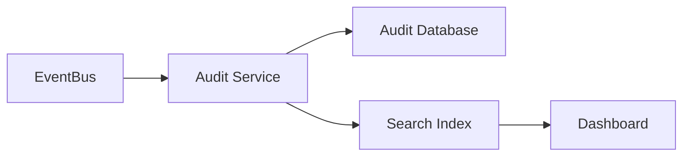
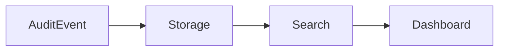
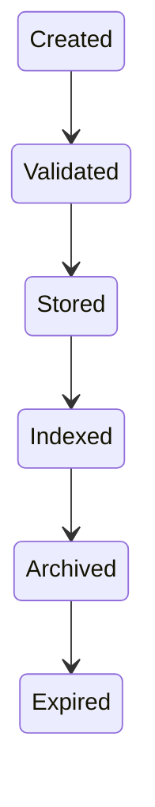
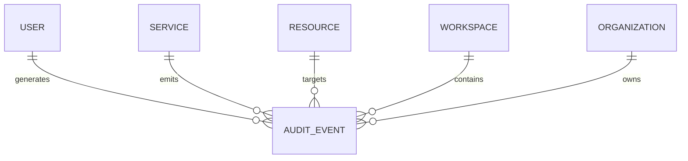

# Audit Logging

> AI Social OS Platform Layer

Version: 2.0.0

Status: Stable

Last Updated: 2026-07-25

---

# Table of Contents

- Overview
- Objectives
- Why Audit Logging
- Audit Architecture
- Audit Event Model
- Event Sources
- Event Categories
- Audit Record Structure
- Event Lifecycle
- Data Retention
- Search & Query
- Integrity
- Security
- Compliance
- Audit APIs
- Design Principles
- Design Decisions
- Summary

---

# Overview

Audit Logging chịu trách nhiệm ghi nhận toàn bộ các hoạt động quan trọng diễn ra trong AI Social OS.

Khác với Application Logs dùng để phục vụ Debug hoặc Monitoring, Audit Logs tập trung vào việc trả lời các câu hỏi.

- Ai thực hiện?
- Thực hiện khi nào?
- Thực hiện ở đâu?
- Thực hiện hành động gì?
- Tác động lên tài nguyên nào?
- Kết quả là gì?

Audit Log là thành phần bắt buộc trong mọi môi trường Production.

---

# Objectives

Audit Logging hướng tới.

- Complete Traceability
- Compliance
- Security Investigation
- Accountability
- Immutable History
- Centralized Storage
- High Performance
- Searchable

---

# Why Audit Logging

Nếu không có Audit Log.

- Không biết ai xóa Workflow.
- Không biết ai đổi Secret.
- Không biết Agent nào bị chỉnh sửa.
- Không biết API Key bị tạo lúc nào.
- Không thể điều tra sự cố.

Audit Logging giúp tái hiện toàn bộ lịch sử hoạt động của hệ thống.

---

# Audit Architecture



Audit Service chỉ ghi nhận sự kiện.

Không tham gia Business Logic.

---

# Audit Event Model



Mỗi hành động quan trọng sinh ra một Audit Event.

---

# Event Sources

Audit Event có thể đến từ.

```text
Authentication

Authorization

Workspace

Organization

Workflow

Runtime

Agents

Knowledge

Files

Secrets

Billing

Plugins

MCP

API Gateway
```

---

# Event Categories

Ví dụ.

```text
Authentication

Authorization

Security

Configuration

Execution

Workflow

Knowledge

Storage

Administration

Billing

Integration

Runtime
```

---

# Audit Record Structure

Một Audit Record bao gồm.

```text
Audit ID

Timestamp

Actor

Actor Type

Organization

Workspace

Service

Resource

Resource ID

Action

Status

IP Address

User Agent

Request ID

Correlation ID

Metadata
```

Ví dụ.

```text
Action

Create Workflow

Actor

user_123

Workspace

marketing

Result

Success
```

---

# Actor Model

Actor có thể là.

```text
User

Service Account

Internal Service

Plugin

Connector

Scheduler

Automation

API Key
```

Điều này giúp theo dõi cả hoạt động của con người và hệ thống.

---

# Resource Model

Ví dụ.

```text
Workspace

Workflow

Agent

Execution

Knowledge Base

Prompt

Plugin

Secret

Connector

File

Organization
```

---

# Event Lifecycle



Audit Event không được sửa sau khi đã lưu.

---

# Correlation ID

Mỗi Request có một Correlation ID.

```mermaid
flowchart LR
```

Toàn bộ Event trong chuỗi này đều dùng cùng một Correlation ID.

Điều này giúp truy vết toàn bộ Request.

---

# Search & Query

Audit Service hỗ trợ tìm kiếm theo.

- User
- Workspace
- Organization
- Resource
- Action
- Time Range
- Service
- Status
- Correlation ID

---

# Data Retention

Ví dụ.

| Event Type | Retention |
|------------|-----------|
| Authentication | 1 năm |
| Authorization | 1 năm |
| Secret Access | 3 năm |
| Billing | 7 năm |
| Security | 7 năm |
| Workflow Execution | 180 ngày |

Retention Policy có thể thay đổi theo Organization.

---

# Integrity

Audit Logs phải đảm bảo.

- Append Only
- Immutable
- Tamper Resistant
- Timestamped
- Digitally Verifiable (tùy chọn)

Không cho phép cập nhật hoặc xóa từng bản ghi.

---

# Security

Audit Database phải.

- Encrypt at Rest
- Encrypt in Transit
- Access Control
- Read-only Access
- Backup
- Disaster Recovery

Chỉ Administrator hoặc Security Auditor mới có quyền truy cập đầy đủ.

---

# Compliance

Audit Logging hỗ trợ.

- ISO 27001
- SOC 2
- GDPR
- HIPAA (nếu áp dụng)
- PCI DSS (nếu áp dụng)

Việc tuân thủ phụ thuộc vào cách triển khai và cấu hình của tổ chức.

---

# Audit APIs

Ví dụ.

```text
GET    /audit

GET    /audit/{id}

GET    /audit/search

GET    /audit/users/{userId}

GET    /audit/workspaces/{workspaceId}

GET    /audit/correlation/{id}

POST   /audit/export
```

---

# Audit Relationships



---

# Design Principles

Audit Logging được xây dựng theo các nguyên tắc.

- Append Only
- Immutable
- Traceable
- Searchable
- Centralized
- Event Driven
- Secure by Default
- Compliance Ready

---

# Design Decisions

| Decision | Reason |
|-----------|--------|
| Audit Service độc lập | Dễ mở rộng |
| Event Bus Integration | Không ảnh hưởng hiệu năng Service |
| Immutable Storage | Chống chỉnh sửa |
| Correlation ID | Truy vết xuyên Service |
| Search Index | Tìm kiếm nhanh |
| Retention Policy | Kiểm soát dung lượng |
| Centralized Storage | Quản lý thống nhất |

---

# Summary

Audit Logging cung cấp khả năng ghi nhận, lưu trữ và truy vết toàn bộ các hoạt động quan trọng trong AI Social OS.

Thông qua mô hình Event-Driven, Correlation ID, Immutable Storage và Search Index, Audit Logging giúp Platform đáp ứng các yêu cầu về bảo mật, điều tra sự cố, tuân thủ quy định và quản trị doanh nghiệp ở quy mô lớn.