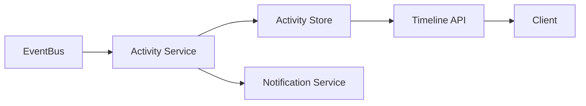
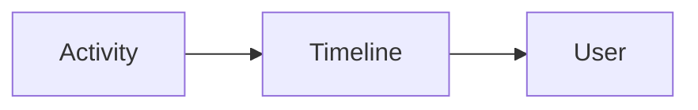
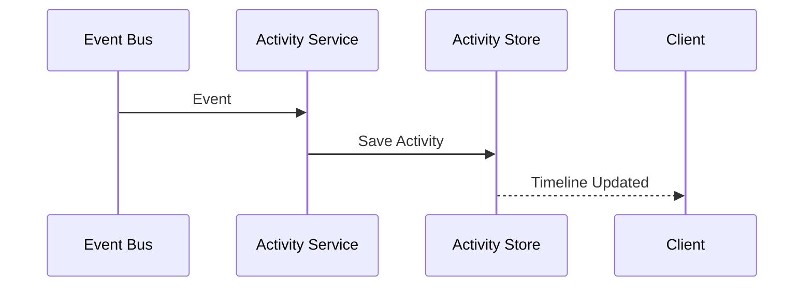
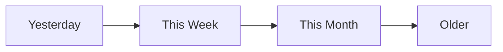
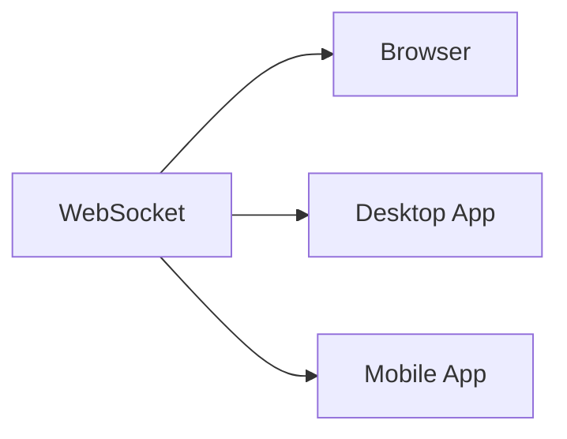
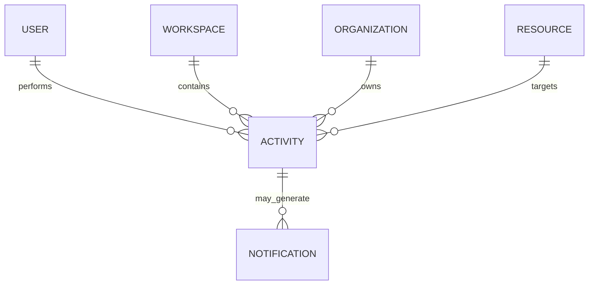

# Activity Feed

> AI Social OS Platform Layer

Version: 2.0.0

Status: Stable

Last Updated: 2026-07-25

---

# Table of Contents

- Overview
- Objectives
- Activity vs Audit
- Architecture
- Activity Sources
- Feed Model
- Feed Types
- Feed Generation
- Feed Aggregation
- Feed Visibility
- Feed Timeline
- Feed Filtering
- Notifications
- APIs
- Design Principles
- Design Decisions
- Summary

---

# Overview

Activity Feed cung cấp dòng thời gian (timeline) các hoạt động diễn ra trong AI Social OS nhằm giúp người dùng theo dõi thay đổi của Workspace, Project và Team.

Khác với Audit Logging phục vụ bảo mật và tuân thủ, Activity Feed hướng đến trải nghiệm người dùng.

Ví dụ.

- Ai tạo Agent?
- Workflow nào vừa được cập nhật?
- Thành viên nào vừa tham gia Workspace?
- Execution nào vừa hoàn thành?
- Plugin nào vừa được cài đặt?

---

# Objectives

Activity Feed hướng tới.

- Team Collaboration
- Timeline Visualization
- Workspace Awareness
- Real-time Updates
- User Engagement
- Searchable History
- Extensible
- Event Driven

---

# Activity vs Audit

| Activity Feed | Audit Log |
|---------------|-----------|
| Hiển thị cho người dùng | Dành cho quản trị và bảo mật |
| Có thể tùy chỉnh | Không được chỉnh sửa |
| Tập trung vào cộng tác | Tập trung vào tuân thủ |
| Có thể gom nhóm sự kiện | Ghi nhận đầy đủ mọi hành động |
| Có thể xóa theo chính sách | Thường lưu bất biến |

---

# Architecture



---

# Activity Sources

Activity có thể được tạo từ.

```text
Workspace

Organization

Workflow

Agent

Execution

Knowledge Base

Prompt

Plugin

Connector

User

Billing

Runtime

Deployment
```

---

# Feed Model



Không phải mọi Event đều tạo Activity.

Chỉ các sự kiện có giá trị đối với người dùng mới xuất hiện trong Feed.

---

# Activity Entity

```text
Activity

├── Activity ID
├── Actor
├── Action
├── Target Resource
├── Workspace
├── Organization
├── Timestamp
├── Visibility
├── Metadata
└── Related Resources
```

---

# Feed Types

Ví dụ.

```text
Workspace Activity

Organization Activity

Project Activity

Workflow Activity

Agent Activity

Execution Activity

Knowledge Activity

System Activity
```

---

# Activity Actions

Ví dụ.

```text
Created

Updated

Deleted

Executed

Shared

Commented

Approved

Rejected

Invited

Joined

Left

Published

Installed
```

---

# Feed Generation



---

# Feed Aggregation

Nhiều Event liên tiếp có thể được gom thành một Activity.

Ví dụ.

```text
John updated 8 workflows
```

thay vì hiển thị 8 bản ghi riêng biệt.

Điều này giúp Timeline ngắn gọn và dễ theo dõi hơn.

---

# Feed Visibility

Activity được giới hạn theo phạm vi.

```text
Platform

Organization

Workspace

Project

Private
```

Người dùng chỉ nhìn thấy Activity mà họ có quyền truy cập.

---

# Timeline



Timeline được sắp xếp theo thời gian giảm dần.

---

# Feed Filtering

Người dùng có thể lọc theo.

- User
- Workspace
- Resource
- Action
- Date Range
- Project
- Agent
- Workflow
- Status

---

# Real-time Updates

Activity Feed hỗ trợ cập nhật theo thời gian thực.



Người dùng không cần tải lại trang để thấy Activity mới.

---

# Relationship with Notifications

Không phải mọi Activity đều tạo Notification.

Ví dụ.

| Activity | Notification |
|-----------|--------------|
| Workflow Updated | Không |
| User Mentioned | Có |
| Workspace Invitation | Có |
| Execution Completed | Tùy cấu hình |
| Billing Updated | Có |

Notification được tạo dựa trên Rule Engine.

---

# APIs

Ví dụ.

```text
GET    /activities

GET    /activities/{id}

GET    /activities/workspaces/{workspaceId}

GET    /activities/users/{userId}

GET    /activities/organizations/{organizationId}

GET    /activities/search
```

---

# Activity Relationships



---

# Design Principles

Activity Feed được xây dựng theo các nguyên tắc.

- User Oriented
- Timeline Based
- Event Driven
- Real-time Ready
- Searchable
- Permission Aware
- Extensible
- Collaborative

---

# Design Decisions

| Decision | Reason |
|-----------|--------|
| Tách khỏi Audit Log | Mục đích sử dụng khác nhau |
| Event Driven | Không ảnh hưởng Business Logic |
| Timeline Aggregation | Giảm nhiễu thông tin |
| Visibility theo Scope | Đảm bảo bảo mật |
| WebSocket Support | Cập nhật thời gian thực |
| Filterable Feed | Dễ tìm kiếm |
| Notification Integration | Tăng khả năng cộng tác |

---

# Summary

Activity Feed cung cấp dòng thời gian các hoạt động quan trọng trong AI Social OS nhằm hỗ trợ cộng tác và theo dõi tiến trình làm việc.

Thông qua cơ chế Event-Driven, Timeline Aggregation, Visibility theo quyền truy cập và cập nhật thời gian thực, Activity Feed mang lại trải nghiệm minh bạch, trực quan và phù hợp cho môi trường làm việc nhóm trên nền tảng AI.