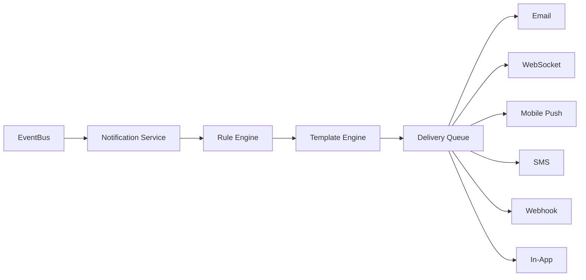
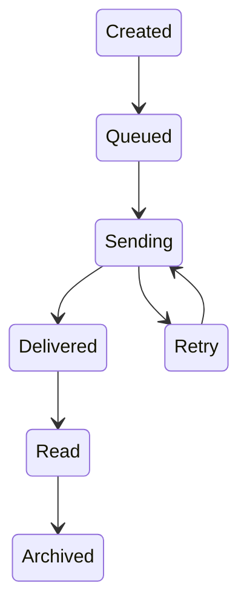
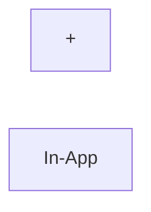
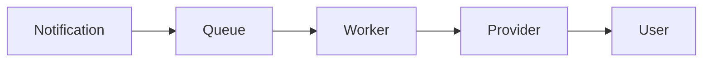
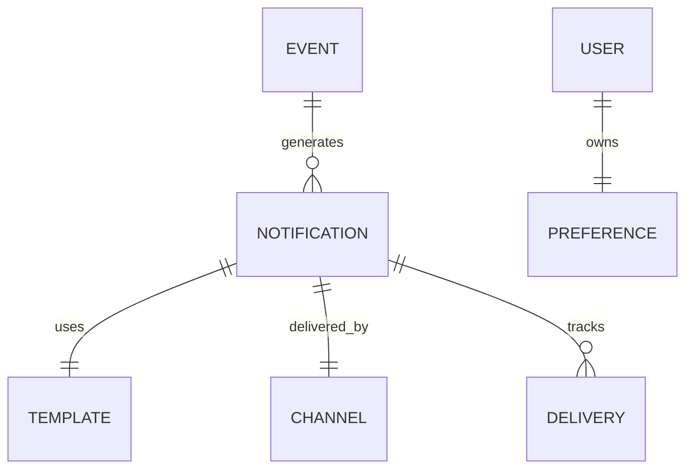

# Notification Service

> AI Social OS Platform Layer

Version: 2.0.0

Status: Stable

Last Updated: 2026-07-25

---

# Table of Contents

- Overview
- Objectives
- Notification Architecture
- Notification Lifecycle
- Notification Channels
- Notification Types
- Notification Events
- Notification Rules
- User Preferences
- Delivery Pipeline
- Retry Strategy
- Scheduling
- Templates
- Notification API
- Design Principles
- Design Decisions
- Summary

---

# Overview

Notification Service chịu trách nhiệm gửi thông báo đến người dùng khi có các sự kiện quan trọng xảy ra trong AI Social OS.

Notification giúp người dùng.

- Biết điều gì vừa xảy ra
- Không bỏ lỡ sự kiện quan trọng
- Theo dõi tiến trình Workflow
- Cộng tác hiệu quả
- Nhận cảnh báo hệ thống

Notification không thực hiện Business Logic.

Nó chỉ tiêu thụ Event và gửi thông báo.

---

# Objectives

Notification Service hướng tới.

- Real-time Delivery
- Multi Channel
- User Preferences
- Reliable Delivery
- Retry Support
- Scheduling
- High Throughput
- Extensible

---

# Notification Architecture



---

# Notification Lifecycle



---

# Notification Channels

Platform hỗ trợ nhiều kênh.

```text
In-App

Email

WebSocket

Mobile Push

SMS

Webhook

Slack

Microsoft Teams

Discord
```

Có thể mở rộng thêm thông qua Plugin.

---

# Notification Types

Ví dụ.

```text
System

Workspace

Workflow

Execution

Agent

Knowledge

Security

Billing

Invitation

Reminder

Approval

Alert
```

---

# Notification Events

Ví dụ.

```text
Workflow Finished

Execution Failed

Execution Completed

User Invited

Workspace Shared

Comment Added

Secret Rotated

License Expired

Billing Failed

Plugin Installed

Deployment Completed
```

---

# Rule Engine

Notification được quyết định bởi Rule Engine.

Ví dụ.



Ví dụ khác.

```mermaid
flowchart LR
```

---

# User Preferences

Mỗi User có cấu hình riêng.

```text
Email

ON

Push

OFF

SMS

OFF

Slack

ON
```

Ngoài ra có thể cấu hình.

- Quiet Hours
- Notification Frequency
- Digest Mode
- Language
- Time Zone

---

# Delivery Pipeline



Worker có thể Scale độc lập.

---

# Retry Strategy

Nếu gửi thất bại.

```mermaid
flowchart LR
```

Các Notification không gửi được sẽ được lưu để xử lý sau.

---

# Scheduling

Notification có thể.

- Gửi ngay
- Gửi theo giờ
- Gửi theo lịch
- Gửi định kỳ
- Gửi theo Cron

Ví dụ.

```text
Daily Summary

08:00

Asia/Ho_Chi_Minh
```

---

# Notification Templates

Mỗi Notification sử dụng Template.

```text
Subject

Body

Variables

Localization

Branding
```

Ví dụ.

```
Hello {{user_name}}

Workflow "{{workflow_name}}" completed successfully.
```

---

# Template Engine

Template hỗ trợ.

- Variables
- Conditional Blocks
- Localization
- Markdown
- HTML
- Plain Text

Ví dụ.

```text
{{workspace}}

{{workflow}}

{{execution}}

{{user}}
```

---

# Notification Providers

Ví dụ.

```text
SMTP

Amazon SES

SendGrid

Firebase

APNs

Slack API

Discord API

Webhook
```

Provider có thể thay đổi mà không ảnh hưởng Business Logic.

---

# Notification API

Ví dụ.

```text
POST   /notifications

GET    /notifications

GET    /notifications/{id}

PATCH  /notifications/{id}/read

DELETE /notifications/{id}

POST   /notifications/test

GET    /notification-preferences

PATCH  /notification-preferences
```

---

# Notification Relationships



---

# Security Considerations

Notification Service phải.

- Kiểm tra Permission trước khi gửi.
- Không gửi Secret.
- Không gửi Token.
- Mã hóa kết nối tới Provider.
- Ghi Audit Log.
- Hỗ trợ Rate Limiting.

---

# Design Principles

Notification Service được xây dựng theo các nguyên tắc.

- Event Driven
- User Centric
- Multi Channel
- Reliable Delivery
- Configurable
- Extensible
- Scalable
- Observable

---

# Design Decisions

| Decision | Reason |
|-----------|--------|
| Event Bus Integration | Không ảnh hưởng Business Logic |
| Queue Based Delivery | Chịu tải lớn |
| Rule Engine | Linh hoạt |
| Template Engine | Tái sử dụng |
| Retry Strategy | Tăng độ tin cậy |
| User Preferences | Cá nhân hóa |
| Multi-channel | Hỗ trợ nhiều nền tảng |

---

# Summary

Notification Service chịu trách nhiệm tiếp nhận Event, quyết định thông báo cần gửi thông qua Rule Engine, xây dựng nội dung bằng Template Engine và phân phối đến người dùng qua nhiều kênh khác nhau.

Thông qua Queue, Retry Strategy, User Preferences và Multi-channel Delivery, Notification Service đảm bảo các thông báo được gửi đúng đối tượng, đúng thời điểm và có khả năng mở rộng cho hệ thống AI Social OS ở quy mô lớn.