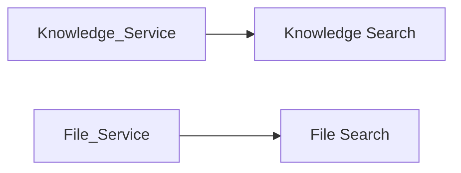
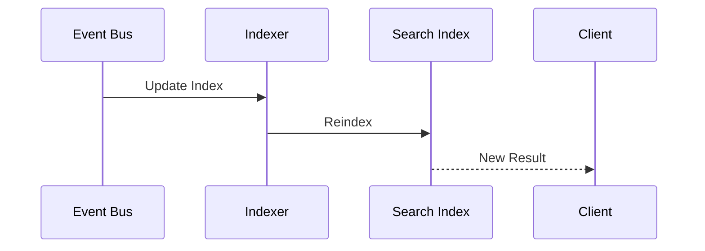
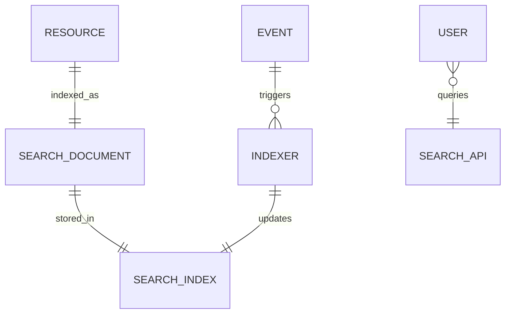

# Search Service

> AI Social OS Platform Layer

Version: 2.0.0

Status: Stable

Last Updated: 2026-07-25

---

# Table of Contents

- Overview
- Objectives
- Why Search Service
- Search Architecture
- Search Pipeline
- Search Sources
- Search Index
- Search Model
- Query Processing
- Ranking
- Filters
- Search Scopes
- Real-time Indexing
- Search APIs
- Design Principles
- Design Decisions
- Summary

---

# Overview

Search Service cung cấp khả năng tìm kiếm thống nhất trên toàn bộ AI Social OS.

Thay vì mỗi Service tự triển khai chức năng tìm kiếm riêng, toàn bộ dữ liệu được lập chỉ mục và truy vấn thông qua Search Service.

Người dùng có thể tìm kiếm.

- Workspaces
- Projects
- Agents
- Workflows
- Executions
- Knowledge Bases
- Prompts
- Files
- Plugins
- Connectors
- Users
- Documents

Search Service chỉ chịu trách nhiệm lập chỉ mục và truy vấn.

Nó không lưu dữ liệu gốc.

---

# Objectives

Search Service hướng tới.

- Unified Search
- Full-text Search
- Near Real-time Indexing
- Multi-Tenant
- Fast Query
- Permission-aware Results
- Scalable
- Extensible

---

# Why Search Service

Nếu mỗi Service đều có Search riêng.



sẽ dẫn đến.

- Trùng lặp dữ liệu
- Khó tối ưu
- Khó mở rộng
- Không có Unified Search

Search Service giải quyết vấn đề bằng một hệ thống tìm kiếm tập trung.

---

# Search Architecture


---

# Search Pipeline


Mọi thay đổi dữ liệu đều được đồng bộ thông qua Event.

---

# Search Sources

Search Service lập chỉ mục từ.

```text
Workspace

Organization

Workflow

Agent

Execution

Knowledge Base

Prompt

Plugin

Connector

User

File

Media
```

Mỗi Resource có Schema Index riêng.

---

# Search Index

Ví dụ.

```text
Workflow Index

Knowledge Index

File Index

User Index

Plugin Index

Execution Index
```

Có thể triển khai trên nhiều Node để tăng khả năng mở rộng.

---

# Search Document

Ví dụ.

```text
Document ID

Resource Type

Workspace ID

Organization ID

Title

Description

Tags

Owner

Content

Created At

Updated At

Metadata
```

Search Document chỉ chứa dữ liệu phục vụ tìm kiếm.

---

# Query Processing


Trước khi trả kết quả, hệ thống luôn áp dụng kiểm tra quyền truy cập.

---

# Ranking

Kết quả tìm kiếm được xếp hạng dựa trên.

- Keyword Match
- Exact Match
- Relevance Score
- Popularity
- Recent Activity
- User Context
- Workspace Context

Có thể bổ sung AI Ranking trong tương lai.

---

# Filters

Search hỗ trợ lọc theo.

- Workspace
- Organization
- Resource Type
- Tags
- Owner
- Status
- Created Time
- Updated Time
- Labels

Ví dụ.

```text
Type = Workflow

Status = Active

Owner = John

Workspace = AI Lab
```

---

# Search Scopes

Search được giới hạn theo.

```mermaid
flowchart LR
```

Người dùng chỉ nhận được kết quả trong phạm vi được phép truy cập.

---

# Full-text Search

Search hỗ trợ.

- Exact Match
- Partial Match
- Prefix Search
- Phrase Search
- Wildcard Search
- Fuzzy Search

Ví dụ.

```text
customer onboarding
```

có thể tìm thấy.

```
Customer Onboarding Workflow
```

---

# Real-time Indexing



Việc lập chỉ mục diễn ra gần thời gian thực.

---

# Search API

Ví dụ.

```text
GET /search?q=workflow

GET /search/workflows

GET /search/files

GET /search/knowledge

GET /search/users

GET /search/plugins
```

Search API cung cấp một giao diện thống nhất cho mọi loại tài nguyên.

---

# Search Relationships



---

# Security Considerations

Search Service phải.

- Kiểm tra Permission trước khi trả kết quả.
- Không lập chỉ mục Secret.
- Không lập chỉ mục Token.
- Không lập chỉ mục dữ liệu nhạy cảm nếu không được phép.
- Hỗ trợ Audit cho các truy vấn quan trọng.

Permission Filtering luôn được áp dụng trước Ranking.

---

# Performance Optimizations

Các kỹ thuật tối ưu.

- Incremental Indexing
- Batch Indexing
- Query Cache
- Result Cache
- Sharding
- Replication
- Parallel Search

Mục tiêu là duy trì độ trễ thấp ngay cả khi số lượng tài liệu tăng lớn.

---

# Design Principles

Search Service được xây dựng theo các nguyên tắc.

- Search First
- Event Driven
- Permission Aware
- Near Real-time
- Scalable
- API First
- Extensible
- Observable

---

# Design Decisions

| Decision | Reason |
|-----------|--------|
| Search Service độc lập | Tái sử dụng cho toàn Platform |
| Event-driven Indexing | Đồng bộ dữ liệu hiệu quả |
| Permission Filtering | Bảo mật |
| Unified Search API | Trải nghiệm nhất quán |
| Incremental Indexing | Giảm tải hệ thống |
| Separate Search Documents | Không phụ thuộc dữ liệu gốc |
| Multi-index Architecture | Dễ mở rộng |

---

# Summary

Search Service cung cấp khả năng tìm kiếm thống nhất cho toàn bộ AI Social OS bằng cách lập chỉ mục các tài nguyên từ nhiều Platform Services và Runtime Services.

Thông qua Event-driven Indexing, Permission-aware Query Processing, Unified Search API và khả năng mở rộng theo nhiều chỉ mục, Search Service mang lại trải nghiệm tìm kiếm nhanh, chính xác và an toàn trong môi trường Multi-Tenant.