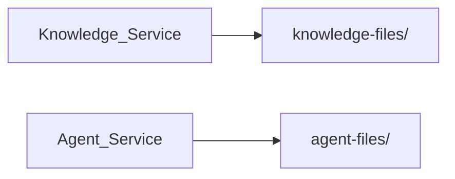
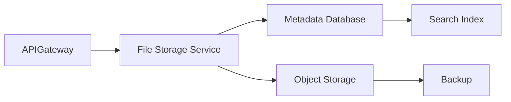
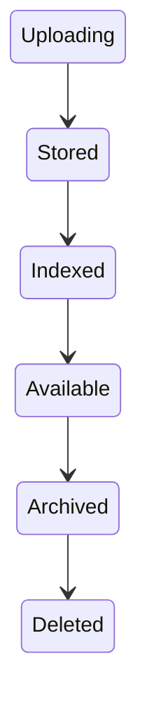
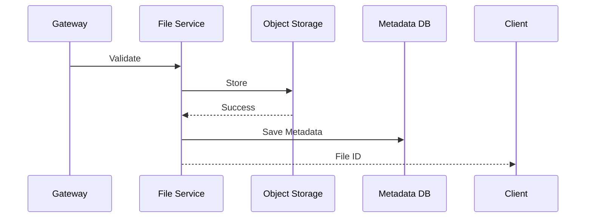
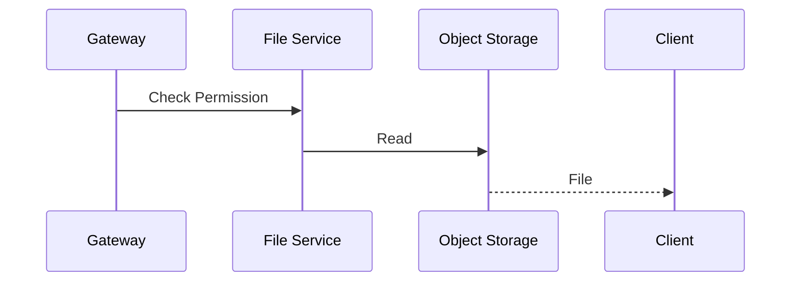
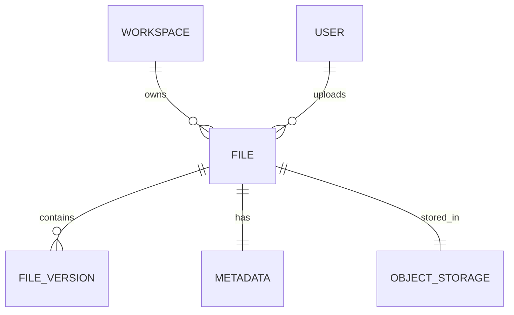

# File Storage Service

> AI Social OS Platform Layer

Version: 2.0.0

Status: Stable

Last Updated: 2026-07-25

---

# Table of Contents

- Overview
- Objectives
- Why File Storage
- Storage Architecture
- File Model
- File Lifecycle
- Storage Providers
- Upload Pipeline
- Download Pipeline
- Metadata Management
- Access Control
- Versioning
- Deduplication
- Retention Policy
- Events
- APIs
- Design Principles
- Design Decisions
- Summary

---

# Overview

File Storage Service chịu trách nhiệm lưu trữ và quản lý toàn bộ tệp tin trong AI Social OS.

Các loại dữ liệu được quản lý bao gồm.

- Documents
- Images
- Videos
- Audio
- PDFs
- CSV
- JSON
- ZIP
- Model Files
- Knowledge Files
- Prompt Assets
- Workflow Attachments

File Storage chỉ quản lý dữ liệu nhị phân và Metadata.

Business Logic được xử lý bởi các Platform Services khác.

---

# Objectives

File Storage hướng tới.

- Unified File Storage
- Secure Upload
- High Availability
- Multi-Tenant
- Versioning
- Deduplication
- Scalable
- Extensible

---

# Why File Storage

Nếu mỗi Service tự lưu File.



sẽ dẫn đến.

- Khó quản lý
- Trùng lặp dữ liệu
- Không có Versioning
- Không có Audit
- Khó Backup

File Storage Service cung cấp một kho lưu trữ thống nhất.

---

# Storage Architecture



---

# File Model

```text
File

├── File ID
├── File Name
├── Original Name
├── MIME Type
├── Size
├── Hash
├── Storage Path
├── Workspace ID
├── Owner
├── Version
├── Created At
└── Metadata
```

File ID là định danh duy nhất trong toàn hệ thống.

---

# File Lifecycle



---

# Storage Providers

File Storage hỗ trợ nhiều Backend.

```text
Amazon S3

Azure Blob Storage

Google Cloud Storage

MinIO

Ceph

Local Storage

NAS
```

Storage Provider có thể thay thế mà không ảnh hưởng Application.

---

# Upload Pipeline



---

# Download Pipeline



Permission luôn được kiểm tra trước khi tải xuống.

---

# Metadata Management

Metadata được lưu riêng.

```text
File Metadata

├── File Name
├── Size
├── Type
├── Owner
├── Workspace
├── Tags
├── Labels
├── Version
└── Checksum
```

Metadata hỗ trợ Search và Audit.

---

# Access Control

Quyền truy cập File dựa trên.

- Workspace
- Membership
- Roles
- Permissions
- Sharing Policy

Ví dụ.

```text
workspace.file.read

workspace.file.upload

workspace.file.delete

workspace.file.share
```

---

# Versioning

File có thể có nhiều Version.

```text
File

├── v1

├── v2

├── v3

└── v4
```

Người dùng có thể.

- Xem lịch sử
- Khôi phục Version cũ
- So sánh Metadata

---

# Deduplication

Khi Upload.

```mermaid
flowchart LR
```

Nếu File giống nhau.

Chỉ Metadata mới được tạo.

Object gốc không bị nhân bản.

---

# Retention Policy

Ví dụ.

| File Type | Retention |
|------------|-----------|
| Temporary Upload | 24 giờ |
| Workflow Attachment | Theo Workspace |
| Knowledge File | Không giới hạn |
| Execution Artifact | 90 ngày |
| Audit Export | 1 năm |

Retention được cấu hình theo Organization hoặc Workspace.

---

# Events

Ví dụ.

- FileUploaded
- FileUpdated
- FileDeleted
- FileDownloaded
- FileShared
- FileVersionCreated
- FileArchived

Các Event được phát lên Event Bus.

---

# APIs

Ví dụ.

```text
POST   /files

GET    /files

GET    /files/{id}

DELETE /files/{id}

PATCH  /files/{id}

POST   /files/{id}/share

GET    /files/{id}/versions

POST   /files/{id}/restore
```

---

# File Relationships



---

# Security Considerations

File Storage phải.

- Kiểm tra Permission trước mọi thao tác.
- Quét Malware nếu cần.
- Mã hóa dữ liệu khi lưu trữ.
- Mã hóa khi truyền tải.
- Kiểm tra MIME Type.
- Giới hạn kích thước Upload.
- Ghi Audit Log.

Không.

- Tin tưởng MIME Type từ Client.
- Cho phép truy cập trực tiếp Object Storage.
- Lưu File ngoài Workspace nếu không có Ownership.

---

# Performance Optimizations

Các kỹ thuật tối ưu.

- Multipart Upload
- Chunk Upload
- CDN
- Object Cache
- Parallel Download
- Compression
- Deduplication

---

# Design Principles

File Storage được xây dựng theo các nguyên tắc.

- Object Storage First
- Metadata Separation
- Secure by Default
- Multi-Tenant
- Version Controlled
- Event Driven
- Scalable
- Observable

---

# Design Decisions

| Decision | Reason |
|-----------|--------|
| Metadata tách khỏi Object | Tăng hiệu năng |
| Object Storage Backend | Dễ mở rộng |
| Versioning | Khôi phục dữ liệu |
| Deduplication | Tiết kiệm dung lượng |
| Permission theo Workspace | Hỗ trợ Multi-Tenant |
| Event Driven | Đồng bộ Platform |
| Provider Abstraction | Không phụ thuộc nhà cung cấp |

---

# Summary

File Storage Service là dịch vụ quản lý và lưu trữ tập trung toàn bộ tệp tin của AI Social OS.

Thông qua kiến trúc Object Storage, Metadata Management, Versioning, Deduplication và Access Control theo Workspace, File Storage cung cấp một nền tảng lưu trữ an toàn, mở rộng và phù hợp cho các ứng dụng AI hoạt động trên quy mô doanh nghiệp. 