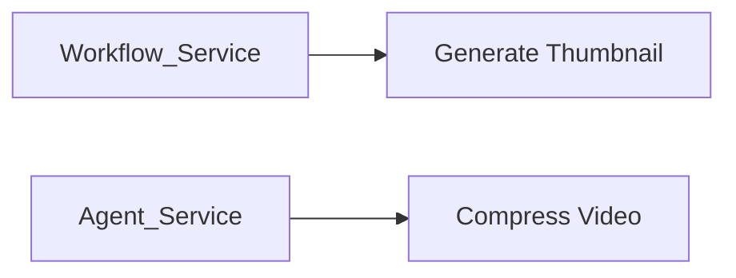
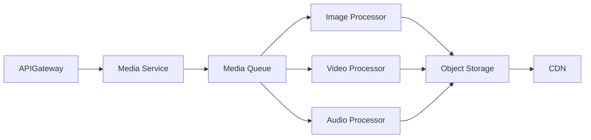
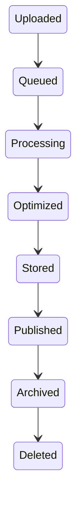
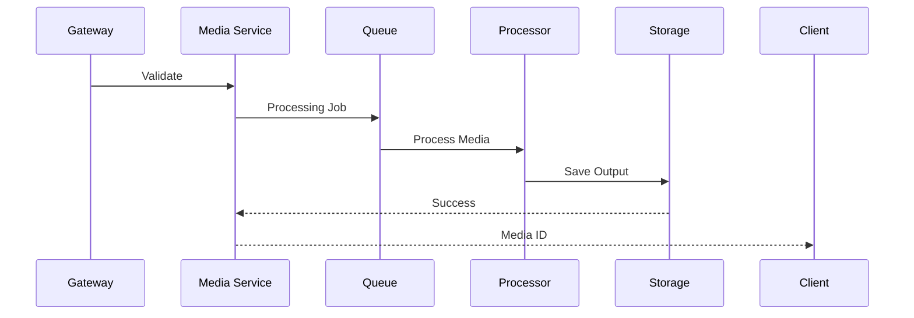
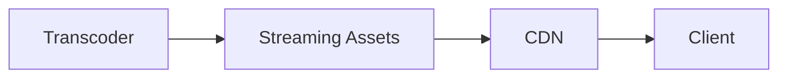
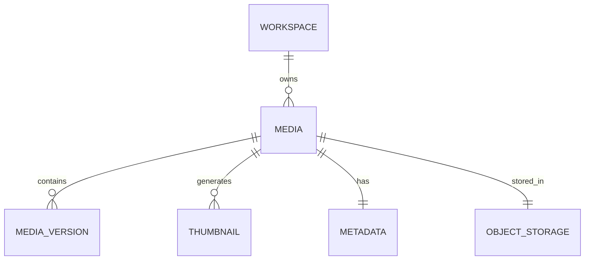

# Media Service

> AI Social OS Platform Layer

Version: 2.0.0

Status: Stable

Last Updated: 2026-07-25

---

# Table of Contents

- Overview
- Objectives
- Why Media Service
- Architecture
- Supported Media
- Media Lifecycle
- Upload Pipeline
- Processing Pipeline
- Storage Model
- Media Metadata
- Media Transformations
- Thumbnail Generation
- Streaming
- Access Control
- Events
- APIs
- Design Principles
- Design Decisions
- Summary

---

# Overview

Media Service chịu trách nhiệm xử lý, lưu trữ và phân phối các nội dung đa phương tiện trong AI Social OS.

Khác với File Storage Service chỉ lưu trữ dữ liệu nhị phân, Media Service còn thực hiện các tác vụ xử lý như.

- Image Processing
- Video Processing
- Audio Processing
- Thumbnail Generation
- Media Compression
- Format Conversion
- Streaming Preparation
- Metadata Extraction

Media Service được tối ưu cho nội dung đa phương tiện.

---

# Objectives

Media Service hướng tới.

- Centralized Media Processing
- High Performance
- Streaming Ready
- Multi-Tenant
- Scalable
- Secure
- Extensible
- Event Driven

---

# Why Media Service

Nếu Media được xử lý trực tiếp trong từng Service.



sẽ dẫn đến.

- Trùng lặp xử lý
- Khó mở rộng
- Tăng tải cho Business Services
- Không đồng nhất

Media Service tập trung toàn bộ khả năng xử lý Media.

---

# Architecture



---

# Supported Media

Media Service hỗ trợ.

```text
Images

Videos

Audio

PDF Preview

Animated GIF

SVG

Icons

Documents Preview

Screen Recording

AI Generated Media
```

Có thể mở rộng thông qua Plugin Processor.

---

# Media Lifecycle



---

# Upload Pipeline



---

# Processing Pipeline

Ví dụ.

```mermaid
flowchart LR
```

Pipeline được cấu hình theo từng loại Media.

---

# Storage Model

Media được lưu theo cấu trúc.

```mermaid
flowchart LR
```

Các phiên bản được liên kết với cùng một Media ID.

---

# Media Metadata

Metadata bao gồm.

```text
Media ID

File Name

Format

Width

Height

Duration

Bitrate

Codec

File Size

Checksum

Owner

Workspace

Tags
```

Metadata phục vụ Search và Streaming.

---

# Image Processing

Các tác vụ phổ biến.

- Resize
- Crop
- Rotate
- Watermark
- Compression
- Format Conversion
- Background Removal (tùy chọn)

---

# Video Processing

Các tác vụ.

- Transcoding
- Compression
- Resolution Scaling
- Thumbnail Extraction
- Preview Generation
- Streaming Package

Ví dụ.

```mermaid
flowchart LR
```

---

# Audio Processing

Ví dụ.

- Format Conversion
- Volume Normalization
- Noise Reduction
- Waveform Generation
- Audio Preview
- Speech Extraction

---

# Thumbnail Generation

Media Service tự động sinh Thumbnail.

Ví dụ.

```mermaid
flowchart LR
```

Đối với Video.

```mermaid
flowchart LR
```

---

# Streaming

Đối với Video và Audio.



Streaming có thể hỗ trợ.

- Adaptive Bitrate
- Progressive Download
- Chunk Streaming

---

# Access Control

Media tuân theo Permission của Workspace.

Ví dụ.

```text
workspace.media.read

workspace.media.upload

workspace.media.delete

workspace.media.share
```

Mọi yêu cầu tải Media đều phải qua Authorization.

---

# Events

Ví dụ.

- MediaUploaded
- MediaProcessed
- MediaOptimized
- ThumbnailGenerated
- MediaDeleted
- MediaShared
- StreamingReady

Các Event được phát lên Event Bus.

---

# APIs

Ví dụ.

```text
POST   /media

GET    /media

GET    /media/{id}

DELETE /media/{id}

GET    /media/{id}/thumbnail

GET    /media/{id}/preview

GET    /media/{id}/stream

POST   /media/{id}/transform
```

---

# Media Relationships



---

# Security Considerations

Media Service phải.

- Quét Malware trước khi xử lý.
- Kiểm tra MIME Type thực tế.
- Giới hạn kích thước Upload.
- Mã hóa dữ liệu khi lưu trữ.
- Mã hóa khi truyền tải.
- Kiểm tra Permission.
- Ghi Audit Log.

Không.

- Thực thi File tải lên.
- Tin tưởng Extension từ Client.
- Cho phép truy cập trực tiếp Object Storage.

---

# Performance Optimizations

Các kỹ thuật tối ưu.

- Parallel Processing
- GPU Acceleration
- Streaming Cache
- CDN Distribution
- Lazy Thumbnail Generation
- Incremental Processing
- Background Jobs

---

# Design Principles

Media Service được xây dựng theo các nguyên tắc.

- Processing First
- Event Driven
- Scalable
- Streaming Ready
- Secure by Default
- Multi-Tenant
- Observable
- Extensible

---

# Design Decisions

| Decision | Reason |
|-----------|--------|
| Tách khỏi File Storage | Chuyên biệt xử lý Media |
| Queue-based Processing | Xử lý bất đồng bộ |
| Derived Assets | Hỗ trợ nhiều kích thước và định dạng |
| Metadata riêng | Tìm kiếm và quản lý hiệu quả |
| Streaming Pipeline | Tối ưu Video và Audio |
| CDN Integration | Giảm độ trễ phân phối |
| Event Driven | Đồng bộ với Platform |

---

# Summary

Media Service là thành phần chuyên trách xử lý và phân phối nội dung đa phương tiện trong AI Social OS.

Thông qua Pipeline xử lý bất đồng bộ, Metadata Management, Thumbnail Generation, Streaming và Access Control theo Workspace, Media Service cung cấp nền tảng quản lý Media hiệu năng cao, an toàn và có khả năng mở rộng cho các ứng dụng AI và cộng tác quy mô lớn.