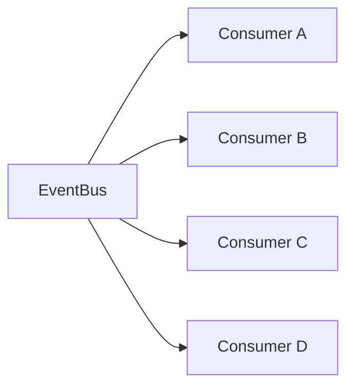
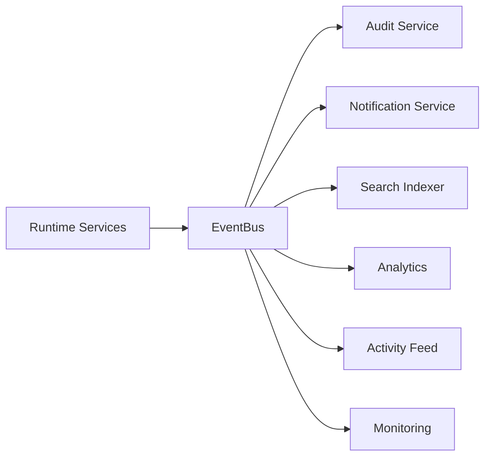
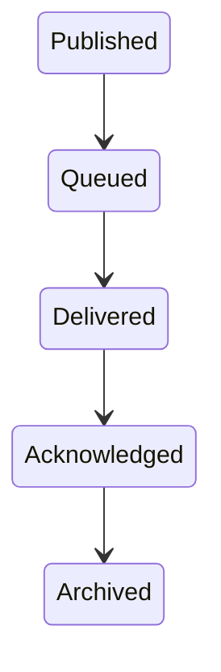
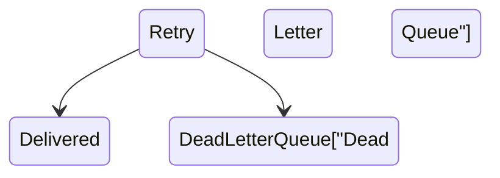
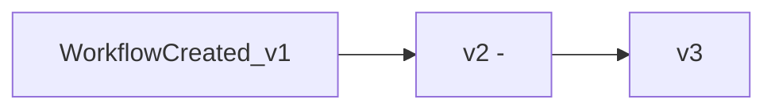
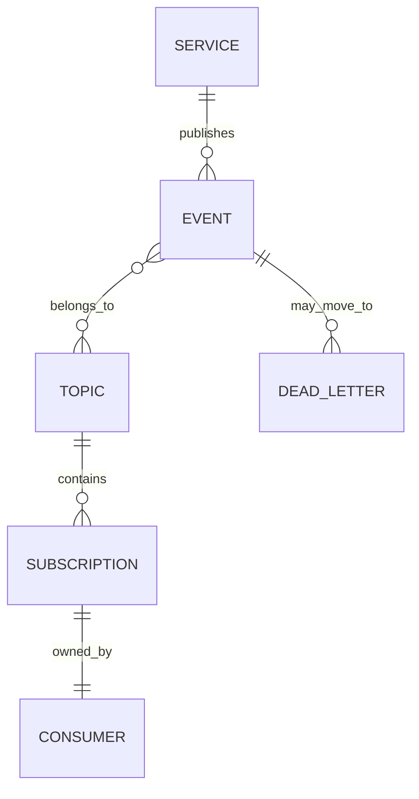

# Event Bus

> AI Social OS Platform Layer

Version: 2.0.0

Status: Stable

Last Updated: 2026-07-25

---

# Table of Contents

- Overview
- Objectives
- Why Event Bus
- Event-Driven Architecture
- Event Bus Architecture
- Event Model
- Event Lifecycle
- Event Producers
- Event Consumers
- Event Topics
- Event Delivery
- Event Ordering
- Retry & Dead Letter Queue
- Event Versioning
- Event Schema
- Event Observability
- Event APIs
- Design Principles
- Design Decisions
- Summary

---

# Overview

Event Bus là hạ tầng giao tiếp bất đồng bộ (Asynchronous Communication Layer) của AI Social OS.

Thay vì các Service gọi trực tiếp lẫn nhau bằng HTTP hoặc gRPC, chúng phát (Publish) và nhận (Subscribe) các Event thông qua Event Bus.

Điều này giúp.

- Giảm sự phụ thuộc giữa các Service
- Tăng khả năng mở rộng
- Hỗ trợ xử lý bất đồng bộ
- Dễ dàng tích hợp Service mới
- Xây dựng kiến trúc Event-Driven

---

# Objectives

Event Bus hướng tới.

- Loose Coupling
- Event-Driven Architecture
- High Throughput
- Reliable Delivery
- Horizontal Scalability
- Fault Tolerance
- Replay Support
- Observability

---

# Why Event Bus

Nếu Service gọi trực tiếp.

```mermaid
flowchart LR
```

Workflow Service phải biết tất cả Service khác.

Điều này làm tăng mức độ phụ thuộc.

Khi sử dụng Event Bus.

```mermaid
flowchart LR
```

Workflow Service không cần biết Consumer nào đang tồn tại.

---

# Event-Driven Architecture



Producer và Consumer hoàn toàn độc lập.

---

# Event Bus Architecture



---

# Event Model

Mỗi Event bao gồm.

```text
Event ID

Event Type

Source

Timestamp

Correlation ID

Workspace ID

Organization ID

Payload

Metadata

Version
```

Event không chứa Business Logic.

Nó chỉ mô tả điều đã xảy ra.

---

# Event Lifecycle



Nếu Delivery thất bại.



---

# Event Producers

Ví dụ.

```text
Authentication Service

Workspace Service

Workflow Service

Runtime Service

Knowledge Service

Agent Service

Billing Service

Plugin Service

API Gateway
```

Bất kỳ Service nào cũng có thể Publish Event.

---

# Event Consumers

Ví dụ.

```text
Audit Service

Notification Service

Analytics

Search Indexer

Activity Feed

Metrics Collector

Monitoring

Automation Engine
```

Một Event có thể có nhiều Consumer.

---

# Event Topics

Ví dụ.

```text
authentication.*

workspace.*

workflow.*

agent.*

execution.*

knowledge.*

billing.*

runtime.*

notification.*

system.*
```

Topic giúp Consumer chỉ nhận các Event cần thiết.

---

# Event Naming Convention

Tên Event sử dụng định dạng.

```text
<Resource><Action>
```

Ví dụ.

```text
WorkflowCreated

WorkflowUpdated

WorkflowDeleted

ExecutionStarted

ExecutionCompleted

ExecutionFailed

SecretRotated

WorkspaceCreated

UserInvited
```

---

# Event Delivery

Event Bus hỗ trợ.

- At Least Once Delivery
- Optional Exactly Once (tùy Backend)
- Durable Delivery
- Persistent Storage

Consumer phải xử lý khả năng nhận cùng một Event nhiều lần.

---

# Event Ordering

Ordering được đảm bảo trong cùng một Partition hoặc Stream.

Ví dụ.

```mermaid
flowchart LR
```

Không đảm bảo thứ tự giữa các Partition khác nhau.

---

# Retry Strategy

Nếu Consumer xử lý thất bại.

```mermaid
flowchart LR
```

Retry Policy có thể cấu hình theo Topic.

---

# Dead Letter Queue

Các Event không xử lý được sẽ được chuyển sang.

```mermaid
flowchart LR
```

DLQ giúp tránh mất dữ liệu và hỗ trợ khắc phục sự cố.

---

# Event Versioning

Event Schema có Version.



Consumer có thể xử lý nhiều Version trong giai đoạn chuyển đổi.

---

# Event Schema

Ví dụ.

```json
{
  "eventId": "...",
  "type": "WorkflowCreated",
  "version": "1.0",
  "timestamp": "...",
  "workspaceId": "...",
  "correlationId": "...",
  "payload": {
    "workflowId": "...",
    "name": "Daily Report"
  }
}
```

Schema phải được quản lý tập trung và tương thích ngược khi có thể.

---

# Event Observability

Theo dõi.

- Publish Rate
- Delivery Rate
- Consumer Lag
- Retry Count
- DLQ Size
- Processing Latency
- Failed Events

Các chỉ số này được gửi đến Monitoring Platform.

---

# Event APIs

Ví dụ.

```text
POST   /events/publish

GET    /events/topics

GET    /events/{id}

POST   /events/replay

GET    /events/dead-letter

POST   /events/dead-letter/retry
```

Các API chủ yếu phục vụ quản trị và vận hành.

---

# Event Relationships



---

# Security Considerations

Event Bus phải.

- Xác thực Producer.
- Xác thực Consumer.
- Kiểm tra quyền Publish và Subscribe.
- Mã hóa dữ liệu khi truyền tải.
- Ghi Audit Log.
- Hỗ trợ Replay có kiểm soát.

Không cho phép Consumer truy cập Topic ngoài phạm vi được cấp quyền.

---

# Design Principles

Event Bus được xây dựng theo các nguyên tắc.

- Event Driven
- Loose Coupling
- Reliable Messaging
- Asynchronous First
- Observable
- Scalable
- Fault Tolerant
- API Independent

---

# Design Decisions

| Decision | Reason |
|-----------|--------|
| Event Bus trung tâm | Giao tiếp thống nhất |
| Publish/Subscribe | Giảm phụ thuộc giữa Service |
| Topic-based Routing | Dễ mở rộng |
| Retry + DLQ | Tăng độ tin cậy |
| Versioned Events | Hỗ trợ nâng cấp |
| Durable Storage | Không mất Event |
| Replay Support | Khôi phục và Debug |

---

# Summary

Event Bus là hạ tầng giao tiếp bất đồng bộ của AI Social OS, kết nối các Platform Services và Runtime Services thông qua mô hình Publish/Subscribe.

Với Topic-based Routing, Retry, Dead Letter Queue, Event Versioning và khả năng Replay, Event Bus tạo nền tảng cho kiến trúc Event-Driven có khả năng mở rộng cao, chịu lỗi tốt và hỗ trợ tích hợp linh hoạt trong toàn bộ hệ sinh thái AI Social OS.