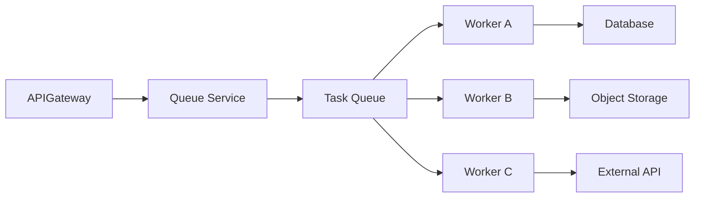
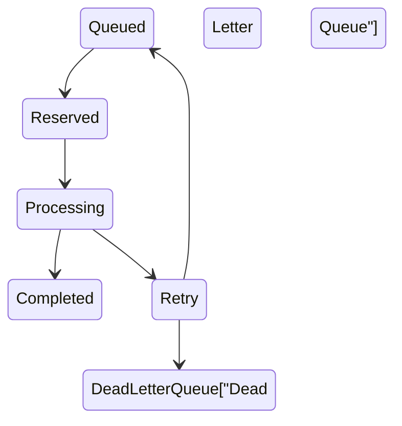
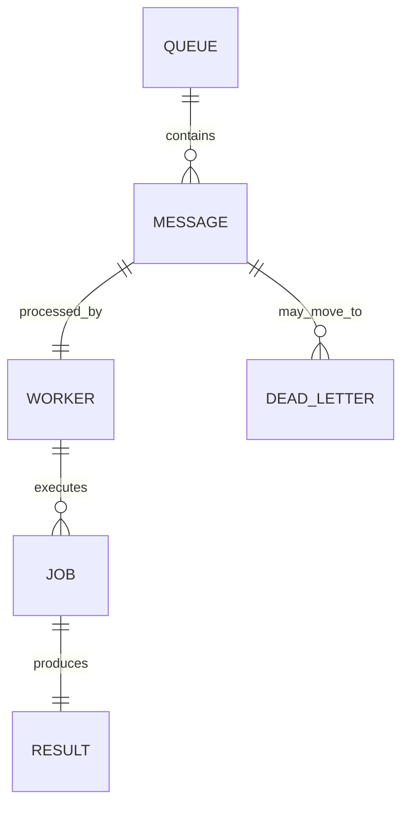

# Message Queue

> AI Social OS Platform Layer

Version: 2.0.0

Status: Stable

Last Updated: 2026-07-25

---

# Table of Contents

- Overview
- Objectives
- Why Message Queue
- Message Queue vs Event Bus
- Queue Architecture
- Message Model
- Queue Lifecycle
- Producers
- Consumers
- Queue Types
- Delivery Guarantees
- Retry Strategy
- Dead Letter Queue
- Priority Queues
- Delayed Messages
- Queue Monitoring
- Queue APIs
- Design Principles
- Design Decisions
- Summary

---

# Overview

Message Queue là hạ tầng xử lý tác vụ bất đồng bộ (Asynchronous Task Processing) của AI Social OS.

Khác với Event Bus dùng để phát tán sự kiện đến nhiều Consumer, Message Queue chịu trách nhiệm phân phối một công việc (Task) đến một Worker phù hợp để thực thi.

Ví dụ.

- AI Inference
- Image Processing
- Video Transcoding
- File Import
- Email Sending
- Report Generation
- Data Synchronization
- Batch Processing

---

# Objectives

Message Queue hướng tới.

- Asynchronous Processing
- Reliable Task Execution
- Load Leveling
- Horizontal Scaling
- Retry Support
- Fault Tolerance
- Priority Scheduling
- High Throughput

---

# Why Message Queue

Nếu Client gọi trực tiếp Service.

```mermaid
flowchart LR
```

Client phải chờ cho đến khi công việc hoàn thành.

Sử dụng Message Queue.

```mermaid
flowchart LR
```

Client chỉ cần nhận Job ID và theo dõi trạng thái.

---

# Message Queue vs Event Bus

| Message Queue | Event Bus |
|---------------|-----------|
| Task Processing | Event Distribution |
| Một Consumer xử lý | Nhiều Consumer nhận |
| Work Queue | Publish / Subscribe |
| Có thể Retry | Có thể Replay |
| Hướng tới Job | Hướng tới Event |

Hai thành phần có thể cùng tồn tại trong một kiến trúc Event-Driven.

---

# Queue Architecture



---

# Message Model

Một Message bao gồm.

```text
Message ID

Queue Name

Task Type

Payload

Priority

Created At

Scheduled At

Retry Count

Correlation ID

Workspace ID

Metadata
```

Message chỉ chứa thông tin cần thiết để Worker thực hiện công việc.

---

# Queue Lifecycle



---

# Producers

Producer có thể là.

```text
Workflow Engine

Runtime

API Gateway

Scheduler

Automation

Webhook

Plugin

Connector
```

Bất kỳ Service nào cũng có thể gửi Task vào Queue.

---

# Consumers

Consumer thường là các Worker.

Ví dụ.

```text
AI Worker

Email Worker

Media Worker

Search Worker

Export Worker

Import Worker

Notification Worker

Analytics Worker
```

Mỗi Worker chỉ xử lý các Queue phù hợp.

---

# Queue Types

Ví dụ.

```text
AI Queue

Media Queue

Email Queue

Import Queue

Export Queue

Notification Queue

Analytics Queue

Maintenance Queue
```

Việc tách Queue giúp tránh ảnh hưởng lẫn nhau.

---

# Delivery Guarantees

Queue hỗ trợ.

- At Least Once
- Ordered Processing (tùy Queue)
- Durable Queue
- Persistent Messages

Worker phải có khả năng xử lý Idempotent.

---

# Retry Strategy

Nếu Worker gặp lỗi.

```mermaid
flowchart LR
```

Retry Policy có thể cấu hình theo từng Queue.

---

# Dead Letter Queue

Các Message không thể xử lý sẽ được chuyển sang.

```mermaid
flowchart LR
```

DLQ giúp bảo toàn dữ liệu và hỗ trợ điều tra.

---

# Priority Queues

Message có thể mang mức ưu tiên.

```text
Critical

High

Normal

Low

Background
```

Worker luôn ưu tiên xử lý các Task có Priority cao hơn.

---

# Delayed Messages

Message có thể được lên lịch.

Ví dụ.

```mermaid
flowchart LR
```

Ứng dụng.

- Reminder
- Retry
- Scheduled Workflow
- Delayed Notification

---

# Queue Monitoring

Theo dõi.

- Queue Length
- Worker Count
- Processing Rate
- Retry Count
- Failed Jobs
- DLQ Size
- Processing Latency

Các chỉ số được gửi đến Monitoring Platform.

---

# Queue APIs

Ví dụ.

```text
POST   /queues/{name}/messages

GET    /queues

GET    /queues/{name}

GET    /jobs/{id}

POST   /jobs/{id}/retry

POST   /jobs/{id}/cancel

GET    /dead-letter
```

Các API chủ yếu phục vụ vận hành và giám sát.

---

# Queue Relationships



---

# Security Considerations

Message Queue phải.

- Xác thực Producer.
- Xác thực Worker.
- Kiểm tra quyền gửi Message.
- Mã hóa dữ liệu khi truyền tải.
- Ghi Audit Log.
- Hỗ trợ Retry an toàn.

Không lưu Secret hoặc Token ở dạng văn bản trong Payload.

---

# Performance Optimizations

Các kỹ thuật tối ưu.

- Batch Fetch
- Prefetch
- Worker Autoscaling
- Queue Partitioning
- Priority Scheduling
- Delayed Queue
- Backpressure Control

---

# Design Principles

Message Queue được xây dựng theo các nguyên tắc.

- Queue First
- Asynchronous Processing
- Reliable Delivery
- Fault Tolerant
- Horizontally Scalable
- Observable
- Event Compatible
- Extensible

---

# Design Decisions

| Decision | Reason |
|-----------|--------|
| Queue tách khỏi Event Bus | Phân tách Event và Task |
| Queue theo loại công việc | Tăng khả năng mở rộng |
| Retry + DLQ | Đảm bảo không mất Task |
| Priority Queue | Hỗ trợ SLA |
| Delayed Messages | Hỗ trợ Scheduling |
| Worker Pool | Scale độc lập |
| Idempotent Processing | An toàn khi Retry |

---

# Summary

Message Queue là hạ tầng xử lý tác vụ bất đồng bộ của AI Social OS, chịu trách nhiệm phân phối các Job đến Worker phù hợp để thực thi một cách tin cậy và có khả năng mở rộng.

Thông qua Queue phân loại, Retry Strategy, Dead Letter Queue, Priority Scheduling và Worker Pool, Message Queue giúp Platform xử lý hiệu quả các tác vụ dài, giảm tải cho API và đảm bảo tính ổn định trong môi trường phân tán.