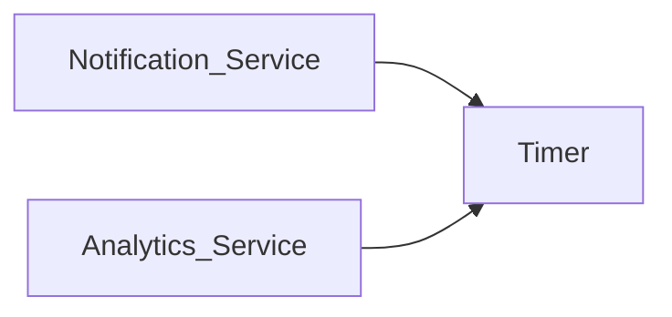
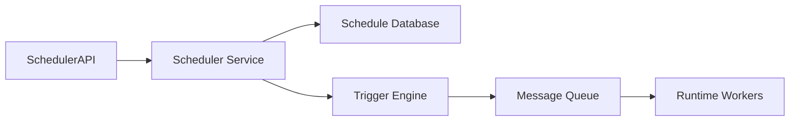
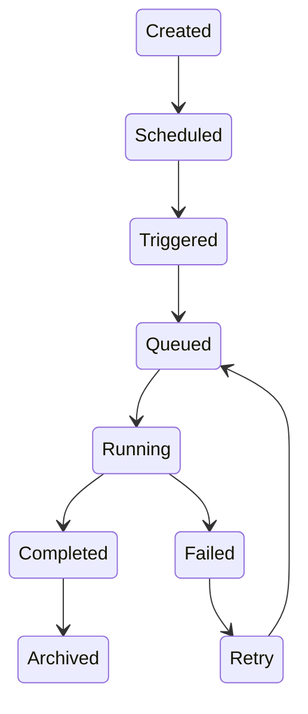
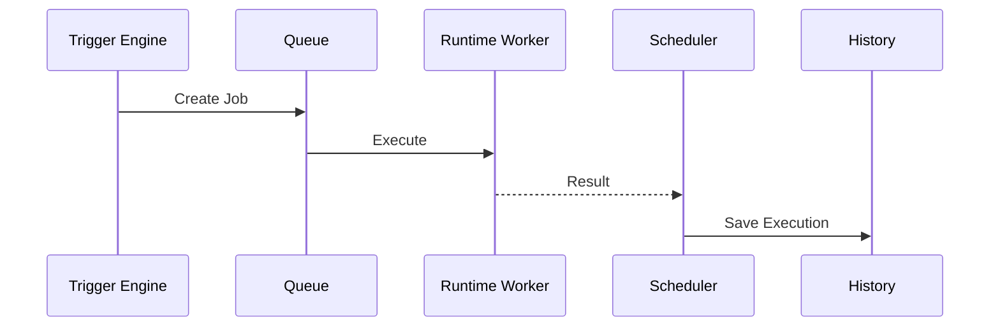
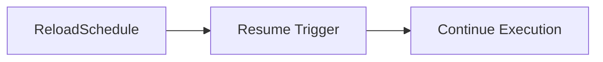
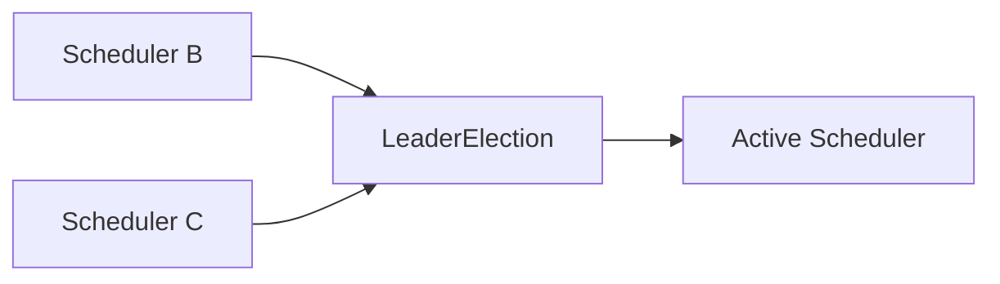
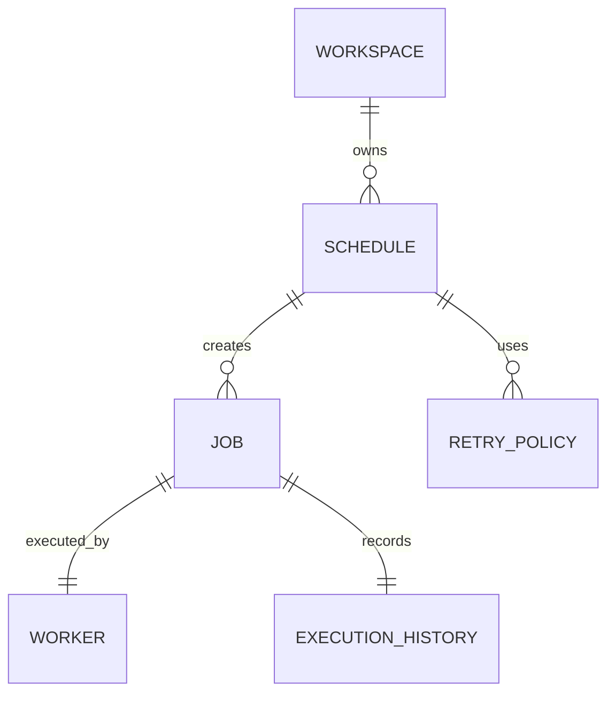

# Scheduler Service

> AI Social OS Platform Layer

Version: 2.0.0

Status: Stable

Last Updated: 2026-07-25

---

# Table of Contents

- Overview
- Objectives
- Why Scheduler Service
- Architecture
- Scheduling Model
- Job Lifecycle
- Schedule Types
- Trigger Types
- Cron Scheduling
- Time Zones
- Execution Pipeline
- Retry Strategy
- Failure Recovery
- High Availability
- Events
- APIs
- Design Principles
- Design Decisions
- Summary

---

# Overview

Scheduler Service chịu trách nhiệm lập lịch và kích hoạt các công việc theo thời gian trong AI Social OS.

Scheduler cho phép Platform tự động thực hiện.

- Workflow
- Agent
- AI Tasks
- Reports
- Synchronization
- Cleanup Jobs
- Notifications
- Data Import
- Data Export
- Health Checks

Scheduler chỉ chịu trách nhiệm quyết định **khi nào** một Job được thực thi.

Việc thực thi được giao cho Runtime hoặc Worker thông qua Message Queue.

---

# Objectives

Scheduler Service hướng tới.

- Reliable Scheduling
- High Availability
- Distributed Execution
- Time Zone Awareness
- Retry Support
- Scalable
- Observable
- Event Driven

---

# Why Scheduler Service

Nếu mỗi Service tự triển khai Timer.



sẽ dẫn đến.

- Trùng lặp logic
- Khó quản lý
- Khó Scale
- Khó đồng bộ
- Không có Dashboard tập trung

Scheduler Service cung cấp cơ chế lập lịch thống nhất cho toàn Platform.

---

# Architecture



---

# Scheduling Model

Một Schedule bao gồm.

```text
Schedule

├── Schedule ID
├── Name
├── Trigger
├── Time Zone
├── Target
├── Payload
├── Retry Policy
├── Status
├── Next Run
└── Metadata
```

---

# Job Lifecycle



---

# Schedule Types

Scheduler hỗ trợ.

```text
One Time

Recurring

Cron

Interval

Calendar

Event-Based

Manual
```

Có thể mở rộng thêm Trigger mới thông qua Plugin.

---

# Trigger Types

Ví dụ.

```text
Every Minute

Every Hour

Every Day

Every Week

Every Month

Specific Date

Cron Expression

External Event
```

---

# Cron Scheduling

Ví dụ.

```mermaid
flowchart LR
```

```mermaid
flowchart LR
```

Cron được đánh giá theo Time Zone của Schedule.

---

# Time Zones

Mỗi Schedule có Time Zone riêng.

Ví dụ.

```text
Asia/Ho_Chi_Minh

UTC

America/New_York

Europe/London
```

Điều này đảm bảo lịch chạy chính xác trên môi trường toàn cầu.

---

# Execution Pipeline



Scheduler không trực tiếp chạy Workflow.

---

# Retry Strategy

Nếu Job thất bại.

```mermaid
flowchart LR
```

Retry Policy có thể cấu hình theo từng Schedule.

---

# Failure Recovery

Nếu Scheduler bị Restart.



Schedule không bị mất sau khi khởi động lại.

---

# High Availability



```mermaid
flowchart LR
```

Chỉ một Scheduler Leader chịu trách nhiệm kích hoạt Job tại một thời điểm nhằm tránh thực thi trùng lặp.

---

# Execution History

Lưu lại.

```text
Execution ID

Schedule ID

Started At

Finished At

Duration

Status

Retry Count

Worker

Result
```

Lịch sử phục vụ Dashboard, Audit và Monitoring.

---

# Scheduler Events

Ví dụ.

- ScheduleCreated
- ScheduleUpdated
- ScheduleDeleted
- JobTriggered
- JobCompleted
- JobFailed
- JobRetried
- SchedulePaused
- ScheduleResumed

Các Event được phát lên Event Bus.

---

# Scheduler API

Ví dụ.

```text
POST   /schedules

GET    /schedules

GET    /schedules/{id}

PATCH  /schedules/{id}

DELETE /schedules/{id}

POST   /schedules/{id}/pause

POST   /schedules/{id}/resume

GET    /schedules/{id}/history
```

---

# Scheduler Relationships



---

# Security Considerations

Scheduler Service phải.

- Kiểm tra Permission khi tạo Schedule.
- Ghi Audit Log.
- Kiểm tra Workspace Ownership.
- Không thực thi Job ngoài phạm vi được phép.
- Hỗ trợ Rate Limiting đối với Schedule Creation.
- Kiểm tra Payload trước khi Queue.

---

# Performance Optimizations

Các kỹ thuật tối ưu.

- Distributed Scheduler
- Leader Election
- Incremental Schedule Scan
- Time Wheel
- Batch Trigger
- Queue-based Execution
- Worker Autoscaling

---

# Design Principles

Scheduler Service được xây dựng theo các nguyên tắc.

- Time Driven
- Event Driven
- Queue First
- High Availability
- Horizontally Scalable
- Observable
- Fault Tolerant
- Multi-Tenant

---

# Design Decisions

| Decision | Reason |
|-----------|--------|
| Scheduler tách khỏi Runtime | Phân tách trách nhiệm |
| Queue-based Execution | Không chặn Scheduler |
| Leader Election | Tránh Trigger trùng |
| Time Zone Support | Hỗ trợ toàn cầu |
| Cron + Interval | Linh hoạt |
| Execution History | Theo dõi và Audit |
| Event Integration | Đồng bộ toàn Platform |

---

# Summary

Scheduler Service là thành phần chịu trách nhiệm lập lịch và kích hoạt các công việc theo thời gian trong AI Social OS.

Thông qua Trigger Engine, Message Queue, Leader Election và Execution History, Scheduler Service đảm bảo các Workflow và Job được thực thi đúng thời điểm, đáng tin cậy và có khả năng mở rộng trong môi trường phân tán.