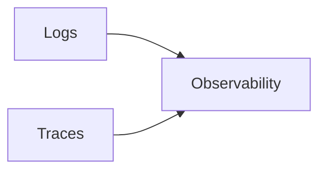
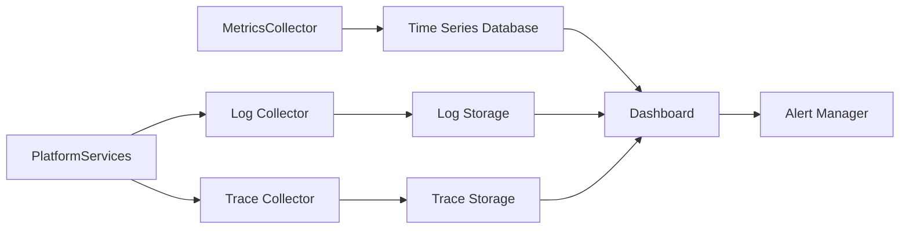
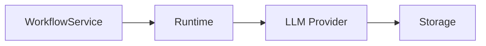
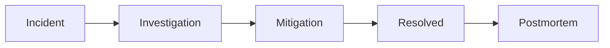
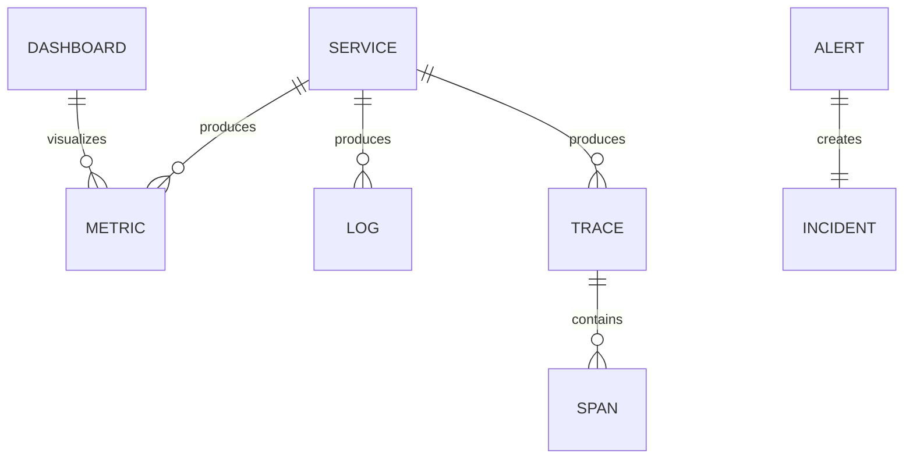

# Monitoring & Observability

> AI Social OS Platform Layer

Version: 2.0.0

Status: Stable

Last Updated: 2026-07-25

---

# Table of Contents

- Overview
- Objectives
- Why Monitoring
- Observability Pillars
- Architecture
- Metrics Collection
- Logging
- Distributed Tracing
- Health Checks
- Alerting
- Dashboards
- SLO / SLA / Error Budget
- Incident Management
- Capacity Planning
- APIs
- Design Principles
- Design Decisions
- Summary

---

# Overview

Monitoring & Observability cung cấp khả năng theo dõi, phân tích và chẩn đoán toàn bộ AI Social OS trong thời gian thực.

Hệ thống giúp trả lời các câu hỏi.

- Platform có đang hoạt động bình thường?
- Service nào đang gặp lỗi?
- Request đang chậm ở đâu?
- Workflow nào thất bại?
- AI Provider nào có độ trễ cao?
- Runtime Worker nào quá tải?

Monitoring không tham gia Business Logic.

Đây là lớp hạ tầng phục vụ vận hành (Operations).

---

# Objectives

Monitoring hướng tới.

- Real-time Visibility
- System Health
- Fault Detection
- Root Cause Analysis
- Performance Analysis
- Capacity Planning
- SLA Monitoring
- High Availability

---

# Why Monitoring

Nếu không có Monitoring.

- Không biết Service nào Down.
- Không biết Worker nào bị treo.
- Không biết Queue nào bị đầy.
- Không biết AI Provider phản hồi chậm.
- Không thể phát hiện sự cố sớm.

Monitoring giúp phát hiện và xử lý vấn đề trước khi ảnh hưởng đến người dùng.

---

# Three Pillars of Observability



Ba thành phần chính.

- Metrics
- Logs
- Traces

Kết hợp với nhau để mô tả trạng thái của toàn hệ thống.

---

# Architecture



---

# Metrics Collection

Thu thập các chỉ số.

```text
CPU Usage

Memory Usage

Disk Usage

Network IO

API Requests

Latency

Error Rate

Queue Length

Worker Count

Execution Count

Token Usage

Inference Time
```

Metrics được thu thập định kỳ hoặc theo Event.

---

# Logging

Mỗi Service sinh ra Log theo cấu trúc.

```text
Timestamp

Service

Level

Message

Request ID

Correlation ID

Workspace ID

Metadata
```

Các mức Log.

```text
DEBUG

INFO

WARN

ERROR

FATAL
```

Log phải có định dạng thống nhất trên toàn Platform.

---

# Distributed Tracing

Tracing giúp theo dõi một Request xuyên suốt nhiều Service.



Mỗi bước chia sẻ cùng.

- Trace ID
- Span ID
- Correlation ID

---

# Health Checks

Mỗi Service cung cấp.

```text
GET /health

GET /ready

GET /live
```

Ví dụ.

| Endpoint | Purpose |
|----------|----------|
| `/health` | Tổng quan trạng thái |
| `/ready` | Sẵn sàng nhận Request |
| `/live` | Tiến trình còn hoạt động |

Health Check được sử dụng bởi Kubernetes hoặc Load Balancer.

---

# Alerting

Alert được kích hoạt khi vượt ngưỡng.

Ví dụ.

```text
CPU > 90%

Memory > 95%

Queue > 10,000

API Error Rate > 5%

Latency > 2 Seconds

Worker Offline
```

Alert có thể gửi qua.

- Email
- Slack
- Microsoft Teams
- Webhook
- Pager System

---

# Dashboards

Dashboard hiển thị.

```text
Platform Overview

API Metrics

Runtime Metrics

Queue Metrics

Workflow Metrics

Provider Metrics

Storage Metrics

Billing Metrics
```

Dashboard hỗ trợ.

- Drill Down
- Filtering
- Time Range
- Workspace Scope

---

# SLO / SLA / Error Budget

Ví dụ.

| Metric | Target |
|---------|---------|
| API Availability | 99.9% |
| Runtime Availability | 99.95% |
| Average API Latency | < 300 ms |
| Workflow Success Rate | > 99% |
| Queue Processing Delay | < 10 s |

Error Budget giúp cân bằng giữa đổi mới và độ ổn định.

---

# Incident Management

Quy trình xử lý sự cố.



Sau mỗi Incident cần thực hiện Postmortem để cải thiện hệ thống.

---

# Capacity Planning

Monitoring hỗ trợ dự báo.

- CPU Growth
- Memory Growth
- Storage Growth
- Queue Growth
- AI Token Consumption
- API Traffic
- Active Users

Thông tin này hỗ trợ lập kế hoạch mở rộng hạ tầng.

---

# Monitoring APIs

Ví dụ.

```text
GET    /metrics

GET    /health

GET    /ready

GET    /live

GET    /alerts

GET    /incidents

GET    /dashboards
```

---

# Monitoring Relationships



---

# Security Considerations

Monitoring Platform phải.

- Kiểm soát quyền truy cập Dashboard.
- Không ghi Secret vào Log.
- Mã hóa dữ liệu Monitoring.
- Hỗ trợ Audit Log.
- Giới hạn truy cập Metrics nội bộ.

Dữ liệu Logs và Traces phải tuân theo chính sách Retention của Organization.

---

# Performance Optimizations

Các kỹ thuật tối ưu.

- Metrics Aggregation
- Log Sampling
- Trace Sampling
- Compression
- Distributed Storage
- Incremental Query
- Dashboard Cache

---

# Design Principles

Monitoring & Observability được xây dựng theo các nguyên tắc.

- Observable by Default
- Metrics First
- Structured Logging
- Distributed Tracing
- Real-time Alerting
- High Availability
- Scalable
- Secure

---

# Design Decisions

| Decision | Reason |
|-----------|--------|
| Tách Metrics, Logs và Traces | Dễ mở rộng |
| Structured Logging | Dễ tìm kiếm |
| Distributed Tracing | Debug hệ thống phân tán |
| Alert Manager | Phản ứng nhanh với sự cố |
| Dashboard tập trung | Quan sát toàn Platform |
| Health Endpoints | Tích hợp Kubernetes |
| Correlation ID | Truy vết xuyên Service |

---

# Summary

Monitoring & Observability cung cấp khả năng quan sát toàn diện cho AI Social OS thông qua Metrics, Logs và Distributed Tracing.

Với Dashboard tập trung, Alerting theo thời gian thực, Health Checks và Incident Management, nền tảng có thể phát hiện sớm sự cố, phân tích nguyên nhân gốc và duy trì tính ổn định, hiệu năng cũng như khả năng mở rộng trong môi trường Production quy mô lớn.