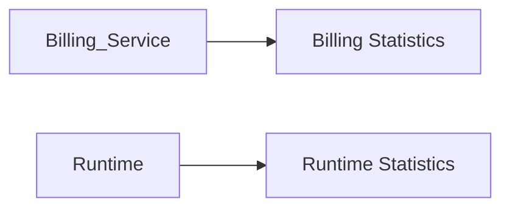
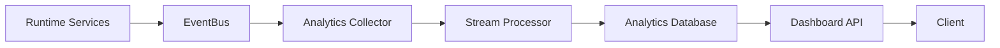
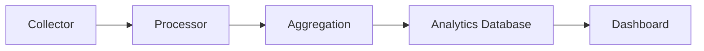
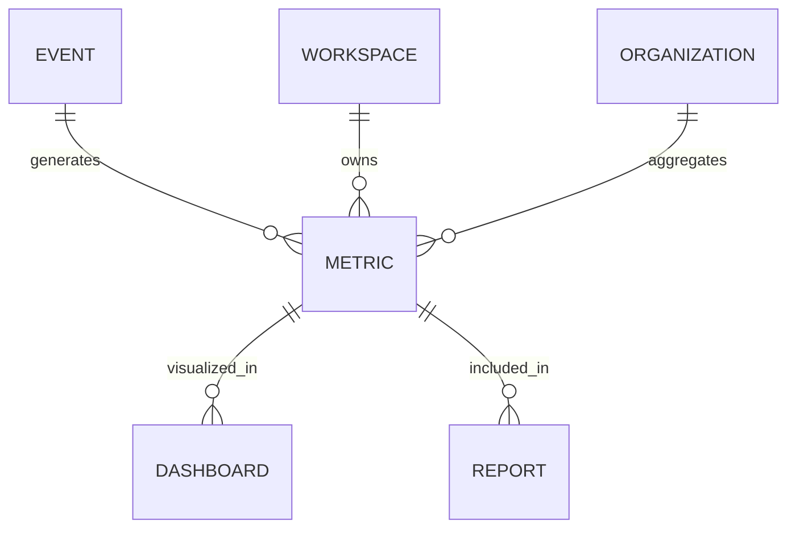

# Analytics Service

> AI Social OS Platform Layer

Version: 2.0.0

Status: Stable

Last Updated: 2026-07-25

---

# Table of Contents

- Overview
- Objectives
- Why Analytics Service
- Analytics Architecture
- Data Sources
- Data Pipeline
- Event Collection
- Metrics
- Dimensions
- Aggregations
- Real-time Analytics
- Historical Analytics
- Dashboards
- Reporting
- APIs
- Design Principles
- Design Decisions
- Summary

---

# Overview

Analytics Service chịu trách nhiệm thu thập, xử lý và phân tích dữ liệu hoạt động của toàn bộ AI Social OS.

Mục tiêu không phải lưu trữ dữ liệu giao dịch (Transactional Data), mà là xây dựng dữ liệu phục vụ.

- Dashboard
- KPI
- Business Intelligence
- Product Analytics
- Usage Analytics
- Capacity Planning
- Cost Analysis
- AI Performance Analysis

Analytics là nền tảng hỗ trợ ra quyết định dựa trên dữ liệu.

---

# Objectives

Analytics Service hướng tới.

- Centralized Analytics
- Real-time Metrics
- Historical Analysis
- Business Intelligence
- AI Usage Insights
- Cost Visibility
- Multi-Tenant
- Extensible

---

# Why Analytics Service

Nếu mỗi Service tự tính toán thống kê.



sẽ dẫn đến.

- Dữ liệu phân tán
- KPI không nhất quán
- Khó xây Dashboard
- Khó mở rộng

Analytics Service tổng hợp dữ liệu từ toàn Platform.

---

# Analytics Architecture



---

# Data Sources

Analytics thu thập dữ liệu từ.

```text
API Gateway

Authentication

Workspace

Workflow

Runtime

Agent

Knowledge

Billing

Storage

Search

Notification

Scheduler

Media

Plugins
```

Ngoài ra còn có dữ liệu từ AI Providers.

---

# Data Pipeline



Pipeline hoạt động bất đồng bộ.

---

# Event Collection

Ví dụ.

```text
Workflow Started

Workflow Completed

Execution Failed

User Login

File Uploaded

Knowledge Indexed

Agent Created

API Request

Model Invoked

Billing Charged
```

Không phải mọi Event đều được lưu.

Collector chỉ giữ các Event phục vụ Analytics.

---

# Metrics

Ví dụ.

```text
Daily Active Users

Monthly Active Users

API Requests

Execution Count

Workflow Success Rate

Average Runtime

AI Token Usage

Storage Usage

Search Queries

Notification Count

Media Uploads
```

Metrics được cập nhật theo thời gian thực hoặc theo Batch.

---

# Dimensions

Analytics hỗ trợ phân tích theo.

```text
Workspace

Organization

Project

Region

Provider

Model

User

Agent

Workflow

Time

Channel
```

Một Metric có thể được phân tích theo nhiều Dimension.

---

# Aggregations

Ví dụ.

```text
SUM

COUNT

AVG

MIN

MAX

P95

P99

MEDIAN
```

Analytics Engine hỗ trợ tổng hợp dữ liệu theo nhiều mức.

---

# Real-time Analytics

Ví dụ.

```text
Current Active Users

Current Running Workflows

Queue Length

Worker Utilization

Current AI Requests

API Throughput
```

Các số liệu này được cập nhật gần thời gian thực.

---

# Historical Analytics

Ví dụ.

```text
Daily Usage

Weekly Trend

Monthly Growth

Quarterly Report

Yearly Statistics
```

Hỗ trợ phân tích xu hướng dài hạn.

---

# AI Analytics

Ví dụ.

```text
Model Usage

Provider Usage

Token Consumption

Prompt Count

Completion Count

Inference Latency

Inference Cost

Cache Hit Rate

Model Errors
```

Các số liệu này hỗ trợ tối ưu hóa AI Runtime.

---

# Cost Analytics

Ví dụ.

```text
OpenAI Cost

Anthropic Cost

Gemini Cost

Storage Cost

Bandwidth Cost

Execution Cost

Workspace Cost
```

Có thể tổng hợp theo.

- User
- Workspace
- Organization
- Project

---

# Dashboards

Ví dụ.

```text
Platform Dashboard

Runtime Dashboard

AI Dashboard

Billing Dashboard

Storage Dashboard

Usage Dashboard

Operations Dashboard

Executive Dashboard
```

Dashboard hỗ trợ.

- Charts
- Tables
- Time Series
- Heat Maps
- KPI Cards

---

# Reporting

Analytics hỗ trợ.

```text
Daily Report

Weekly Report

Monthly Report

Quarterly Report

Annual Report

Custom Report
```

Report có thể được Scheduler tạo tự động.

---

# Analytics APIs

Ví dụ.

```text
GET    /analytics

GET    /analytics/usage

GET    /analytics/runtime

GET    /analytics/ai

GET    /analytics/storage

GET    /analytics/billing

GET    /analytics/workspaces/{id}
```

---

# Analytics Relationships



---

# Security Considerations

Analytics Service phải.

- Tôn trọng Permission.
- Không lưu Secret.
- Không lưu Prompt nhạy cảm nếu không được phép.
- Hỗ trợ Data Anonymization.
- Hỗ trợ Data Retention.
- Ghi Audit Log.

Dashboard chỉ hiển thị dữ liệu mà người dùng có quyền truy cập.

---

# Performance Optimizations

Các kỹ thuật tối ưu.

- Stream Processing
- Incremental Aggregation
- Materialized Views
- Time-series Storage
- Result Cache
- Parallel Aggregation
- Columnar Storage

---

# Design Principles

Analytics Service được xây dựng theo các nguyên tắc.

- Event Driven
- Data Oriented
- Real-time First
- Historical Ready
- Multi-Tenant
- Scalable
- Observable
- API First

---

# Design Decisions

| Decision | Reason |
|-----------|--------|
| Analytics tách khỏi Transaction DB | Giảm tải hệ thống |
| Event-driven Collection | Đồng bộ dữ liệu hiệu quả |
| Aggregation Layer | Tăng hiệu năng truy vấn |
| Time-series Metrics | Hỗ trợ Dashboard |
| Materialized Views | Truy vấn nhanh |
| Multi-dimensional Analytics | Phân tích linh hoạt |
| Scheduler Integration | Báo cáo tự động |

---

# Summary

Analytics Service là nền tảng thu thập và phân tích dữ liệu của AI Social OS, cung cấp các chỉ số vận hành, kinh doanh và AI thông qua Dashboard, Report và API.

Với kiến trúc Event-Driven, Stream Processing, Aggregation và Time-series Analytics, Analytics Service giúp tổ chức theo dõi hiệu suất hệ thống, tối ưu chi phí AI, phân tích hành vi người dùng và hỗ trợ ra quyết định dựa trên dữ liệu ở quy mô doanh nghiệp.