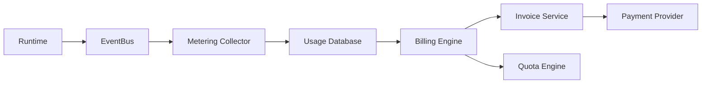
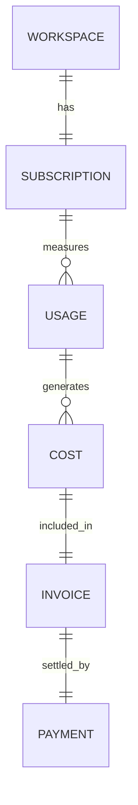

# Billing & Metering Service

> AI Social OS Platform Layer

Version: 2.0.0

Status: Stable

Last Updated: 2026-07-25

---

# Table of Contents

- Overview
- Objectives
- Why Billing & Metering
- Architecture
- Billing Model
- Metering Model
- Usage Collection
- Usage Dimensions
- Pricing Model
- Subscription Plans
- Quotas
- Cost Calculation
- Invoicing
- Payment Integration
- Events
- APIs
- Design Principles
- Design Decisions
- Summary

---

# Overview

Billing & Metering Service chịu trách nhiệm đo lường (Metering), tính chi phí (Billing) và quản lý gói dịch vụ (Subscription) của AI Social OS.

Service này giúp Platform.

- Theo dõi mức sử dụng
- Áp dụng giới hạn tài nguyên
- Tính chi phí AI
- Tính chi phí lưu trữ
- Quản lý Subscription
- Sinh hóa đơn
- Hỗ trợ thanh toán

Billing hoạt động độc lập với Business Logic.

---

# Objectives

Billing & Metering hướng tới.

- Accurate Usage Tracking
- Flexible Pricing
- Multi-Tenant
- Subscription Management
- Quota Enforcement
- Cost Transparency
- Auditability
- Scalability

---

# Why Billing & Metering

Nếu chỉ lưu Usage.

```mermaid
flowchart LR
```

sẽ không thể.

- Tính tiền
- Giới hạn tài nguyên
- Kiểm soát chi phí
- Phân tích mức sử dụng

Billing & Metering biến dữ liệu sử dụng thành chi phí và chính sách.

---

# Architecture



---

# Billing Model

Billing gồm các thành phần.

```mermaid
flowchart LR
```

---

# Metering Model

Mỗi lần sử dụng được ghi nhận dưới dạng Usage Record.

```text
Usage ID

Workspace

Organization

User

Resource

Quantity

Unit

Timestamp

Metadata
```

Ví dụ.

```text
Model

GPT-5

Input Tokens

2,300

Output Tokens

850
```

---

# Usage Collection

Usage được thu thập từ.

```text
API Gateway

Runtime

AI Providers

Storage

Search

Media

Scheduler

Workflow

Notification
```

Collector hoạt động thông qua Event Bus.

---

# Usage Dimensions

Ví dụ.

```text
Workspace

Organization

User

Project

Provider

Model

Region

Time

Service

Feature
```

Có thể tổng hợp Usage theo nhiều Dimension.

---

# Pricing Model

Billing hỗ trợ.

```text
Free

Subscription

Pay As You Go

Enterprise Contract

Usage Based

Hybrid Pricing
```

Mỗi Workspace có thể sử dụng một Pricing Plan khác nhau.

---

# Subscription Plans

Ví dụ.

| Plan | Features |
|------|----------|
| Free | Giới hạn tài nguyên |
| Starter | AI cơ bản |
| Professional | AI + Collaboration |
| Business | Multi Workspace |
| Enterprise | Không giới hạn theo hợp đồng |

Plan quyết định.

- Quota
- Giá
- Tính năng
- SLA

---

# Quotas

Ví dụ.

```text
API Requests

100,000 / Month

AI Tokens

20,000,000 / Month

AI Budget (USD)

Theo cấu hình Workspace

Storage

100 GB

Knowledge Bases

100

Agents

500

Executions

Unlimited
```

Quota Engine kiểm tra trước khi Runtime thực hiện, có thể cảnh báo (Warn) hoặc chặn (Block) khi Workspace vượt giới hạn AI Budget đã cấu hình.

---

# Cost Calculation

Ví dụ.

```text
Input Tokens

×

Provider Price

+

Output Tokens

×

Provider Price

+

Storage

+

Bandwidth

=

Total Cost
```

Cost Calculation có thể thay đổi theo Provider.

Kết quả tính toán (Provider Cost thực tế) được dùng để hiển thị Cost Visibility cho Workspace và làm đầu vào cho Quota/Budget Enforcement, không dùng để cộng thêm Margin/Markup rồi bán lại token AI.

---

# AI Usage Metering & Cost Visibility

Ví dụ.

```text
OpenAI

Anthropic

Gemini

Azure OpenAI

Local Models
```

Billing Engine lưu riêng theo từng Provider.

- Usage (Input/Output Tokens, Requests)
- Provider Cost (chi phí thực tế phát sinh với Provider)
- Currency

> **Lưu ý:** AI Social OS không thu phí chênh lệch (markup) trên chi phí AI Provider. Doanh thu nền tảng đến từ phí subscription/nền tảng, không phải từ việc bán lại token AI có lời. Việc theo dõi Provider Cost chỉ nhằm mục đích minh bạch chi phí (Cost Visibility) cho Workspace — đặc biệt phù hợp với mô hình Workspace tự kết nối API Key của Provider (FR-031), nơi Workspace là bên trực tiếp trả phí cho Provider và Platform chỉ cần hiển thị/minh bạch mức tiêu thụ theo Provider/Model/Campaign gần thời gian thực.

---

# Invoicing

Invoice bao gồm.

```text
Invoice Number

Organization

Workspace

Billing Period

Items

Taxes

Discounts

Total

Status
```

Invoice có thể sinh tự động theo chu kỳ.

---

# Payment Integration

Billing hỗ trợ tích hợp.

```text
Stripe

PayPal

Bank Transfer

Invoice Payment

Enterprise Contract
```

Payment Provider có thể thay thế mà không ảnh hưởng Billing Engine.

---

# Billing Events

Ví dụ.

- UsageRecorded
- QuotaExceeded
- BudgetWarningIssued
- InvoiceGenerated
- InvoicePaid
- SubscriptionChanged
- SubscriptionExpired
- PaymentFailed
- CostCalculated

Các Event được phát lên Event Bus.

---

# Billing APIs

Ví dụ.

```text
GET    /billing

GET    /billing/usage

GET    /billing/invoices

GET    /billing/subscription

POST   /billing/subscription

GET    /billing/quotas

GET    /billing/costs
```

---

# Billing Relationships



---

# Security Considerations

Billing Service phải.

- Ghi Audit Log.
- Không sửa Usage Record sau khi ghi nhận.
- Kiểm tra Permission.
- Mã hóa dữ liệu thanh toán.
- Hỗ trợ Data Retention.
- Hỗ trợ Export phục vụ kế toán.

Không lưu trực tiếp thông tin thẻ thanh toán nếu sử dụng Payment Provider bên ngoài.

---

# Performance Optimizations

Các kỹ thuật tối ưu.

- Incremental Metering
- Batch Aggregation
- Cost Cache
- Materialized Views
- Time-series Storage
- Parallel Calculation
- Background Invoice Generation

---

# Design Principles

Billing & Metering được xây dựng theo các nguyên tắc.

- Usage First
- Event Driven
- Immutable Usage Records
- Multi-Tenant
- Transparent Cost
- Extensible Pricing
- API First
- Auditable

---

# Design Decisions

| Decision | Reason |
|-----------|--------|
| Metering tách khỏi Billing | Phân tách trách nhiệm |
| Usage Records bất biến | Đảm bảo tính chính xác |
| Event-driven Collection | Đồng bộ dữ liệu hiệu quả |
| Pricing Engine độc lập | Dễ mở rộng mô hình giá |
| Quota Engine riêng | Kiểm soát tài nguyên |
| Invoice Generation | Tự động hóa thanh toán |
| Payment Abstraction | Không phụ thuộc nhà cung cấp |

---

# Summary

Billing & Metering Service là thành phần quản lý mức sử dụng, chi phí và gói dịch vụ của AI Social OS.

Thông qua Metering, Pricing Engine, Quota Management, Cost Calculation và Invoice Generation, hệ thống có thể theo dõi chính xác việc sử dụng tài nguyên, tối ưu chi phí AI và hỗ trợ nhiều mô hình thanh toán cho khách hàng từ cá nhân đến doanh nghiệp.