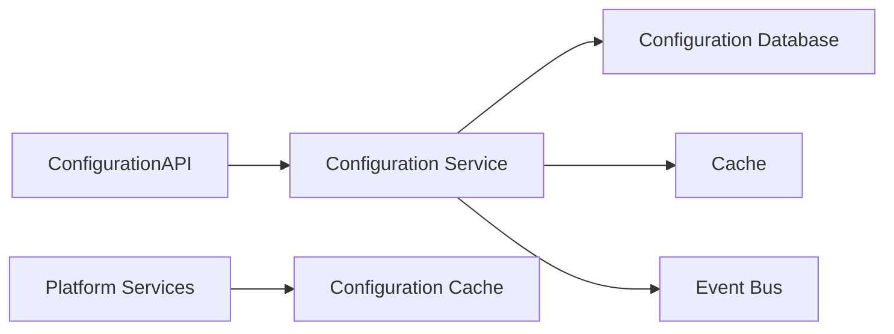
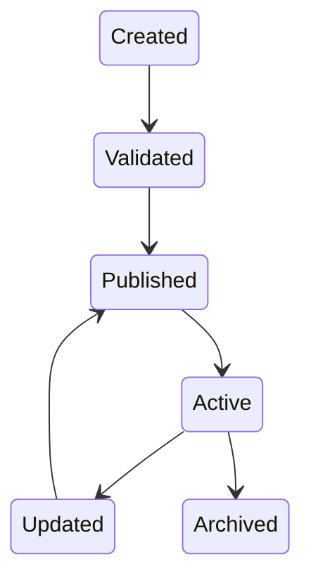
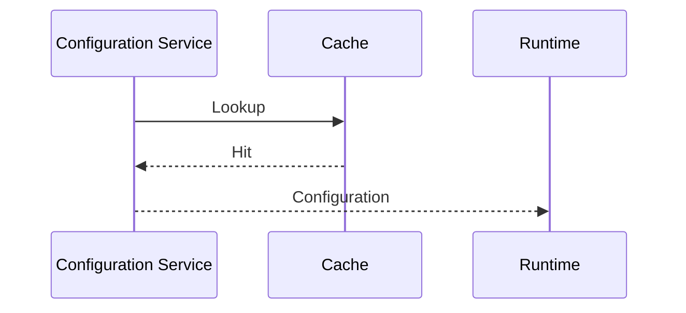
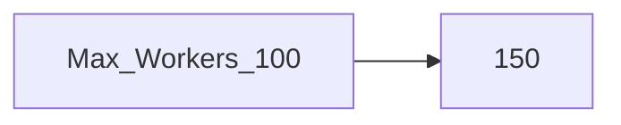
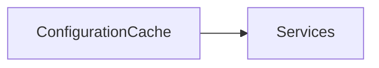
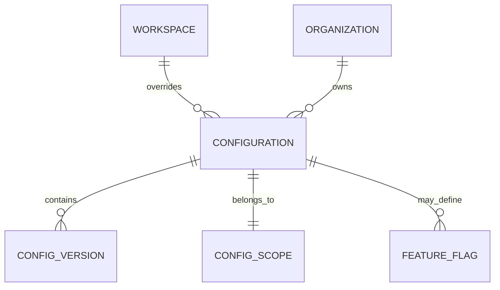

# Configuration Service

> AI Social OS Platform Layer

Version: 2.0.0

Status: Stable

Last Updated: 2026-07-25

---

# Table of Contents

- Overview
- Objectives
- Why Configuration Service
- Architecture
- Configuration Model
- Configuration Hierarchy
- Configuration Lifecycle
- Configuration Types
- Configuration Resolution
- Dynamic Configuration
- Versioning
- Validation
- Configuration Events
- APIs
- Design Principles
- Design Decisions
- Summary

---

# Overview

Configuration Service chịu trách nhiệm quản lý toàn bộ cấu hình (Configuration) của AI Social OS.

Thay vì để từng Service tự đọc cấu hình từ File hoặc Environment Variables, tất cả cấu hình được quản lý tập trung.

Configuration bao gồm.

- Platform Settings
- Organization Settings
- Workspace Settings
- Runtime Settings
- AI Provider Settings
- Feature Flags
- System Limits
- Default Values
- UI Preferences

Configuration Service **không lưu Secret**.

Secret được quản lý bởi Secret Manager.

---

# Objectives

Configuration Service hướng tới.

- Centralized Configuration
- Dynamic Updates
- Versioning
- Validation
- Multi-Tenant
- Auditability
- High Availability
- Extensibility

---

# Why Configuration Service

Nếu mỗi Service có File cấu hình riêng.

```text
workflow.yaml

runtime.yaml

search.yaml

notification.yaml
```

sẽ dẫn đến.

- Khó đồng bộ
- Khó cập nhật
- Không có Version
- Không Audit
- Khó quản lý nhiều môi trường

Configuration Service cung cấp một nguồn cấu hình thống nhất.

---

# Architecture



---

# Configuration Model

Một Configuration bao gồm.

```text
Configuration

├── Configuration ID
├── Key
├── Value
├── Scope
├── Environment
├── Version
├── Status
├── Metadata
└── Updated At
```

Ví dụ.

```text
Key

runtime.max_concurrency

Value

100
```

---

# Configuration Hierarchy

Configuration được áp dụng theo thứ tự ưu tiên.

```mermaid
flowchart LR
```

Cấu hình ở cấp thấp hơn sẽ ghi đè cấu hình ở cấp cao hơn.

---

# Configuration Lifecycle



---

# Configuration Types

Ví dụ.

```text
System Configuration

Runtime Configuration

AI Configuration

Storage Configuration

Search Configuration

Workflow Configuration

Feature Flags

UI Configuration
```

---

# Configuration Resolution



Nếu Cache không có dữ liệu.

Configuration Service sẽ đọc từ Database.

---

# Dynamic Configuration

Configuration có thể thay đổi mà không cần Restart Service.

Ví dụ.



Worker mới sẽ sử dụng giá trị mới ngay sau khi cấu hình được Publish.

---

# Configuration Versioning

Mỗi Configuration có nhiều Version.

```mermaid
flowchart LR
```

Có thể Rollback về Version trước nếu cần.

---

# Validation

Mỗi Configuration phải được kiểm tra.

Ví dụ.

```text
runtime.max_workers

Minimum

1

Maximum

1000
```

Configuration không hợp lệ sẽ bị từ chối.

---

# Feature Flags

Feature Flag là một loại Configuration đặc biệt.

Ví dụ.

```text
feature.agent_memory

Enabled

feature.multi_provider

Disabled
```

Feature Flag hỗ trợ.

- Canary Release
- A/B Testing
- Gradual Rollout
- Internal Preview

---

# Configuration Cache

Configuration thường xuyên được lưu Cache.



Cache giúp giảm độ trễ và tải lên Database.

---

# Configuration Events

Ví dụ.

- ConfigurationCreated
- ConfigurationUpdated
- ConfigurationPublished
- ConfigurationDeleted
- FeatureFlagEnabled
- FeatureFlagDisabled

Các Event được phát lên Event Bus để các Service đồng bộ.

---

# Configuration APIs

Ví dụ.

```text
GET    /configurations

GET    /configurations/{key}

POST   /configurations

PATCH  /configurations/{key}

DELETE /configurations/{key}

POST   /configurations/{key}/publish

GET    /feature-flags

PATCH  /feature-flags/{key}
```

---

# Configuration Relationships



---

# Security Considerations

Configuration Service phải.

- Kiểm tra Permission trước khi cập nhật.
- Ghi Audit Log.
- Không lưu Secret.
- Hỗ trợ Rollback.
- Hỗ trợ Versioning.
- Kiểm tra Schema trước khi Publish.

Chỉ Administrator hoặc người được phân quyền mới có thể thay đổi Configuration.

---

# Performance Optimizations

Các kỹ thuật tối ưu.

- Distributed Cache
- Incremental Synchronization
- Lazy Loading
- Local Cache
- Change Notifications
- Batch Updates
- Optimistic Locking

---

# Design Principles

Configuration Service được xây dựng theo các nguyên tắc.

- Configuration as Data
- Centralized Management
- Dynamic Reload
- Version Controlled
- Multi-Tenant
- Event Driven
- Secure by Default
- Observable

---

# Design Decisions

| Decision | Reason |
|-----------|--------|
| Configuration tách khỏi Source Code | Dễ quản lý |
| Secret tách sang Secret Manager | Tăng bảo mật |
| Dynamic Reload | Không cần Restart Service |
| Versioning | Rollback an toàn |
| Distributed Cache | Giảm độ trễ |
| Event-driven Synchronization | Đồng bộ nhanh |
| Feature Flags | Triển khai linh hoạt |

---

# Summary

Configuration Service là thành phần quản lý tập trung toàn bộ cấu hình của AI Social OS.

Thông qua Configuration Hierarchy, Dynamic Reload, Versioning, Feature Flags và Event-driven Synchronization, hệ thống có thể cập nhật cấu hình theo thời gian thực, quản lý nhiều môi trường và Workspace, đồng thời đảm bảo tính nhất quán, bảo mật và khả năng mở rộng trong toàn bộ Platform.