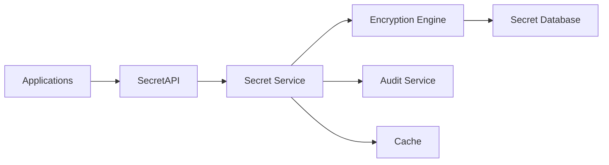
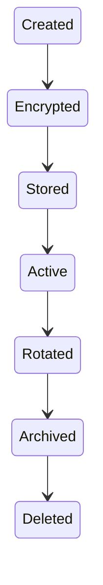
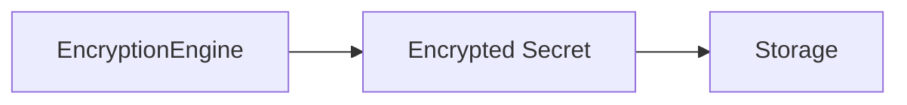
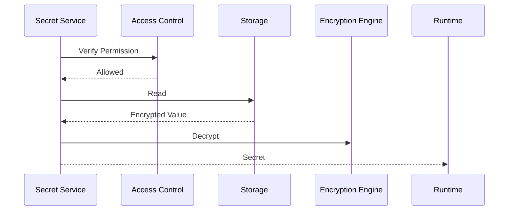
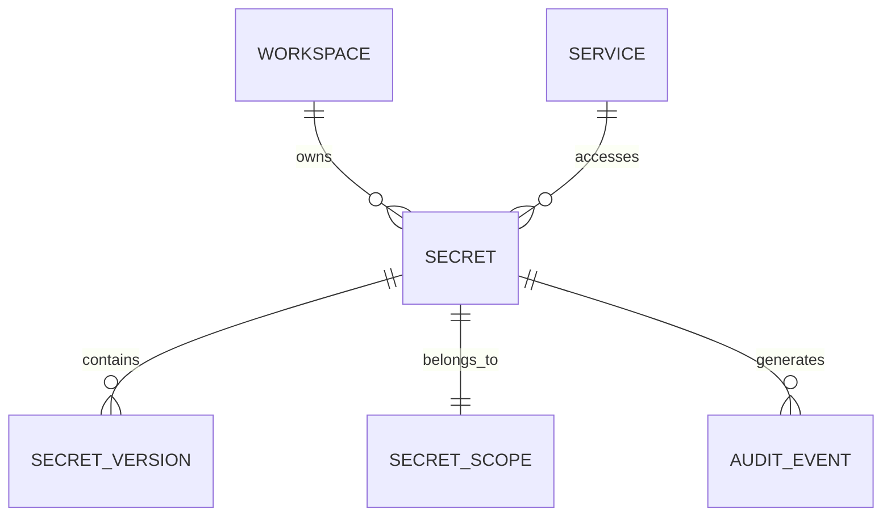

# Secret Management Service

> AI Social OS Platform Layer

Version: 2.0.0

Status: Stable

Last Updated: 2026-07-25

---

# Table of Contents

- Overview
- Objectives
- Why Secret Management
- Architecture
- Secret Model
- Secret Lifecycle
- Secret Types
- Secret Scopes
- Encryption
- Secret Resolution
- Secret Rotation
- Secret Versioning
- Secret Access Control
- Secret Audit
- Secret APIs
- Design Principles
- Design Decisions
- Summary

---

# Overview

Secret Management Service chịu trách nhiệm lưu trữ, quản lý và phân phối an toàn các thông tin nhạy cảm trong AI Social OS.

Ví dụ.

- API Keys
- OAuth Tokens
- Database Credentials
- SSH Keys
- JWT Signing Keys
- TLS Certificates
- Webhook Secrets
- AI Provider Keys
- SMTP Passwords
- Cloud Credentials

Secret Management là thành phần bắt buộc trong môi trường Production.

Không Service nào được phép lưu Secret trực tiếp trong Source Code hoặc Database thông thường.

---

# Objectives

Secret Management hướng tới.

- Secure Storage
- Encryption by Default
- Fine-grained Access Control
- Secret Rotation
- Versioning
- Auditability
- High Availability
- Multi-Tenant

---

# Why Secret Management

Nếu Secret được lưu trong.

```text
.env

config.yaml

database

source code
```

sẽ dẫn đến.

- Rò rỉ thông tin
- Khó xoay vòng Secret
- Không Audit
- Không phân quyền
- Khó quản lý nhiều môi trường

Secret Management cung cấp kho lưu trữ tập trung và bảo mật.

---

# Architecture



---

# Secret Model

Một Secret bao gồm.

```text
Secret

├── Secret ID
├── Name
├── Type
├── Scope
├── Version
├── Status
├── Metadata
└── Created At
```

Giá trị Secret luôn được mã hóa trước khi lưu.

---

# Secret Lifecycle



Secret không được lưu ở dạng văn bản thuần (Plain Text).

---

# Secret Types

Ví dụ.

```text
API Key

OAuth Token

Database Password

SSH Private Key

TLS Certificate

JWT Secret

Webhook Secret

Cloud Credential

Encryption Key

License Key
```

---

# Secret Scopes

Secret có thể thuộc các phạm vi.

```text
Platform

Organization

Workspace

Project

Runtime

Connector
```

Ví dụ.

```mermaid
flowchart LR
```

Workspace khác không thể truy cập Secret này.

---

# Encryption



Nguyên tắc.

- Encrypt at Rest
- Encrypt in Transit
- Key Separation
- Key Rotation

Có thể sử dụng KMS hoặc HSM để quản lý Master Key.

---

# Secret Resolution



Secret chỉ được giải mã khi thực sự cần sử dụng.

---

# Secret Rotation

Secret hỗ trợ xoay vòng định kỳ.

```mermaid
flowchart LR
```

Rotation có thể.

- Manual
- Scheduled
- Automatic

Ví dụ.

```text
Every 90 Days
```

---

# Secret Versioning

Một Secret có thể có nhiều Version.

```mermaid
flowchart LR
```

Runtime luôn sử dụng Version hiện tại trừ khi được chỉ định khác.

---

# Secret Access Control

Permission ví dụ.

```text
secret.read

secret.create

secret.update

secret.rotate

secret.delete
```

Chỉ Service hoặc User được cấp quyền mới có thể truy cập Secret.

---

# Secret Injection

Runtime không lưu Secret trong cấu hình.

Thay vào đó.

```mermaid
flowchart LR
```

Workflow chỉ lưu tham chiếu đến Secret.

---

# Secret Audit

Mọi thao tác đều được ghi Audit.

Ví dụ.

- Secret Created
- Secret Accessed
- Secret Rotated
- Secret Deleted
- Permission Changed

Audit Log không ghi giá trị Secret.

---

# Secret APIs

Ví dụ.

```text
POST   /secrets

GET    /secrets

GET    /secrets/{id}

PATCH  /secrets/{id}

DELETE /secrets/{id}

POST   /secrets/{id}/rotate

GET    /secrets/{id}/versions
```

API không bao giờ trả về Secret Value nếu người gọi không có quyền.

---

# Secret Relationships



---

# Security Considerations

Secret Management phải.

- Encrypt at Rest.
- Encrypt in Transit.
- Không ghi Secret vào Log.
- Không ghi Secret vào Audit.
- Hỗ trợ Key Rotation.
- Hỗ trợ Least Privilege.
- Hỗ trợ Break-glass Access (nếu được cấu hình).

Không.

- Hardcode Secret.
- Lưu Secret trong Source Code.
- Gửi Secret qua Event Bus.
- Trả Secret cho Client nếu không cần thiết.

---

# Performance Optimizations

Các kỹ thuật tối ưu.

- In-memory Cache
- Short-lived Cache
- Connection Pooling
- Lazy Resolution
- Batch Secret Fetch
- Encryption Hardware Acceleration

Cache phải có TTL ngắn và không được ghi ra đĩa.

---

# Design Principles

Secret Management được xây dựng theo các nguyên tắc.

- Zero Trust
- Encrypt Everything
- Least Privilege
- Secret Never Leaves Secure Boundary
- Version Controlled
- Auditable
- Multi-Tenant
- Secure by Default

---

# Design Decisions

| Decision | Reason |
|-----------|--------|
| Secret Service độc lập | Tăng bảo mật |
| Encryption Engine riêng | Quản lý khóa tập trung |
| Secret Reference | Không lưu Secret trong Workflow |
| Versioning | Hỗ trợ Rotation |
| Audit Integration | Theo dõi truy cập |
| Fine-grained Permission | Kiểm soát chặt chẽ |
| KMS/HSM Support | Quản lý Master Key |

---

# Summary

Secret Management Service là thành phần chịu trách nhiệm lưu trữ, bảo vệ và phân phối an toàn các thông tin nhạy cảm trong AI Social OS.

Thông qua cơ chế mã hóa, Versioning, Secret Rotation, Fine-grained Access Control và Audit Logging, Secret Management đảm bảo các khóa và thông tin xác thực luôn được quản lý an toàn, giảm thiểu rủi ro rò rỉ dữ liệu và đáp ứng các yêu cầu bảo mật của hệ thống doanh nghiệp.