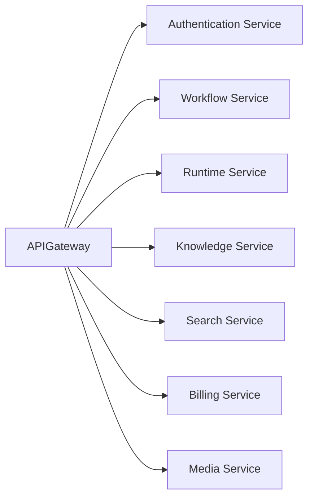
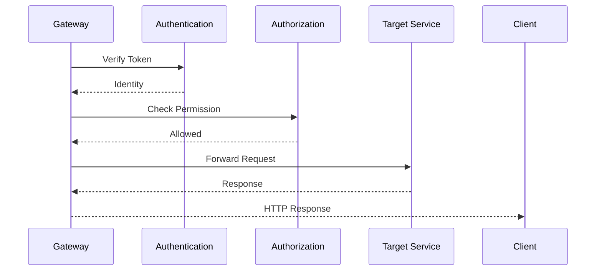
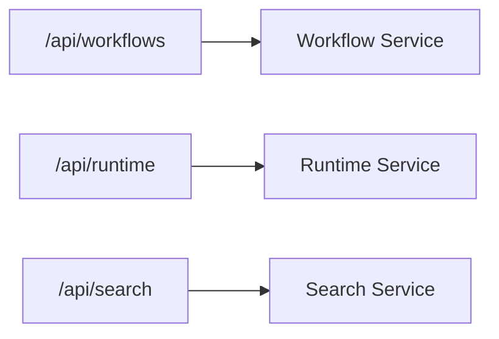
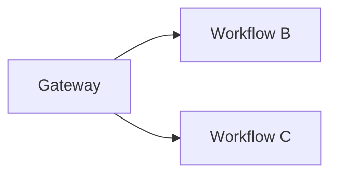
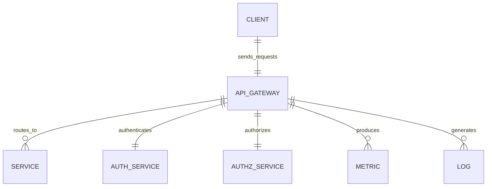

# API Gateway

> AI Social OS Platform Layer

Version: 2.0.0

Status: Stable

Last Updated: 2026-07-25

---

# Table of Contents

- Overview
- Objectives
- Why API Gateway
- Architecture
- Request Lifecycle
- Gateway Responsibilities
- Authentication
- Authorization
- Routing
- Rate Limiting
- Load Balancing
- Request Transformation
- Response Transformation
- API Versioning
- Observability
- APIs
- Design Principles
- Design Decisions
- Summary

---

# Overview

API Gateway là điểm vào (Entry Point) duy nhất của AI Social OS.

Mọi Client đều giao tiếp với Platform thông qua API Gateway thay vì truy cập trực tiếp từng Service.

Gateway chịu trách nhiệm.

- Authentication
- Authorization
- Routing
- Rate Limiting
- Request Validation
- Request Transformation
- Response Transformation
- Logging
- Metrics
- API Versioning

Gateway không chứa Business Logic.

Nó chỉ điều phối Request đến Service phù hợp.

---

# Objectives

API Gateway hướng tới.

- Unified API Entry
- Secure Access
- High Performance
- Horizontal Scalability
- Centralized Security
- Traffic Control
- Observability
- Extensibility

---

# Why API Gateway

Nếu Client gọi trực tiếp.

```mermaid
flowchart LR
```

Client phải biết địa chỉ của mọi Service.

Điều này gây.

- Tight Coupling
- Khó bảo mật
- Khó Versioning
- Khó Scale
- Khó Monitoring

API Gateway cung cấp một điểm truy cập thống nhất.

---

# Architecture



---

# Request Lifecycle



---

# Gateway Responsibilities

Gateway chịu trách nhiệm.

- Authentication
- Authorization
- Routing
- Request Validation
- Rate Limiting
- Request Logging
- Metrics Collection
- Request ID Generation
- Correlation ID Injection
- API Version Resolution

Gateway không thực hiện Business Logic.

---

# Authentication

Gateway hỗ trợ.

```text
JWT

OAuth 2.0

OIDC

API Key

Service Token

Personal Access Token
```

Identity sau khi xác thực sẽ được chuyển tiếp đến Service phía sau.

---

# Authorization

Gateway có thể thực hiện kiểm tra.

```text
Workspace Permission

Organization Permission

Role

Scopes

Feature Availability
```

Các kiểm tra phức tạp vẫn có thể được Service thực hiện lại.

---

# Routing

Gateway định tuyến theo.



Routing có thể dựa trên.

- Path
- Host
- Header
- Version

---

# Rate Limiting

Ví dụ.

```text
Anonymous

100 Requests / Hour

Authenticated User

10,000 Requests / Hour

Enterprise

Unlimited
```

Rate Limit có thể áp dụng theo.

- User
- API Key
- Workspace
- Organization
- IP Address

---

# Load Balancing



Gateway phân phối Request giữa nhiều Instance.

---

# Request Transformation

Gateway có thể.

- Thêm Header
- Chuẩn hóa Header
- Sinh Correlation ID
- Chuẩn hóa Request Format
- Inject Workspace Context

Ví dụ.

```mermaid
flowchart LR
```

---

# Response Transformation

Gateway có thể.

- Chuẩn hóa Error Format
- Thêm Metadata
- Nén Response
- Thêm Pagination Metadata
- Thêm Rate Limit Header

---

# API Versioning

Gateway hỗ trợ.

```text
/api/v1

/api/v2

/api/v3
```

Hoặc.

```text
Header

API-Version
```

Việc chuyển đổi Version được thực hiện tại Gateway.

---

# Observability

Gateway ghi nhận.

- Request Count
- Error Rate
- Response Time
- Rate Limit Hits
- Authentication Failures
- Authorization Failures
- Traffic Volume

Tất cả Metrics được gửi tới Monitoring Platform.

---

# API Gateway APIs

Ví dụ.

```text
GET    /health

GET    /ready

GET    /metrics

GET    /routes

GET    /rate-limits

GET    /gateway/status
```

Các API này chủ yếu phục vụ vận hành.

---

# Gateway Relationships



---

# Security Considerations

API Gateway phải.

- Xác thực mọi Request.
- Chặn Request không hợp lệ.
- Hỗ trợ HTTPS bắt buộc.
- Hỗ trợ CORS.
- Hỗ trợ Rate Limiting.
- Hỗ trợ Request Size Limit.
- Ghi Audit Log cho các thao tác quan trọng.

Không.

- Tin tưởng Header từ Client.
- Bỏ qua Authorization.
- Trả về Stack Trace nội bộ.

---

# Performance Optimizations

Các kỹ thuật tối ưu.

- Connection Pooling
- HTTP Keep-Alive
- Response Compression
- Request Batching
- Edge Cache
- Circuit Breaker
- Adaptive Load Balancing

---

# Design Principles

API Gateway được xây dựng theo các nguyên tắc.

- Single Entry Point
- Secure by Default
- Stateless
- API First
- Observable
- Horizontally Scalable
- Low Latency
- Extensible

---

# Design Decisions

| Decision | Reason |
|-----------|--------|
| Gateway độc lập | Quản lý tập trung |
| Authentication tại Gateway | Giảm tải Backend |
| Centralized Rate Limiting | Chống lạm dụng |
| API Versioning | Dễ nâng cấp |
| Correlation ID | Hỗ trợ Distributed Tracing |
| Request Transformation | Chuẩn hóa giao tiếp |
| Load Balancing | Tăng khả năng mở rộng |

---

# Summary

API Gateway là điểm truy cập thống nhất của AI Social OS, chịu trách nhiệm xác thực, phân quyền, định tuyến và quản lý lưu lượng truy cập đến các Platform Services.

Thông qua Authentication, Authorization, Rate Limiting, API Versioning và khả năng quan sát tập trung, API Gateway đảm bảo hệ thống an toàn, hiệu quả và dễ mở rộng trong môi trường Microservices và AI Runtime quy mô lớn.