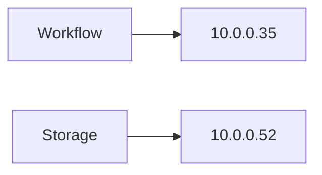
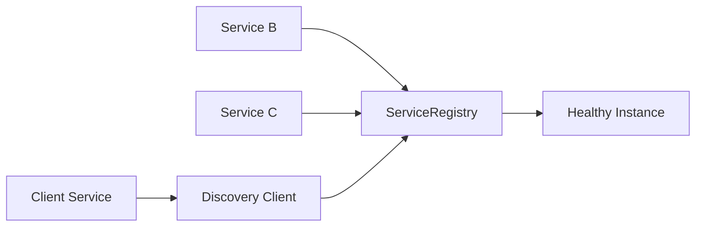
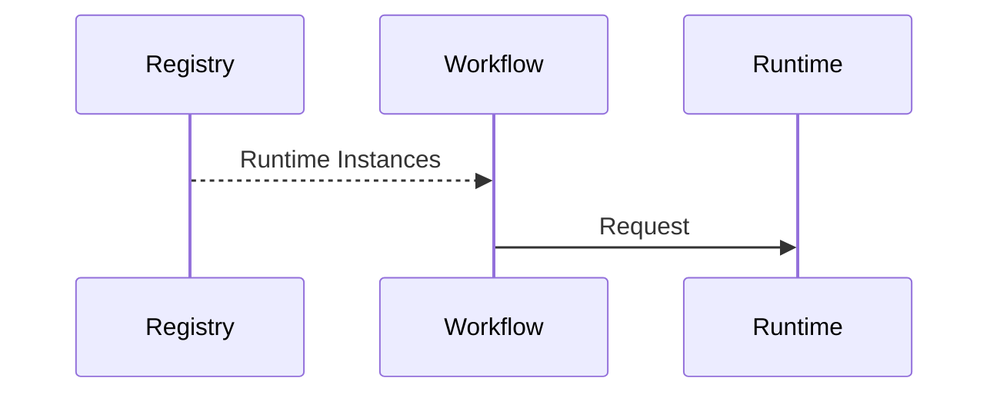
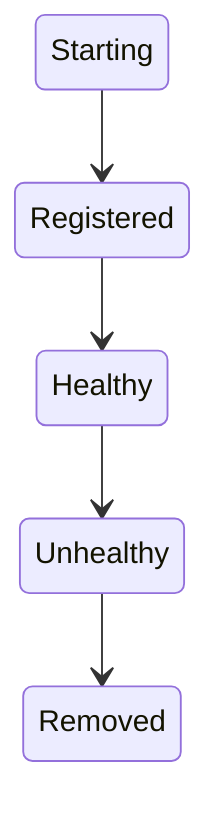
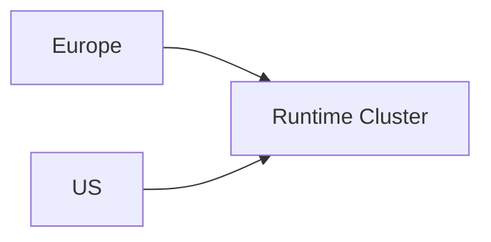
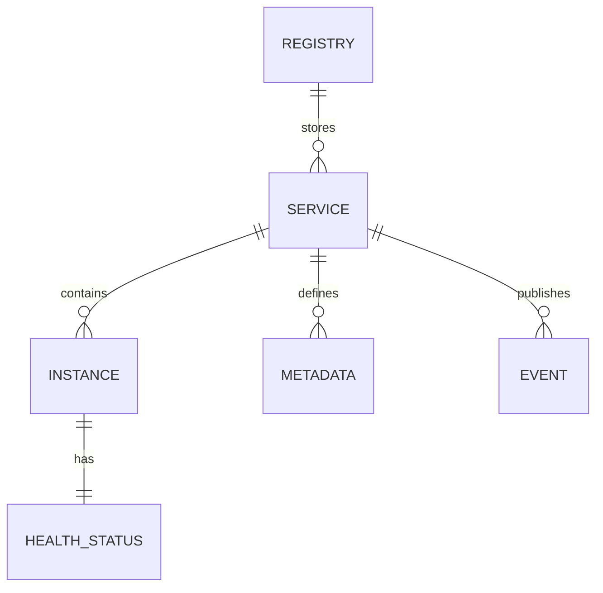

# Service Discovery

> AI Social OS Platform Layer

Version: 2.0.0

Status: Stable

Last Updated: 2026-07-25

---

# Table of Contents

- Overview
- Objectives
- Why Service Discovery
- Architecture
- Service Registration
- Service Registry
- Service Resolution
- Health Monitoring
- Service Lifecycle
- Load Balancing
- Failover
- Service Metadata
- Events
- APIs
- Design Principles
- Design Decisions
- Summary

---

# Overview

Service Discovery là thành phần quản lý việc đăng ký (Registration), khám phá (Discovery) và theo dõi trạng thái (Health) của toàn bộ Services trong AI Social OS.

Trong môi trường Microservices, địa chỉ IP của Service có thể thay đổi liên tục do.

- Auto Scaling
- Rolling Update
- Container Restart
- Node Failure
- Kubernetes Scheduling

Service Discovery giúp các Service tìm thấy nhau mà không cần cấu hình cứng (Hardcode).

---

# Objectives

Service Discovery hướng tới.

- Dynamic Service Resolution
- High Availability
- Automatic Registration
- Health Awareness
- Load Distribution
- Fault Tolerance
- Multi-Region Support
- Observability

---

# Why Service Discovery

Nếu Service gọi trực tiếp.



Khi Service được Deploy lại.

```mermaid
flowchart LR
```

mọi cấu hình đều phải cập nhật.

Service Discovery giải quyết vấn đề này bằng Registry trung tâm.

---

# Architecture



---

# Service Registration

Khi khởi động.

```mermaid
flowchart LR
```

Thông tin đăng ký.

```text
Service Name

Instance ID

Host

Port

Protocol

Version

Region

Health Status
```

---

# Service Registry

Registry lưu thông tin của tất cả Service đang hoạt động.

Ví dụ.

```text
Authentication

3 Instances

Workflow

5 Instances

Runtime

20 Instances

Search

4 Instances

Storage

6 Instances
```

Registry chỉ trả về các Instance đang khỏe mạnh.

---

# Service Resolution



Client không cần biết IP cụ thể của Runtime.

---

# Health Monitoring

Mỗi Service gửi Heartbeat định kỳ.

```mermaid
flowchart LR
```

Nếu quá thời gian.

```mermaid
flowchart LR
```

Instance sẽ không còn được trả về cho Client.

---

# Service Lifecycle



---

# Load Balancing

Discovery có thể trả về.

```text
Runtime A

Runtime B

Runtime C
```

Client hoặc Gateway sẽ chọn Instance.

Ví dụ.

- Round Robin
- Least Connections
- Random
- Weighted
- Latency Based

---

# Failover

Nếu Instance bị lỗi.


Request tiếp theo sẽ được chuyển sang Instance khác.

---

# Service Metadata

Mỗi Service có Metadata.

```text
Name

Version

Region

Capabilities

Protocol

Tags

Environment

Weight
```

Metadata hỗ trợ Routing thông minh.

---

# Multi-Region Discovery

Ví dụ.



Registry có thể ưu tiên Service gần người dùng nhất.

---

# Discovery Cache

Client có thể Cache kết quả.


Cache giảm số lượng Request tới Registry.

---

# Discovery Events

Ví dụ.

- ServiceRegistered
- ServiceUpdated
- ServiceRemoved
- ServiceHealthy
- ServiceUnhealthy
- InstanceStarted
- InstanceStopped

Các Event được phát lên Event Bus.

---

# Discovery APIs

Ví dụ.

```text
POST   /services/register

DELETE /services/{id}

GET    /services

GET    /services/{name}

GET    /services/{name}/instances

GET    /services/{id}/health
```

---

# Service Relationships



---

# Security Considerations

Service Discovery phải.

- Xác thực Service trước khi đăng ký.
- Chỉ cho phép Service nội bộ truy cập Registry.
- Mã hóa kết nối.
- Kiểm tra Health định kỳ.
- Ghi Audit Log.
- Hỗ trợ Mutual TLS nếu cần.

Không cho phép Service giả mạo đăng ký.

---

# Performance Optimizations

Các kỹ thuật tối ưu.

- Registry Replication
- Local Discovery Cache
- Incremental Updates
- Health Check Batching
- Connection Pooling
- Watch-based Synchronization
- Read Replicas

---

# Design Principles

Service Discovery được xây dựng theo các nguyên tắc.

- Dynamic Discovery
- Health-aware Routing
- Highly Available
- Low Latency
- Stateless Clients
- Observable
- Fault Tolerant
- Cloud Native

---

# Design Decisions

| Decision | Reason |
|-----------|--------|
| Registry trung tâm | Quản lý Service thống nhất |
| Automatic Registration | Giảm cấu hình thủ công |
| Health-based Discovery | Tránh Instance lỗi |
| Discovery Cache | Giảm tải Registry |
| Metadata Routing | Hỗ trợ Routing thông minh |
| Multi-Region Support | Giảm độ trễ |
| Event Integration | Đồng bộ toàn Platform |

---

# Summary

Service Discovery là thành phần quản lý việc đăng ký, khám phá và theo dõi trạng thái của các Service trong AI Social OS.

Thông qua Service Registry, Health Monitoring, Dynamic Resolution và Failover, Service Discovery cho phép các Microservices giao tiếp linh hoạt mà không phụ thuộc vào địa chỉ mạng cố định, đồng thời đảm bảo hệ thống luôn sẵn sàng và có khả năng mở rộng trong môi trường Cloud Native.