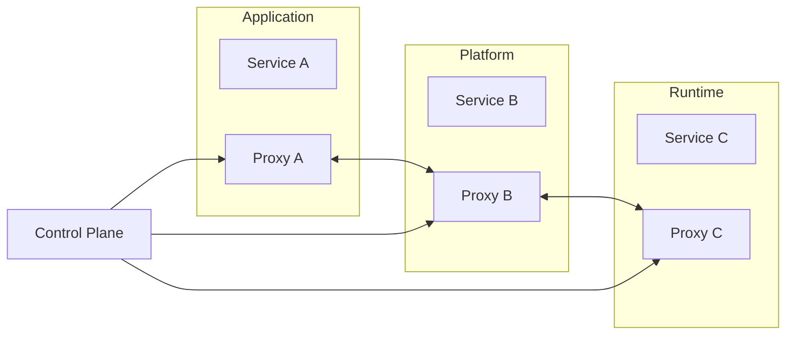
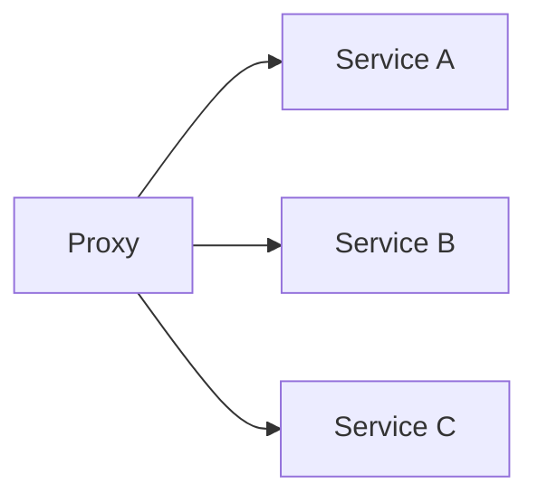
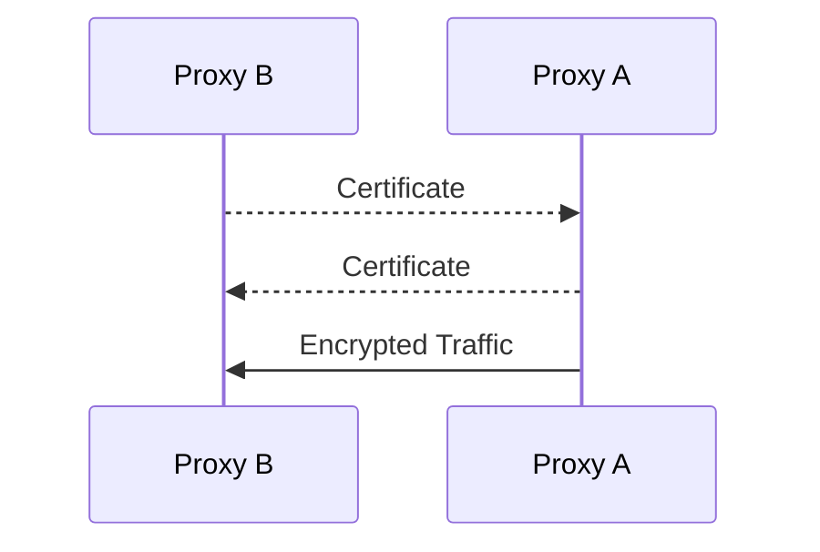
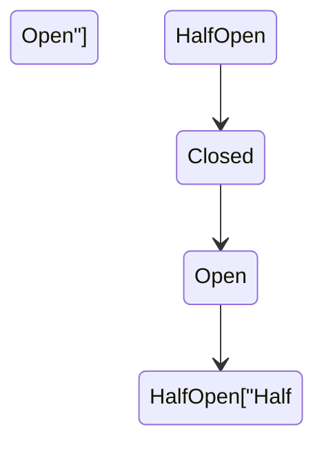
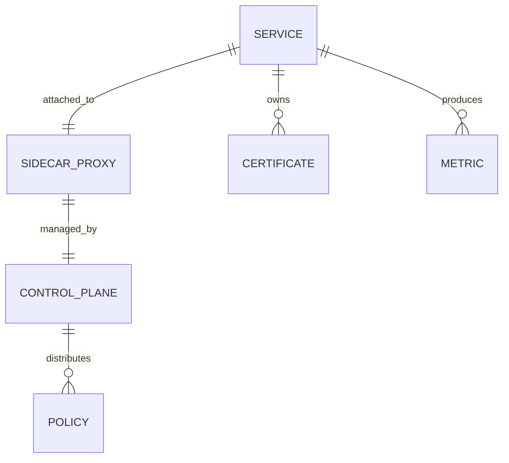

# Service Mesh

> AI Social OS Platform Layer

Version: 2.0.0

Status: Stable

Last Updated: 2026-07-25

---

# Table of Contents

- Overview
- Objectives
- Why Service Mesh
- Architecture
- Data Plane
- Control Plane
- Sidecar Proxy
- Traffic Management
- Service-to-Service Security
- Mutual TLS
- Traffic Policies
- Load Balancing
- Circuit Breaker
- Retry & Timeout
- Observability
- APIs
- Design Principles
- Design Decisions
- Summary

---

# Overview

Service Mesh là lớp hạ tầng chịu trách nhiệm quản lý toàn bộ giao tiếp giữa các Services trong AI Social OS.

Khác với API Gateway chỉ xử lý lưu lượng từ Client đến Platform (North-South Traffic), Service Mesh quản lý lưu lượng giữa các Services bên trong Platform (East-West Traffic).

Service Mesh cung cấp.

- Secure Communication
- Traffic Management
- Load Balancing
- Retry
- Circuit Breaker
- Mutual TLS
- Service Identity
- Observability

Business Logic hoàn toàn không cần biết đến Service Mesh.

---

# Objectives

Service Mesh hướng tới.

- Zero Trust Networking
- Secure Service Communication
- Traffic Control
- Reliability
- High Availability
- Observability
- Scalability
- Policy Enforcement

---

# Why Service Mesh

Nếu mỗi Service tự xử lý.

```text
Retry

Timeout

TLS

Load Balancing

Metrics

Tracing
```

mọi Service đều phải lặp lại cùng một Logic.

Service Mesh đưa toàn bộ các chức năng này xuống tầng hạ tầng.

---

# Architecture



---

# Data Plane

Data Plane bao gồm toàn bộ Sidecar Proxy.

Mỗi Request giữa các Service đều đi qua Proxy.

```mermaid
flowchart LR
```

Data Plane chịu trách nhiệm.

- Routing
- Retry
- TLS
- Metrics
- Load Balancing

---

# Control Plane

Control Plane chịu trách nhiệm cấu hình toàn bộ Mesh.

Bao gồm.

```text
Policies

Certificates

Traffic Rules

Routing Rules

Service Identity

Telemetry
```

Control Plane không xử lý Request.

---

# Sidecar Proxy

Mỗi Pod hoặc Service đều có.

```text
Application

+

Sidecar Proxy
```

Proxy thực hiện.

- Encryption
- Authorization
- Metrics
- Retry
- Timeout
- Traffic Routing

Application không cần thay đổi Source Code.

---

# Traffic Management



Traffic có thể được điều khiển bằng Rule.

Ví dụ.

- Header
- Path
- Version
- Region
- Weight

---

# Service-to-Service Security

Mọi kết nối giữa Services đều được xác thực.

Ví dụ.

```mermaid
flowchart LR
```

Mỗi Service đều có Identity riêng.

---

# Mutual TLS



Mutual TLS đảm bảo.

- Hai chiều xác thực
- Mã hóa dữ liệu
- Chống giả mạo Service

---

# Traffic Policies

Ví dụ.

```text
Retry

3

Timeout

5 Seconds

Circuit Breaker

Enabled

Max Connections

1000
```

Policy được áp dụng tập trung từ Control Plane.

---

# Load Balancing

Service Mesh hỗ trợ.

```text
Round Robin

Least Request

Random

Weighted

Consistent Hash

Locality Aware
```

Không cần tự triển khai trong Application.

---

# Circuit Breaker



Nếu Service lỗi liên tục.

- Ngắt Request mới.
- Chờ Recovery.
- Thử kết nối lại.

---

# Retry & Timeout

Ví dụ.

```text
Timeout

3 Seconds

Retry

2 Times

Backoff

Exponential
```

Retry được thực hiện bởi Proxy thay vì Application.

---

# Traffic Shifting

Hỗ trợ triển khai.

```text
Version A

90%

Version B

10%
```

Ứng dụng.

- Canary Deployment
- Blue-Green Deployment
- Progressive Rollout
- A/B Testing

---

# Fault Injection

Service Mesh hỗ trợ mô phỏng lỗi.

Ví dụ.

```text
Delay

500 ms

Abort

10%

HTTP 500

5%
```

Giúp kiểm thử khả năng chịu lỗi của hệ thống.

---

# Observability

Mesh tự động thu thập.

- Request Count
- Latency
- Error Rate
- Retry Count
- TLS Status
- Service Graph
- Traffic Volume

Dữ liệu được gửi đến Monitoring Platform.

---

# Service Mesh APIs

Ví dụ.

```text
GET    /mesh/status

GET    /mesh/policies

GET    /mesh/services

GET    /mesh/traffic

GET    /mesh/certificates
```

Các API phục vụ vận hành và giám sát.

---

# Service Mesh Relationships



---

# Security Considerations

Service Mesh phải.

- Bật Mutual TLS mặc định.
- Quản lý Certificate tự động.
- Kiểm tra Service Identity.
- Hỗ trợ Authorization Policy.
- Mã hóa toàn bộ East-West Traffic.
- Ghi Audit Log cho Policy Changes.

Không cho phép giao tiếp giữa các Service nếu chưa được xác thực.

---

# Performance Optimizations

Các kỹ thuật tối ưu.

- Connection Pooling
- HTTP/2
- gRPC Support
- Adaptive Load Balancing
- Locality-aware Routing
- Certificate Rotation
- Proxy Resource Optimization

---

# Design Principles

Service Mesh được xây dựng theo các nguyên tắc.

- Zero Trust
- Secure by Default
- Transparent to Applications
- Policy Driven
- Highly Observable
- Fault Tolerant
- Cloud Native
- Extensible

---

# Design Decisions

| Decision | Reason |
|-----------|--------|
| Sidecar Proxy | Không cần sửa Application |
| Control Plane tách biệt | Quản lý tập trung |
| Mutual TLS mặc định | Tăng bảo mật |
| Retry & Timeout tại Proxy | Giảm Logic trong Service |
| Traffic Shifting | Hỗ trợ triển khai liên tục |
| Fault Injection | Kiểm thử độ tin cậy |
| Telemetry tự động | Quan sát toàn hệ thống |

---

# Summary

Service Mesh là lớp hạ tầng quản lý giao tiếp giữa các Services trong AI Social OS, cung cấp các khả năng về bảo mật, điều phối lưu lượng và khả năng quan sát mà không yêu cầu thay đổi mã nguồn ứng dụng.

Thông qua Sidecar Proxy, Mutual TLS, Traffic Management, Circuit Breaker và Telemetry, Service Mesh giúp Platform đạt được mức độ bảo mật cao, khả năng chịu lỗi tốt và hỗ trợ vận hành hiệu quả trong môi trường Microservices quy mô lớn.