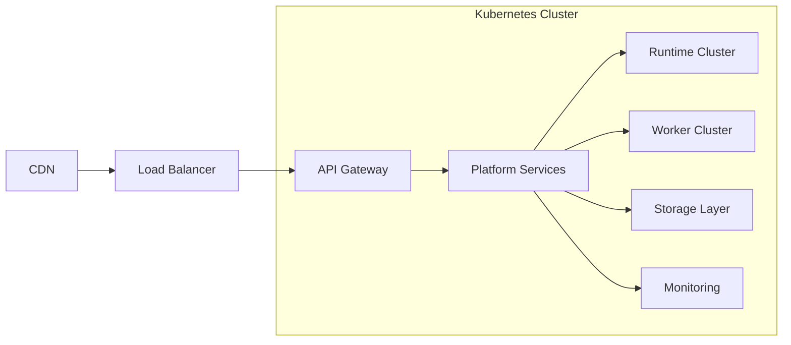
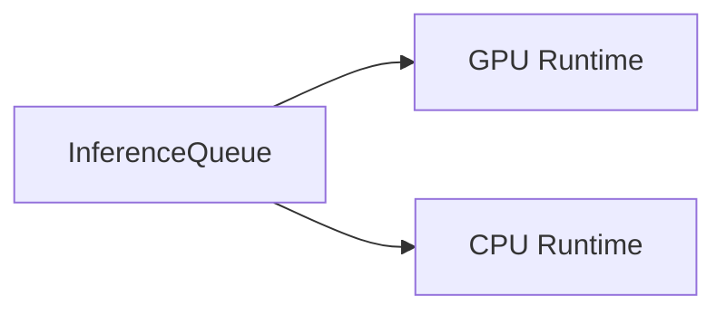
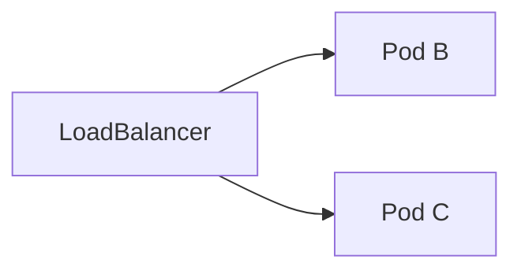
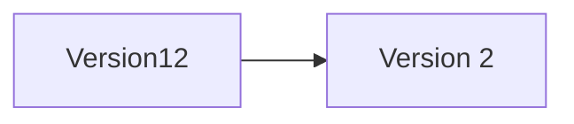
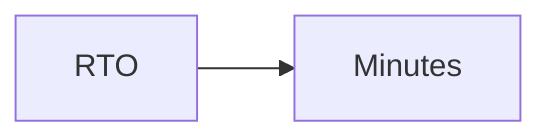
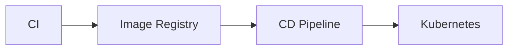

# Deployment Architecture

> AI Social OS Platform Layer

Version: 2.0.0

Status: Stable

Last Updated: 2026-07-25

---

# Table of Contents

- Overview
- Objectives
- Deployment Principles
- Environment Strategy
- Deployment Architecture
- Kubernetes Cluster
- Compute Layer
- Networking Layer
- Storage Layer
- AI Runtime Cluster
- Scaling Strategy
- High Availability
- Disaster Recovery
- CI/CD Integration
- Infrastructure as Code
- Design Principles
- Design Decisions
- Summary

---

# Overview

Deployment Architecture mô tả cách AI Social OS được triển khai trên hạ tầng Cloud Native nhằm đảm bảo.

- High Availability
- Horizontal Scalability
- Fault Tolerance
- Security
- Maintainability
- Observability

Toàn bộ Platform được thiết kế theo kiến trúc Kubernetes-first.

---

# Objectives

Deployment Architecture hướng tới.

- Cloud Native
- Zero Downtime
- Automatic Scaling
- Multi-Environment
- Infrastructure as Code
- Self Healing
- Multi-Region Ready
- Secure Deployment

---

# Deployment Principles

Các nguyên tắc triển khai.

- Stateless Services
- Immutable Infrastructure
- Container First
- API First
- Automation First
- Infrastructure as Code
- GitOps Friendly
- Self Healing

---

# Environment Strategy

Platform được chia thành nhiều môi trường.

```mermaid
flowchart LR
```

Mỗi môi trường có cấu hình và tài nguyên riêng.

---

# Deployment Architecture



---

# Kubernetes Cluster

Một Cluster bao gồm.

```mermaid
flowchart LR
```

Mỗi Platform Service được triển khai dưới dạng Deployment.

---

# Compute Layer

Các nhóm Compute.

```text
API Nodes

Runtime Nodes

GPU Nodes

Worker Nodes

Analytics Nodes
```

Có thể tách Node Pool theo loại công việc.

---

# Networking Layer


Networking hỗ trợ.

- HTTPS
- Mutual TLS
- Internal DNS
- Network Policies

---

# Storage Layer

Các loại Storage.

```text
PostgreSQL

Redis

Object Storage

Vector Database

Blob Storage

Time-series Database

Log Storage
```

Storage được triển khai độc lập với Compute.

---

# AI Runtime Cluster

AI Runtime được triển khai riêng.



Runtime có thể tự động mở rộng theo tải.

---

# Scaling Strategy

Platform hỗ trợ.

```text
Horizontal Pod Autoscaler

Vertical Pod Autoscaler

Cluster Autoscaler

GPU Autoscaler
```

Autoscaling dựa trên.

- CPU
- Memory
- Queue Length
- GPU Utilization
- Request Rate

---

# High Availability



Mỗi Service có nhiều Replica.

Nếu một Pod gặp lỗi.

- Kubernetes tự khởi tạo Pod mới.
- Traffic tự động chuyển sang Pod còn hoạt động.

---

# Rolling Deployment



Deployment mới được triển khai dần.

Không làm gián đoạn dịch vụ.

---

# Blue-Green Deployment

```mermaid
flowchart LR
```

Cho phép Rollback nhanh nếu phát hiện lỗi.

---

# Canary Deployment

Ví dụ.

```text
Version A

95%

Version B

5%
```

Sau khi ổn định.

```text
Version B

100%
```

---

# Disaster Recovery

Chiến lược.

- Database Backup
- Object Storage Replication
- Multi-AZ Deployment
- Infrastructure Backup
- Secret Backup
- Configuration Backup

Recovery bao gồm.



---

# CI/CD Integration



Pipeline tự động.

- Build
- Test
- Scan
- Deploy
- Verify

---

# Infrastructure as Code

Toàn bộ hạ tầng được quản lý bằng.

```text
Terraform

Helm

Kustomize

Ansible

GitOps
```

Không thay đổi hạ tầng thủ công trên Production.

---

# Deployment Observability

Theo dõi.

- Deployment Status
- Replica Count
- Pod Health
- CPU Usage
- Memory Usage
- GPU Usage
- Network Traffic
- Deployment History

Thông tin được gửi tới Monitoring Platform.

---

# Security Considerations

Triển khai phải đảm bảo.

- HTTPS Everywhere
- Mutual TLS
- Secret Injection
- Image Scanning
- Least Privilege
- Network Policies
- Read-only Containers (khi phù hợp)

Container Image phải được kiểm tra trước khi triển khai.

---

# Performance Optimizations

Các kỹ thuật tối ưu.

- Autoscaling
- Resource Requests
- Resource Limits
- Node Affinity
- Pod Anti-affinity
- Image Layer Cache
- CDN

---

# Design Principles

Deployment Architecture được xây dựng theo các nguyên tắc.

- Cloud Native
- Kubernetes First
- Immutable Infrastructure
- Self Healing
- Highly Available
- Secure by Default
- Observable
- Automated

---

# Design Decisions

| Decision | Reason |
|-----------|--------|
| Kubernetes First | Chuẩn Cloud Native |
| Runtime Cluster riêng | Tối ưu AI Workload |
| GPU Node Pool | Phân tách tài nguyên |
| Rolling Update | Không gián đoạn dịch vụ |
| Canary Deployment | Giảm rủi ro phát hành |
| Infrastructure as Code | Dễ tái tạo hạ tầng |
| GitOps Ready | Triển khai tự động |

---

# Summary

Deployment Architecture định nghĩa cách AI Social OS được triển khai trên hạ tầng Cloud Native với Kubernetes làm nền tảng trung tâm.

Thông qua Containerization, Autoscaling, Rolling Deployment, Canary Release, Infrastructure as Code và CI/CD tự động, hệ thống đạt được khả năng mở rộng linh hoạt, tính sẵn sàng cao, khả năng phục hồi nhanh và đáp ứng yêu cầu vận hành của các hệ thống AI quy mô doanh nghiệp.