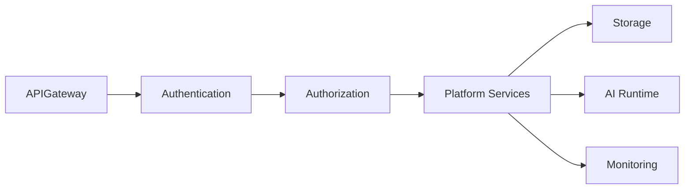
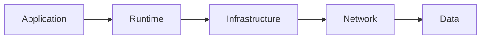
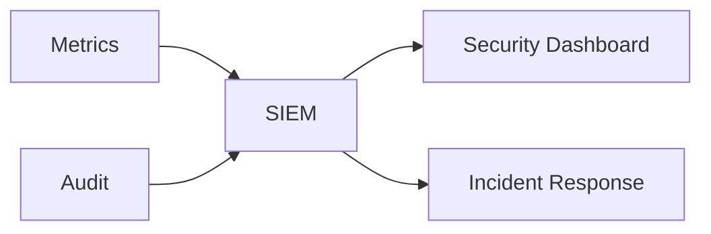
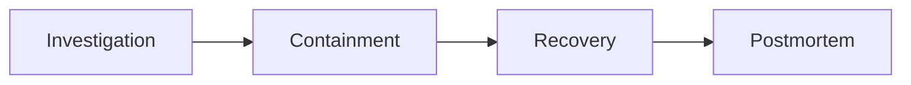
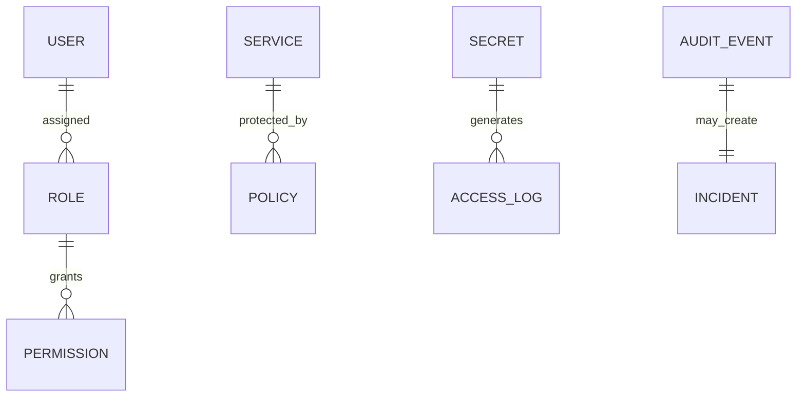

# Platform Security

> AI Social OS Platform Layer

Version: 2.0.0

Status: Stable

Last Updated: 2026-07-25

---

# Table of Contents

- Overview
- Objectives
- Security Principles
- Zero Trust Architecture
- Security Layers
- Identity & Authentication
- Authorization
- Data Protection
- Network Security
- Infrastructure Security
- Runtime Security
- Application Security
- AI Security
- Compliance
- Security Monitoring
- Incident Response
- Security APIs
- Design Principles
- Design Decisions
- Summary

---

# Overview

Platform Security là tập hợp các kiến trúc, chính sách và cơ chế nhằm bảo vệ toàn bộ AI Social OS trước các mối đe dọa về bảo mật.

Platform Security không phải là một Service riêng lẻ.

Đây là một lớp xuyên suốt (Cross-cutting Concern) áp dụng cho mọi thành phần của hệ thống.

Bao gồm.

- API Gateway
- Authentication
- Runtime
- Workflow
- Storage
- Search
- AI Providers
- Connectors
- Plugins
- Infrastructure

---

# Objectives

Platform Security hướng tới.

- Zero Trust
- Defense in Depth
- Least Privilege
- Secure by Default
- Compliance
- Data Privacy
- Continuous Monitoring
- Threat Detection

---

# Security Principles

Toàn bộ Platform tuân theo các nguyên tắc.

- Never Trust
- Always Verify
- Least Privilege
- Explicit Authorization
- Encryption Everywhere
- Audit Everything
- Secure Defaults
- Fail Secure

---

# Zero Trust Architecture



Mọi Request đều phải trải qua.

- Authentication
- Authorization
- Validation
- Logging

Không tồn tại Trusted Network.

---

# Security Layers



Bảo mật được triển khai ở nhiều tầng.

---

# Identity & Authentication

Platform hỗ trợ.

```text
JWT

OAuth 2.0

OIDC

SAML

API Keys

PAT

Service Accounts
```

Identity được xác minh trước khi truy cập bất kỳ tài nguyên nào.

---

# Authorization

Permission được đánh giá dựa trên.

```text
Role

Scope

Workspace

Organization

Resource Ownership

Policy
```

Authorization áp dụng ở nhiều cấp.

- API Gateway
- Business Service
- Runtime
- Storage

---

# Data Protection

Dữ liệu được bảo vệ thông qua.

```text
Encryption at Rest

Encryption in Transit

Key Rotation

Secret Management

Data Retention

Backup Encryption
```

Thông tin nhạy cảm không được lưu dưới dạng Plain Text.

---

# Network Security

Mọi kết nối mạng phải.

- Sử dụng HTTPS.
- Hỗ trợ Mutual TLS cho Service nội bộ.
- Có Network Policies.
- Có Firewall.
- Có DDoS Protection.
- Có Rate Limiting.

---

# Infrastructure Security

Bao gồm.

```text
Image Scanning

OS Hardening

Container Isolation

Least Privilege

Read-only Filesystem

Node Security

Kernel Updates
```

Infrastructure được kiểm tra định kỳ.

---

# Runtime Security

Runtime phải.

- Sandbox Execution.
- Resource Limits.
- Process Isolation.
- Timeout.
- Memory Limits.
- CPU Limits.
- GPU Isolation (nếu cần).

Không cho phép Workflow truy cập trực tiếp hệ điều hành.

---

# Application Security

Bao gồm.

- Input Validation
- Output Encoding
- CSRF Protection
- XSS Prevention
- SQL Injection Prevention
- SSRF Prevention
- Command Injection Prevention

Mọi API đều phải xác thực dữ liệu đầu vào.

---

# AI Security

AI Runtime cần bổ sung các cơ chế bảo vệ.

```text
Prompt Validation

Prompt Sanitization

Prompt Injection Detection

Output Filtering

Model Access Control

Provider Isolation

Token Limits
```

Ngoài ra.

- Kiểm soát Prompt chứa Secret.
- Phát hiện Prompt độc hại.
- Ngăn AI truy cập tài nguyên trái phép.

---

# Compliance

Platform hướng tới hỗ trợ.

```text
ISO 27001

SOC 2

GDPR

HIPAA

PCI DSS

NIST
```

Tùy thuộc vào yêu cầu triển khai.

---

# Security Monitoring



Theo dõi.

- Authentication Failure
- Permission Denied
- Secret Access
- API Abuse
- Suspicious Activity
- Configuration Changes

---

# Incident Response

Quy trình.



Mọi Incident đều phải được ghi nhận và phân tích.

---

# Security APIs

Ví dụ.

```text
GET /security/status

GET /security/policies

GET /security/audit

GET /security/incidents

GET /security/compliance
```

---

# Security Relationships



---

# Security Best Practices

Platform áp dụng.

- Principle of Least Privilege
- Zero Trust Networking
- Immutable Infrastructure
- Secret Rotation
- Regular Vulnerability Scanning
- Dependency Scanning
- MFA for Administrators
- Continuous Security Monitoring

---

# Performance Considerations

Security phải được triển khai sao cho.

- Không tạo Bottleneck.
- Cache Permission hợp lý.
- Sử dụng Hardware Encryption khi có thể.
- Giảm chi phí TLS Handshake.
- Hỗ trợ Horizontal Scaling.

---

# Design Principles

Platform Security được xây dựng theo các nguyên tắc.

- Secure by Default
- Defense in Depth
- Zero Trust
- Policy Driven
- Auditable
- Privacy First
- Least Privilege
- Continuous Verification

---

# Design Decisions

| Decision | Reason |
|-----------|--------|
| Zero Trust | Không tin cậy mặc định |
| Mutual TLS | Bảo vệ Service nội bộ |
| Secret Management riêng | Giảm rủi ro lộ thông tin |
| RBAC + Policy | Kiểm soát truy cập linh hoạt |
| Security Monitoring | Phát hiện sớm sự cố |
| AI Security Layer | Bảo vệ AI Runtime |
| Audit Everything | Phục vụ Compliance |

---

# Summary

Platform Security là lớp bảo mật xuyên suốt của AI Social OS, bao phủ từ người dùng, ứng dụng, AI Runtime đến hạ tầng triển khai.

Thông qua Zero Trust Architecture, Authentication, Authorization, Encryption, Secret Management, AI Security và Security Monitoring, nền tảng đảm bảo dữ liệu, dịch vụ và tài nguyên luôn được bảo vệ trước các mối đe dọa hiện đại, đồng thời đáp ứng các yêu cầu vận hành và tuân thủ trong môi trường doanh nghiệp.