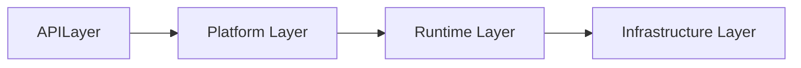
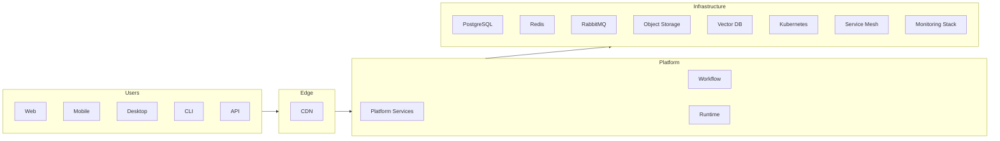
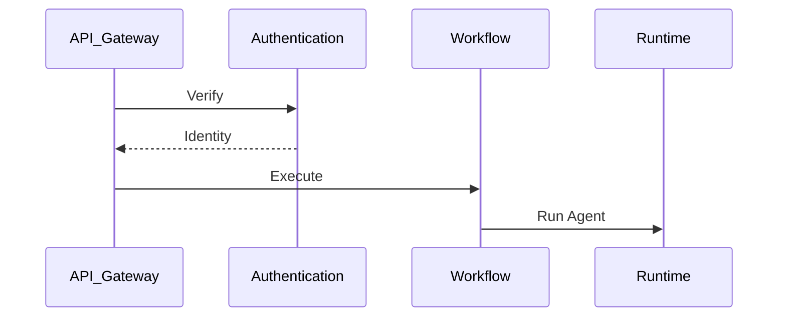
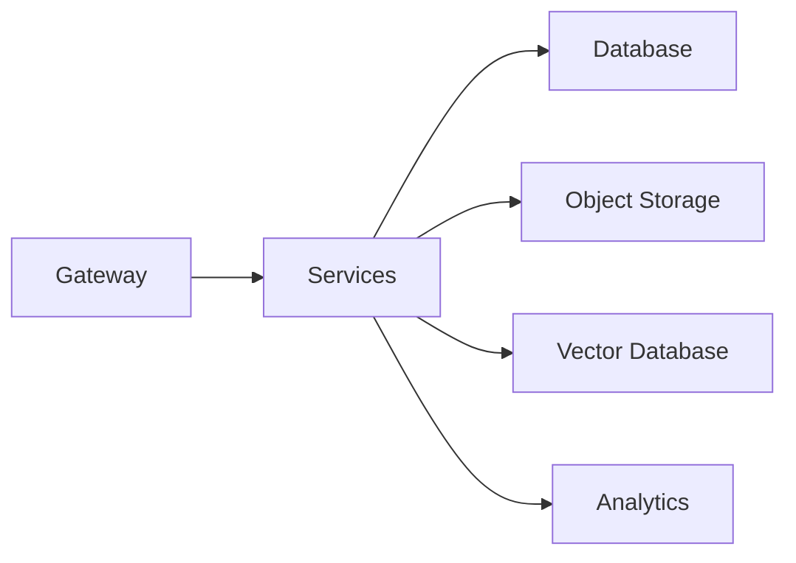
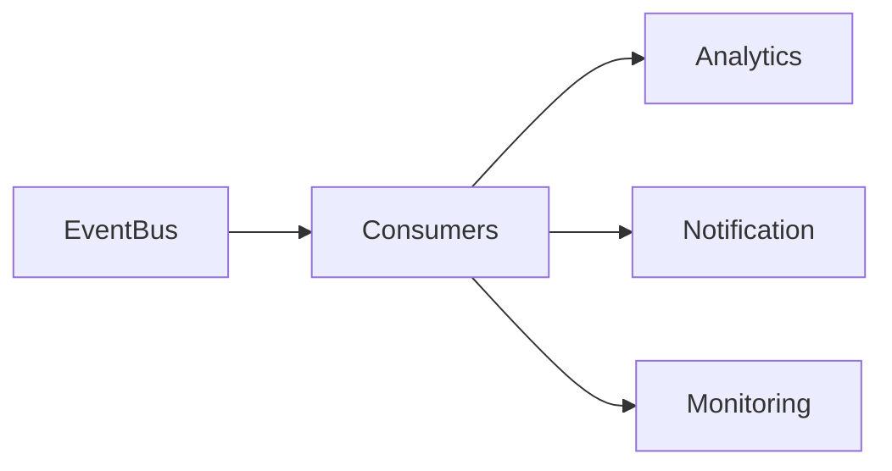
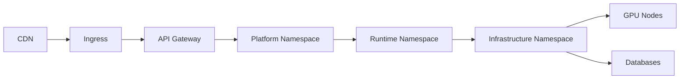

# Platform Reference Architecture

> AI Social OS Platform Layer

Version: 2.0.0

Status: Stable

Last Updated: 2026-07-25

---

# Table of Contents

- Overview
- Objectives
- Architecture Layers
- High-Level Architecture
- Request Flow
- Service Domains
- Core Components
- Infrastructure Components
- Data Flow
- Event Flow
- Deployment View
- Technology Recommendations
- Reference Stack
- Design Principles
- Design Decisions
- Summary

---

# Overview

Platform Reference Architecture mô tả kiến trúc tổng thể của AI Social OS ở mức cao nhất.

Tài liệu này tổng hợp toàn bộ các thành phần đã được mô tả trong các tài liệu Platform trước đó thành một kiến trúc thống nhất.

Đây là tài liệu dùng để.

- Onboarding Developers
- Kiến trúc hệ thống
- Planning
- Review
- Enterprise Documentation
- Technical Decision Making

---

# Objectives

Reference Architecture hướng tới.

- Complete View
- Technology Independent
- Scalable
- Cloud Native
- Event Driven
- AI Native
- Multi Tenant
- Enterprise Ready

---

# Architecture Layers



---

# High-Level Architecture



---

# Request Flow



---

```mermaid
flowchart LR
```

```mermaid
flowchart LR
```

```mermaid
flowchart LR
```

```mermaid
flowchart LR
```

```mermaid
flowchart LR
```

```mermaid
flowchart LR
```

```mermaid
flowchart LR
```

---

# Service Domains

Platform được chia thành các Domain.

```text
Identity Domain

Workspace Domain

Workflow Domain

AI Runtime Domain

Knowledge Domain

Storage Domain

Communication Domain

Operations Domain

Platform Infrastructure
```

Mỗi Domain có thể được phát triển độc lập.

---

# Core Components

Các Core Platform Services.

```text
API Gateway

Authentication

Authorization

Workspace

Workflow

Runtime

Knowledge

Storage

Search

Scheduler

Notification

Media

Analytics

Billing

Configuration

Secret Management

Monitoring
```

Đây là các Service bắt buộc của AI Social OS.

---

# Infrastructure Components

```text
Kubernetes

Container Registry

PostgreSQL

Redis

RabbitMQ

Vector Database

Object Storage

Service Mesh

Ingress Controller

Monitoring Stack

Logging Stack
```

Infrastructure có thể thay thế bằng các công nghệ tương đương.

---

# Data Flow



---

# Event Flow



Platform sử dụng Event-driven Architecture để giảm Coupling giữa các Services.

---

# Deployment View



Mỗi nhóm Service được triển khai trong Namespace riêng.

---

# Technology Recommendations

| Layer | Recommended Technologies |
|--------|--------------------------|
| Frontend | Next.js, React |
| Backend | FastAPI, NestJS |
| AI Runtime | Python, Ray, vLLM |
| Workflow | Temporal, n8n |
| Event Bus | RabbitMQ, Kafka |
| Database | PostgreSQL |
| Cache | Redis |
| Vector DB | Qdrant, Milvus |
| Storage | MinIO, S3 |
| Deployment | Kubernetes |
| Service Mesh | Istio, Linkerd |
| Monitoring | Prometheus, Grafana |
| Logging | Loki, OpenSearch |
| Tracing | OpenTelemetry, Jaeger |

---

# Reference Stack

```mermaid
flowchart LR
```

---

# Cross-Cutting Capabilities

Các thành phần áp dụng cho toàn Platform.

- Authentication
- Authorization
- Logging
- Monitoring
- Audit
- Configuration
- Secret Management
- Service Discovery
- Service Mesh
- Security
- Analytics

Đây không phải là Business Domain mà là nền tảng hỗ trợ.

---

# Design Principles

Reference Architecture được xây dựng theo các nguyên tắc.

- Domain Driven Design
- Microservices
- Event Driven
- Cloud Native
- API First
- AI Native
- Zero Trust
- Observability First
- Infrastructure as Code
- Multi Tenant

---

# Design Decisions

| Decision | Reason |
|-----------|--------|
| Domain-based Architecture | Giảm Coupling |
| API Gateway | Điểm truy cập thống nhất |
| Event Bus | Giao tiếp bất đồng bộ |
| Runtime độc lập | Dễ mở rộng AI |
| Kubernetes | Cloud Native |
| Service Mesh | Bảo mật Service |
| Monitoring xuyên suốt | Dễ vận hành |
| Configuration & Secret tách riêng | Quản trị an toàn |

---

# Architecture Characteristics

Platform đạt được các đặc tính.

- High Availability
- Horizontal Scalability
- Fault Tolerance
- Low Coupling
- High Cohesion
- Multi-Tenant
- AI Native
- Event Driven
- Observable
- Secure by Default

---

# Summary

Platform Reference Architecture là bản thiết kế tổng thể của AI Social OS, kết nối toàn bộ Platform Services, AI Runtime và Infrastructure thành một hệ thống thống nhất.

Kiến trúc được xây dựng theo hướng Cloud Native, Microservices và Event-driven, với Kubernetes, Service Mesh và API Gateway làm nền tảng triển khai. Nhờ đó, AI Social OS có thể mở rộng linh hoạt, vận hành ổn định và hỗ trợ nhiều mô hình AI, Workflow và Business Domain trong môi trường doanh nghiệp quy mô lớn.