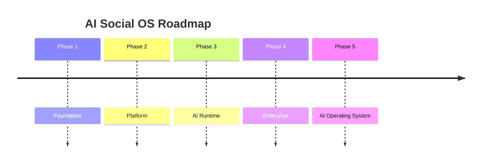
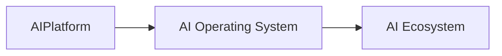
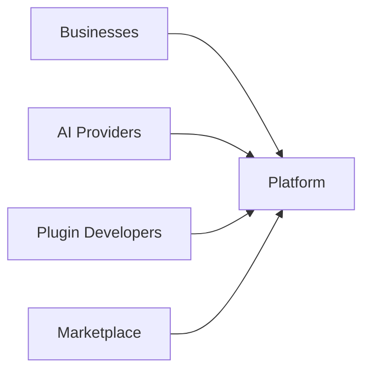

# Platform Roadmap

> AI Social OS Platform Layer

Version: 2.0.0

Status: Living Document

Last Updated: 2026-07-25

---

# Table of Contents

- Overview
- Vision
- Guiding Principles
- Current State
- Roadmap Strategy
- Phase 1 — Foundation
- Phase 2 — Core Platform
- Phase 3 — AI Runtime
- Phase 4 — Enterprise
- Phase 5 — AI Operating System
- Long-term Vision
- Risks
- Success Metrics
- Design Principles
- Summary

---

# Overview

Platform Roadmap mô tả lộ trình phát triển dài hạn của AI Social OS.

Mục tiêu của tài liệu này không phải mô tả chi tiết kỹ thuật mà xác định:

- Platform sẽ phát triển theo hướng nào.
- Những năng lực nào sẽ được xây dựng trước.
- Những tính năng nào được ưu tiên.
- Khi nào Platform đạt Enterprise Ready.
- Khi nào Platform trở thành AI Operating System.

---

# Vision

AI Social OS hướng tới trở thành một nền tảng hoàn chỉnh để xây dựng, triển khai và vận hành các hệ thống AI Agent quy mô doanh nghiệp.

Platform không chỉ là Workflow Engine.

Không chỉ là AI Agent Framework.

Không chỉ là Low-code Platform.

Mà là một AI Operating System.

---

# Guiding Principles

Lộ trình phát triển tuân theo các nguyên tắc.

- API First
- Cloud Native
- AI Native
- Modular
- Event Driven
- Multi Tenant
- Extensible
- Enterprise Ready

---

# Current State

Platform hiện đã có kiến trúc cho các thành phần.

```text
Identity

Workspace

Workflow

Runtime

Knowledge

Storage

Media

Scheduler

Notification

Billing

Analytics

Monitoring

Configuration

Secrets

Gateway

Service Mesh

Deployment

Security
```

Đây là nền tảng để xây dựng các tính năng cao hơn.

---

# Roadmap Strategy



---

# Phase 1 — Foundation

Mục tiêu.

Xây dựng nền tảng hạ tầng.

Bao gồm.

- Authentication
- Authorization
- Workspace
- API Gateway
- Storage
- Configuration
- Secret Management
- Monitoring
- Logging

Kết quả.

Platform có thể phục vụ các ứng dụng cơ bản.

---

# Phase 2 — Core Platform

Mục tiêu.

Hoàn thiện các Platform Services.

Bao gồm.

- Workflow Engine
- Scheduler
- Notification
- Media
- Search
- Knowledge Base
- Analytics
- Billing

Kết quả.

Platform có thể triển khai các hệ thống AI Workflow.

---

# Phase 3 — AI Runtime

Mục tiêu.

Xây dựng AI Runtime hoàn chỉnh.

Bao gồm.

- Agent Runtime
- Model Router
- Memory Runtime
- Tool Runtime
- Prompt Engine
- MCP Runtime
- Multi Provider Support
- Streaming
- Session Memory

Kết quả.

Platform có thể vận hành AI Agent Production.

---

# Phase 4 — Enterprise

Mục tiêu.

Đáp ứng yêu cầu doanh nghiệp.

Bao gồm.

- RBAC
- Audit
- SSO
- Multi Organization
- Quotas
- Cost Control
- Compliance
- HA Deployment
- Multi Region
- Disaster Recovery

Kết quả.

Enterprise Ready.

---

# Phase 5 — AI Operating System

Mục tiêu.

Biến Platform thành AI OS.

Bao gồm.

- Autonomous Agents
- Multi-Agent Collaboration
- Agent Marketplace
- Skill Marketplace
- Plugin Marketplace
- AI App Store
- AI Desktop
- AI Workspace
- AI Memory Graph
- AI Collaboration

Kết quả.

Một nền tảng AI hoàn chỉnh.

---

# Long-term Vision



---

# Future Capabilities

Các khả năng trong tương lai.

```text
Agent Marketplace

Prompt Marketplace

Plugin Marketplace

Knowledge Marketplace

Workflow Marketplace

Model Marketplace

Template Marketplace

Automation Marketplace
```

---

# Enterprise Features

Các tính năng sẽ được mở rộng.

- Multi Cluster
- Multi Cloud
- Multi Region
- Hybrid Deployment
- Air-gapped Deployment
- Enterprise Governance
- Organization Policies
- Compliance Automation

---

# AI Capabilities

Các khả năng AI trong tương lai.

- Planning Agents
- Reasoning Agents
- Coding Agents
- Research Agents
- Voice Agents
- Vision Agents
- Robotics Integration
- Long-term Memory
- Self-improving Agents

---

# Platform Ecosystem



---

# Risks

Các rủi ro chính.

- AI Provider thay đổi API.
- Chi phí AI tăng.
- Multi-agent Complexity.
- Vendor Lock-in.
- Compliance Requirements.
- Data Privacy.
- Scalability Challenges.

Mọi quyết định kỹ thuật cần giảm thiểu các rủi ro này.

---

# Success Metrics

Platform được xem là thành công khi đạt.

- Horizontal Scalability
- Enterprise Adoption
- Stable APIs
- High Availability
- Low Operational Cost
- Large Plugin Ecosystem
- Large Marketplace
- Multi-Agent Support
- Community Contributions

---

# Design Principles

Roadmap được xây dựng theo.

- Build Small
- Iterate Fast
- Stable APIs
- Backward Compatibility
- Extensible Architecture
- Platform First
- AI Native
- Open Ecosystem

---

# Milestone Summary

| Phase | Primary Goal | Expected Outcome |
|---------|--------------|-----------------|
| Foundation | Core Infrastructure | Stable Platform |
| Core Platform | Business Services | Production Platform |
| AI Runtime | AI Execution | AI Agent Platform |
| Enterprise | Governance & Security | Enterprise Ready |
| AI Operating System | Ecosystem | AI Social OS |

---

# Summary

Platform Roadmap xác định chiến lược phát triển dài hạn của AI Social OS từ một nền tảng hạ tầng Cloud Native đến một AI Operating System hoàn chỉnh.

Thông qua năm giai đoạn phát triển từ Foundation, Core Platform, AI Runtime, Enterprise đến AI Operating System, Platform được xây dựng theo hướng mở, mô-đun và có khả năng mở rộng, tạo nền tảng cho một hệ sinh thái AI Agent quy mô doanh nghiệp và cộng đồng phát triển trong tương lai.