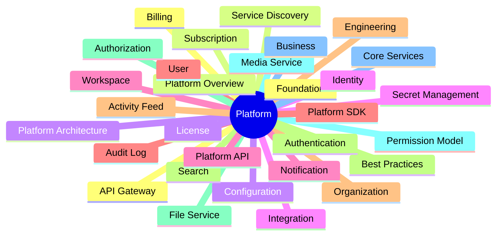
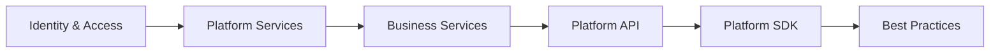
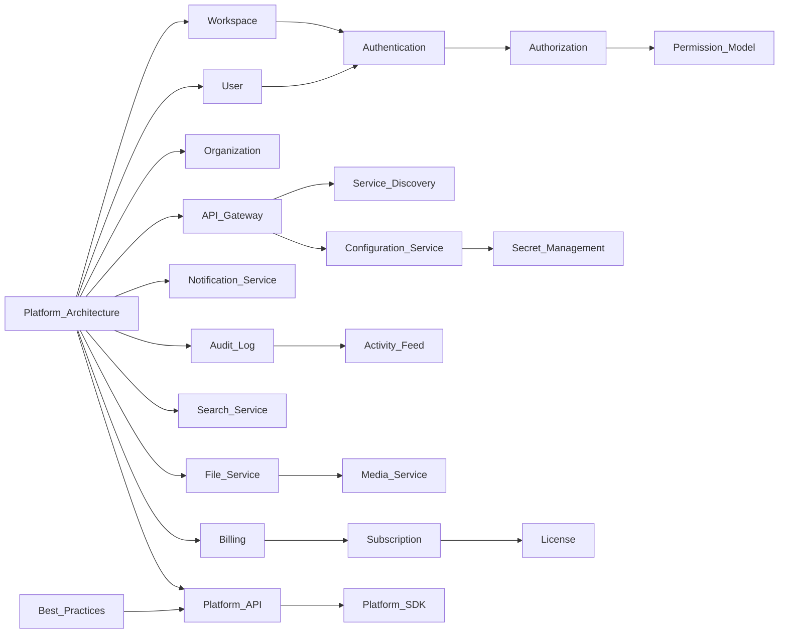

# Platform Documentation Index

> AI Social OS Platform Layer

Version: 2.0.0

Status: Stable

Last Updated: 2026-07-25

---

# Overview

Platform là tầng dịch vụ dùng chung của AI Social OS.

Tầng này quản lý toàn bộ các khả năng không thuộc Runtime nhưng được sử dụng bởi mọi Application, bao gồm:

- Identity
- Workspace
- Security
- API Gateway
- Configuration
- Notification
- Search
- File Storage
- Billing

Platform đóng vai trò cầu nối giữa Applications và Runtime.

---

# Documentation Map



---

# Foundation

| File | Description |
|------|-------------|
| 01_PLATFORM_OVERVIEW.md | Tổng quan Platform |
| 02_PLATFORM_ARCHITECTURE.md | Kiến trúc Platform |

---

# Identity & Access

| File | Description |
|------|-------------|
| 03_WORKSPACE_MANAGEMENT.md | Workspace Management |
| 04_USER_MANAGEMENT.md | User Management |
| 05_ORGANIZATION.md | Organization Model |
| 06_AUTHENTICATION.md | Authentication |
| 07_AUTHORIZATION.md | Authorization |
| 08_PERMISSION_MODEL.md | Permission Model |

---

# Platform Services

| File | Description |
|------|-------------|
| 09_API_GATEWAY.md | API Gateway |
| 10_SERVICE_DISCOVERY.md | Service Discovery |
| 11_CONFIGURATION_SERVICE.md | Configuration Service |
| 12_SECRET_MANAGEMENT.md | Secret Management |
| 13_NOTIFICATION_SERVICE.md | Notification Service |
| 14_AUDIT_LOG.md | Audit Log |
| 15_ACTIVITY_FEED.md | Activity Feed |
| 16_SEARCH_SERVICE.md | Search Service |
| 17_FILE_SERVICE.md | File Service |
| 18_MEDIA_SERVICE.md | Media Service |

---

# Business Services

| File | Description |
|------|-------------|
| 19_BILLING.md | Billing |
| 20_SUBSCRIPTION.md | Subscription |
| 21_LICENSE.md | License Management |

---

# Integration

| File | Description |
|------|-------------|
| 22_PLATFORM_API.md | Platform API |
| 23_PLATFORM_SDK.md | Platform SDK |

---

# Engineering

| File | Description |
|------|-------------|
| 24_PLATFORM_BEST_PRACTICES.md | Best Practices |

---

# Learning Path



---

# Dependency Graph



---

# Platform Coverage

```text
Foundation
████████████████████

Identity
████████████████████

Platform Services
████████████████████

Business Services
████████████████████

Integration
████████████████████

Engineering
████████████████████
```

---

# Summary

Platform Documentation bao gồm 24 tài liệu chuyên sâu cùng với `README.md` và `INDEX.md`, mô tả toàn bộ kiến trúc Platform của AI Social OS.

Các tài liệu được tổ chức theo từng nhóm chức năng từ Foundation, Identity, Platform Services, Business Services đến Integration và Best Practices, tạo thành tài liệu tham chiếu đầy đủ cho việc thiết kế, phát triển và vận hành Platform Layer.