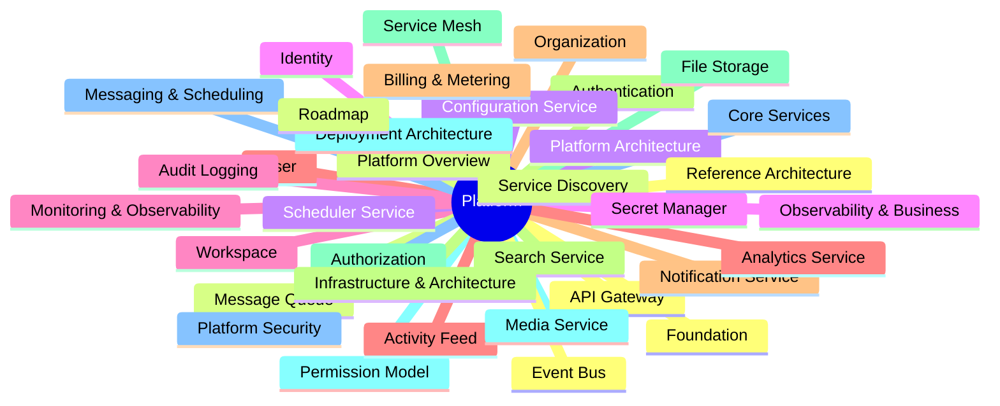
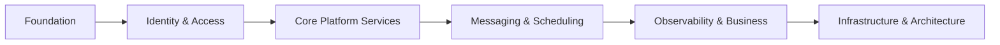
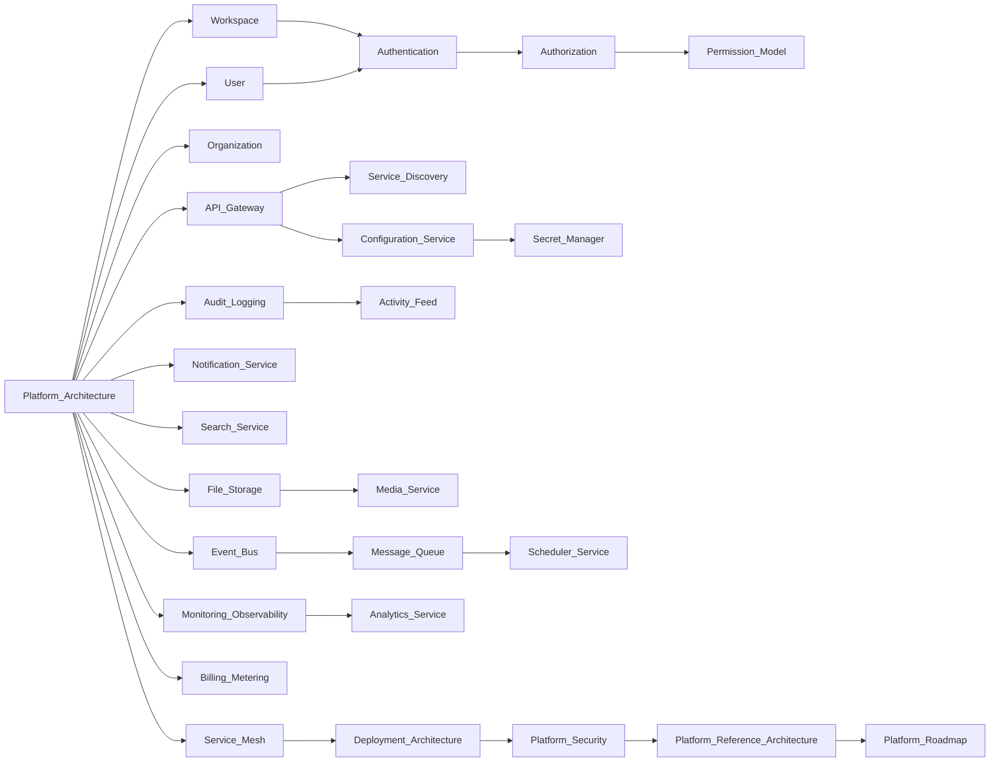

# Platform Documentation Index

> AI Social OS Platform Layer

Version: 2.0.0

Status: Stable

Last Updated: 2026-07-25

---

# Overview

Platform là tầng dịch vụ dùng chung của AI Social OS.

Tầng này quản lý toàn bộ các khả năng không thuộc Runtime nhưng được sử dụng bởi mọi Application, bao gồm:

- Identity
- Workspace
- Security
- API Gateway
- Configuration
- Notification
- Search
- File Storage
- Billing

Platform đóng vai trò cầu nối giữa Applications và Runtime.

---

# Documentation Map



---

# Foundation

| File | Description |
|------|-------------|
| 01_PLATFORM_OVERVIEW.md | Platform Overview |
| 02_PLATFORM_ARCHITECTURE.md | Platform Architecture |

---

# Identity & Access

| File | Description |
|------|-------------|
| 03_WORKSPACE_MANAGEMENT.md | Workspace Management |
| 04_USER_MANAGEMENT.md | User Management |
| 05_ORGANIZATION.md | Organization |
| 06_AUTHENTICATION.md | Authentication |
| 07_AUTHORIZATION.md | Authorization |
| 08_PERMISSION_MODEL.md | Permission Model |

---

# Core Platform Services

| File | Description |
|------|-------------|
| 09_API_GATEWAY.md | API Gateway |
| 10_SERVICE_DISCOVERY.md | Service Discovery |
| 11_CONFIGURATION_SERVICE.md | Configuration Service |
| 12_SECRET_MANAGER.md | Secret Manager |
| 13_AUDIT_LOGGING.md | Audit Logging |
| 14_ACTIVITY_FEED.md | Activity Feed |
| 15_NOTIFICATION_SERVICE.md | Notification Service |
| 16_SEARCH_SERVICE.md | Search Service |
| 17_FILE_STORAGE.md | File Storage Service |
| 18_MEDIA_SERVICE.md | Media Service |

---

# Messaging & Scheduling

| File | Description |
|------|-------------|
| 19_EVENT_BUS.md | Event Bus |
| 20_MESSAGE_QUEUE.md | Message Queue |
| 21_SCHEDULER_SERVICE.md | Scheduler Service |

---

# Observability & Business

| File | Description |
|------|-------------|
| 22_MONITORING_OBSERVABILITY.md | Monitoring & Observability |
| 23_ANALYTICS_SERVICE.md | Analytics Service |
| 24_BILLING_METERING.md | Billing & Metering Service |

---

# Infrastructure & Architecture

| File | Description |
|------|-------------|
| 29_SERVICE_MESH.md | Service Mesh |
| 30_DEPLOYMENT_ARCHITECTURE.md | Deployment Architecture |
| 31_PLATFORM_SECURITY.md | Platform Security |
| 32_PLATFORM_REFERENCE_ARCHITECTURE.md | Platform Reference Architecture |
| 33_PLATFORM_ROADMAP.md | Platform Roadmap |

Note: file numbers 25-28 are retired. They previously held duplicate write-ups of API Gateway, Service Discovery, Configuration Service and Secret Manager that have since been merged into 09, 10, 11 and 12 respectively.

---

# Learning Path



---

# Dependency Graph



---

# Platform Coverage

```text
Foundation
████████████████████

Identity & Access
████████████████████

Core Platform Services
████████████████████

Messaging & Scheduling
████████████████████

Observability & Business
████████████████████

Infrastructure & Architecture
████████████████████
```

---

# Summary

Platform Documentation bao gồm 29 tài liệu chuyên sâu (đánh số 01-24 và 29-33) cùng với `README.md` và `INDEX.md`, mô tả toàn bộ kiến trúc Platform của AI Social OS.

Các tài liệu được tổ chức theo từng nhóm chức năng từ Foundation, Identity & Access, Core Platform Services, Messaging & Scheduling, Observability & Business đến Infrastructure & Architecture, tạo thành tài liệu tham chiếu đầy đủ cho việc thiết kế, phát triển và vận hành Platform Layer. Các số thứ tự 25-28 đã được gộp vào 09, 10, 11 và 12 trong đợt hợp nhất tài liệu trùng lặp gần nhất.