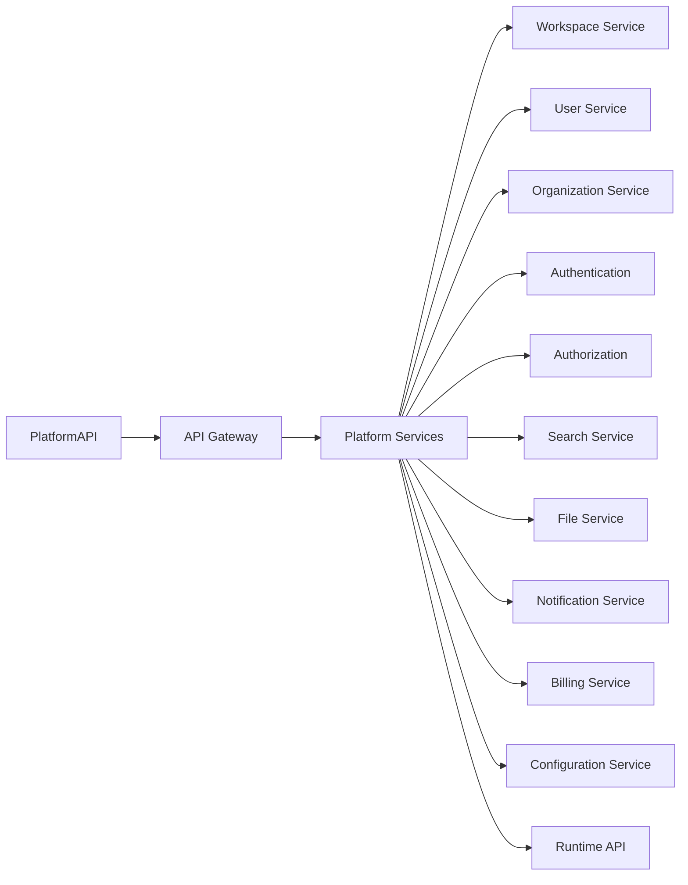
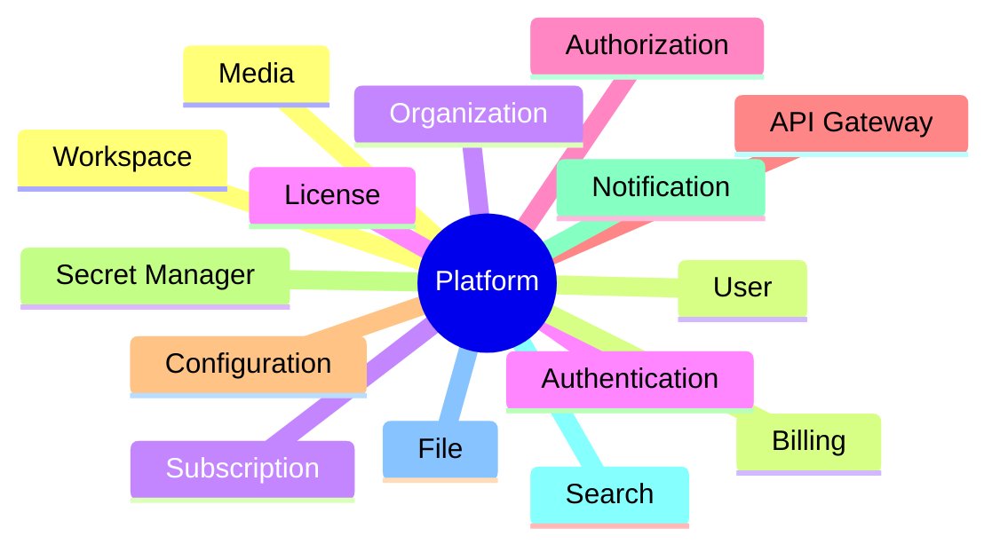
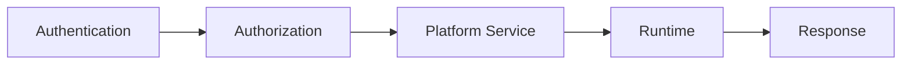
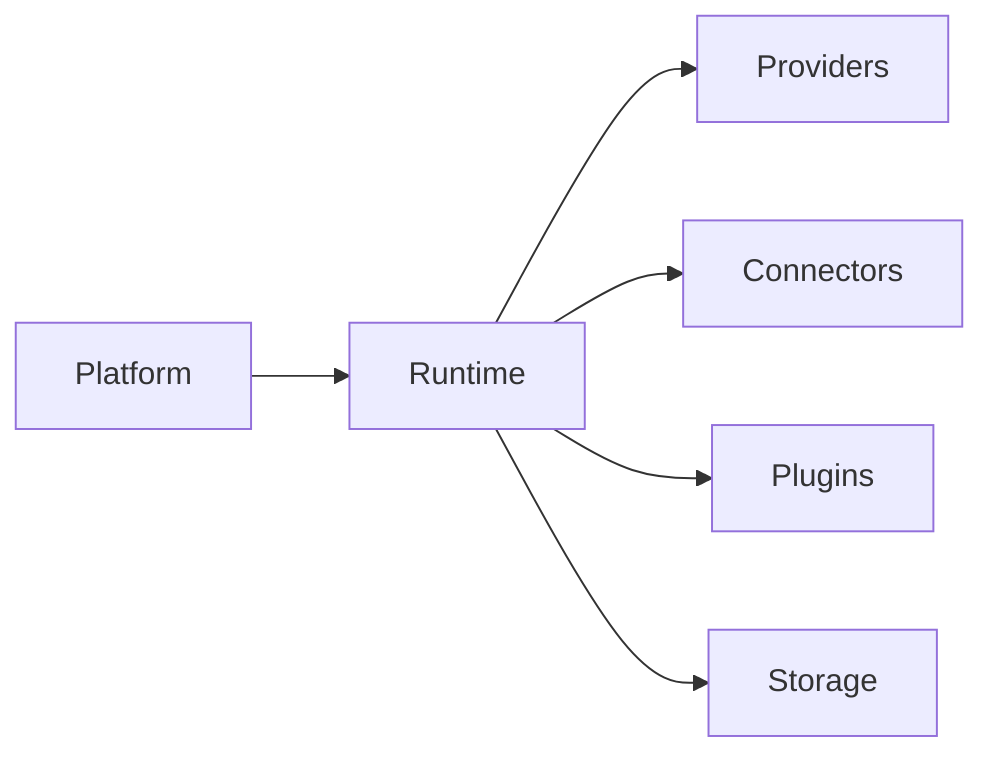

# AI Social OS Platform

> Platform Layer Documentation

Version: 2.0.0

Status: Stable

Last Updated: 2026-07-25

---

# Overview

Platform là tầng dịch vụ cốt lõi của AI Social OS, cung cấp toàn bộ các năng lực dùng chung cho hệ thống.

Khác với Runtime chịu trách nhiệm thực thi Workflow và Agent, Platform chịu trách nhiệm quản lý người dùng, Workspace, API, Security, Configuration, Billing và các dịch vụ nền tảng khác.

Platform là lớp trung gian giữa Applications và Runtime.

---

# Platform Responsibilities

Platform chịu trách nhiệm.

- User Management
- Workspace Management
- Organization Management
- Authentication
- Authorization
- API Gateway
- Secret Management
- Configuration Management
- Search
- Notification
- File Management
- Billing
- Subscription
- License Management
- Audit Logging

Platform không trực tiếp thực thi Workflow.

Mọi Execution đều được chuyển xuống Runtime.

---

# Platform Architecture



---

# Documentation Structure

```
platform/

├── README.md
│
├── 01_PLATFORM_OVERVIEW.md
├── 02_PLATFORM_ARCHITECTURE.md
├── 03_WORKSPACE_MANAGEMENT.md
├── 04_USER_MANAGEMENT.md
├── 05_ORGANIZATION.md
├── 06_AUTHENTICATION.md
├── 07_AUTHORIZATION.md
├── 08_PERMISSION_MODEL.md
├── 09_API_GATEWAY.md
├── 10_SERVICE_DISCOVERY.md
├── 11_CONFIGURATION_SERVICE.md
├── 12_SECRET_MANAGEMENT.md
├── 13_NOTIFICATION_SERVICE.md
├── 14_AUDIT_LOG.md
├── 15_ACTIVITY_FEED.md
├── 16_SEARCH_SERVICE.md
├── 17_FILE_SERVICE.md
├── 18_MEDIA_SERVICE.md
├── 19_BILLING.md
├── 20_SUBSCRIPTION.md
├── 21_LICENSE.md
├── 22_PLATFORM_API.md
├── 23_PLATFORM_SDK.md
├── 24_PLATFORM_BEST_PRACTICES.md
```

---

# Reading Order

## Phase 1 — Foundation

1. Platform Overview
2. Platform Architecture

---

## Phase 2 — Identity

3. Workspace Management
4. User Management
5. Organization
6. Authentication
7. Authorization
8. Permission Model

---

## Phase 3 — Platform Services

9. API Gateway
10. Service Discovery
11. Configuration Service
12. Secret Management
13. Notification Service
14. Audit Log
15. Activity Feed
16. Search Service
17. File Service
18. Media Service

---

## Phase 4 — Business

19. Billing
20. Subscription
21. License

---

## Phase 5 — Integration

22. Platform API
23. Platform SDK

---

## Phase 6 — Engineering

24. Platform Best Practices

---

# Platform Components



---

# Platform Lifecycle



---

# Design Principles

Platform được xây dựng theo các nguyên tắc.

- Service Oriented
- API First
- Multi Tenant
- Secure by Default
- Event Driven
- Configurable
- Extensible
- Observable

---

# Relationship With Other Layers



---

# Intended Audience

Bộ tài liệu Platform dành cho.

- Software Architects
- Backend Engineers
- Platform Engineers
- DevOps Engineers
- Security Engineers
- SDK Developers
- API Developers

---

# Summary

Platform là tầng dịch vụ nền tảng của AI Social OS, cung cấp các năng lực dùng chung như Identity, Security, Configuration, API Gateway, Notification, Search, Billing và Workspace Management.

Thông qua các Platform Services, toàn bộ Applications có thể sử dụng chung một nền tảng thống nhất, bảo mật, có khả năng mở rộng và tích hợp chặt chẽ với Runtime để xây dựng các sản phẩm AI quy mô lớn.