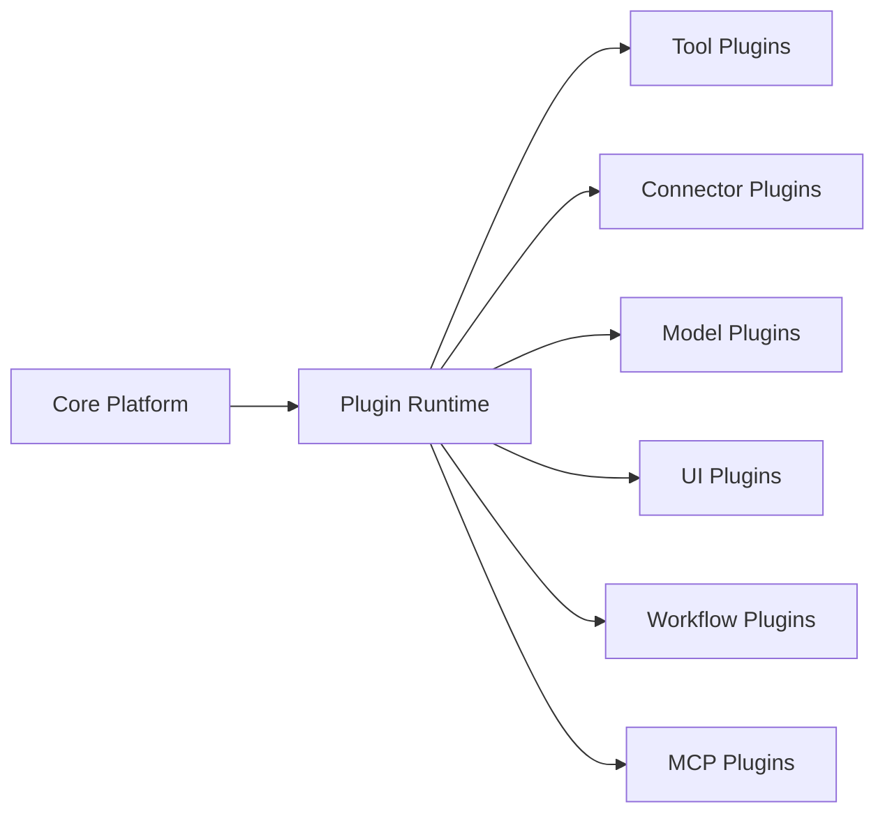
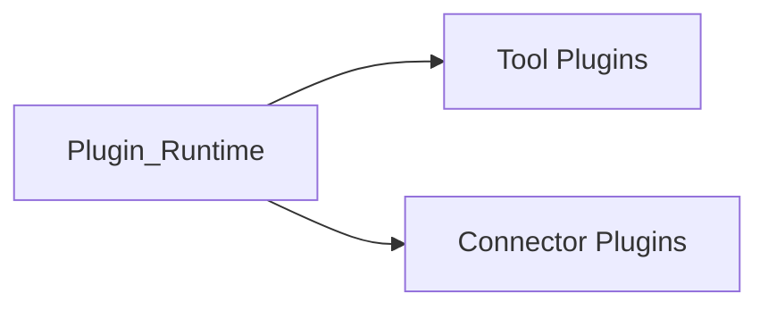
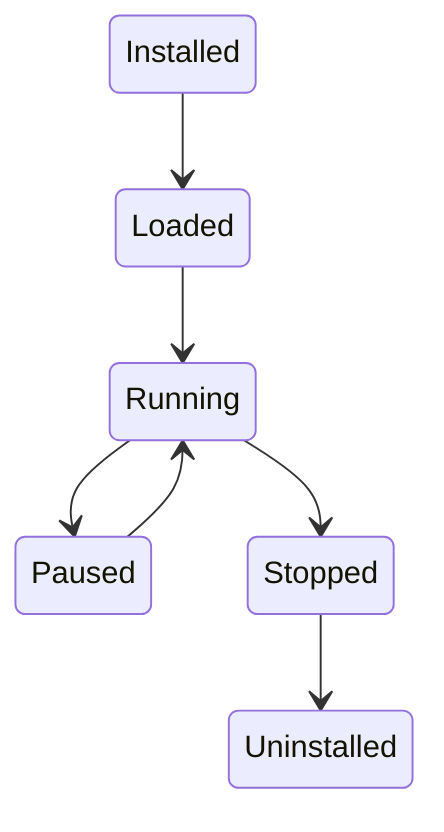

# Plugin Architecture

> AI Social OS Plugin Layer

Version: 2.0.0

Status: Stable

Last Updated: 2026-07-25

---

# Table of Contents

- Overview
- Objectives
- Why Plugin System
- Plugin Principles
- Architecture
- Plugin Categories
- Plugin Lifecycle
- Runtime Integration
- AI Integration
- Security
- Design Principles
- Design Decisions
- Summary

---

# Overview

Plugin Layer mở rộng khả năng của AI Social OS bằng cách cho phép cài đặt các thành phần bên ngoài mà không cần thay đổi Core System.

Plugin có thể bổ sung.

- Tools
- AI Models
- External APIs
- Workflow Nodes
- Connectors


```mermaid
flowchart LR
```

---

# Plugin Principles

Plugin tuân theo.

- Plugin First
- Sandbox Execution
- Capability Driven
- Versioned
- Secure
- Observable
- Hot Reload
- Independent Deployment

---

# High-Level Architecture



---

# Plugin Lifecycle



```mermaid
flowchart LR
```

```mermaid
flowchart LR
```

```mermaid
flowchart LR
```

```mermaid
flowchart LR
```

```mermaid
flowchart LR
    ```
```

---

# Runtime Integration

Plugin Runtime chịu trách nhiệm.

- Load Plugin
- Validate
- Initialize
- Register Capability
- Monitor
- Shutdown

Plugin không truy cập trực tiếp Core.

---

# AI Integration

AI Agent có thể sử dụng Plugin như Tool.

Ví dụ.

```
```mermaid
flowchart LR
```

AI không cần biết Plugin được viết bằng ngôn ngữ nào.

---

# Security

Plugin phải chạy trong Sandbox.

Plugin không được phép.

- truy cập Memory trái phép
- truy cập File System không được cấp quyền
- truy cập Secret nếu không có Permission

---

# Design Principles

Plugin Layer được xây dựng theo.

- Extensible
- Secure
- Vendor Neutral
- Sandbox Native
- Capability Based
- Hot Swappable
- Event Driven
- Observable

---

# Design Decisions

| Decision | Reason |
|----------|--------|
| Plugin Runtime riêng | Tách khỏi Core |
| Capability Registry | Không phụ thuộc Plugin Name |
| Sandbox | Bảo mật |
| Manifest chuẩn | Chuẩn hóa Plugin |
| Dynamic Loading | Không cần Restart |
| Marketplace | Phân phối Plugin |
| Versioning | Hỗ trợ nâng cấp |

---

# Summary

Plugin Layer là cơ chế mở rộng chính của AI Social OS.

Thông qua Plugin Runtime, Capability Registry và Sandbox Execution, hệ thống có thể tích hợp các Tool, Connector, MCP Server và AI Service từ nhiều nhà cung cấp khác nhau mà vẫn đảm bảo tính bảo mật, khả năng mở rộng và độc lập với Core Platform.