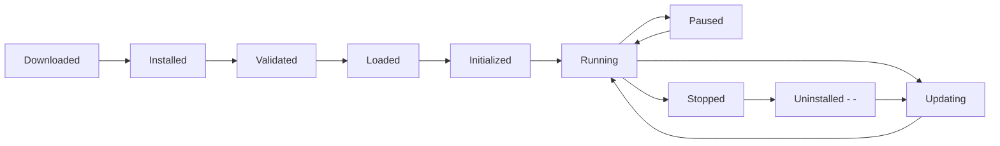

# Plugin Lifecycle

> AI Social OS Plugin Layer

Version: 2.0.0

Status: Stable

Last Updated: 2026-07-25

---

# Table of Contents

- Overview
- Objectives
- Lifecycle States
- Installation
- Validation
- Initialization
- Registration
- Runtime
- Upgrade
- Disable
- Uninstall
- Failure Recovery


```mermaid
flowchart LR
```

```mermaid
flowchart LR
```

```mermaid
flowchart LR
    ```
```

---

# Installation

Plugin có thể được cài từ.

- Marketplace
- Git Repository
- Local Package
- Enterprise Registry

---

# Validation

Plugin Runtime kiểm tra.

- Manifest
- Signature
- Compatibility
- Dependencies
- Permissions
- Version

Nếu Validation thất bại.

Plugin không được cài đặt.

---

# Initialization

Plugin Runtime gọi.

```
```mermaid
flowchart LR
```

Plugin chưa được phép xử lý Request.

---

# Registration

Plugin đăng ký.

- Capabilities
- Tools
- Connectors
- Events
- UI Components
- Permissions

Ví dụ.

```yaml
capabilities:

- search.web

- weather.query

- translation.text
```

---

# Running

Plugin bắt đầu xử lý.

- Tool Calls
- Events
- API Requests
- Workflow Tasks

Plugin Runtime theo dõi.

- Memory
- CPU
- Errors
- Health

---

# Hot Reload

Plugin có thể cập nhật.

```mermaid
flowchart LR
```

Không cần Restart Platform.

---

# Upgrade

Quá trình Upgrade.

```mermaid
flowchart LR
```

Rollback nếu xảy ra lỗi.

---

# Pause

Plugin có thể bị tạm dừng.

Ví dụ.

- Maintenance
- High CPU
- Admin Request

Plugin không nhận Request mới.

---

# Stop

Plugin dừng hoàn toàn.

Resources được giải phóng.

- Memory
- Connections
- Workers

---

# Uninstall

Quá trình.

```mermaid
flowchart LR
```

Plugin Runtime đảm bảo không còn Dependency.

---

# Failure Recovery

Nếu Plugin lỗi.

```mermaid
flowchart LR
```

Nếu vượt quá Retry.

```text
Disable Plugin
```

---

# Lifecycle Events

Plugin Runtime phát sinh.

```text
PluginInstalled

PluginValidated

PluginLoaded

PluginStarted

PluginPaused

PluginUpdated

PluginStopped

PluginRemoved
```

---

# Design Principles

Lifecycle được xây dựng theo.

- Observable
- Recoverable
- Versioned
- Secure
- Hot Reload
- Deterministic

---

# Summary

Plugin Lifecycle chuẩn hóa toàn bộ vòng đời của Plugin, giúp AI Social OS quản lý việc cài đặt, nâng cấp, vận hành và gỡ bỏ Plugin một cách nhất quán, an toàn và có khả năng phục hồi.