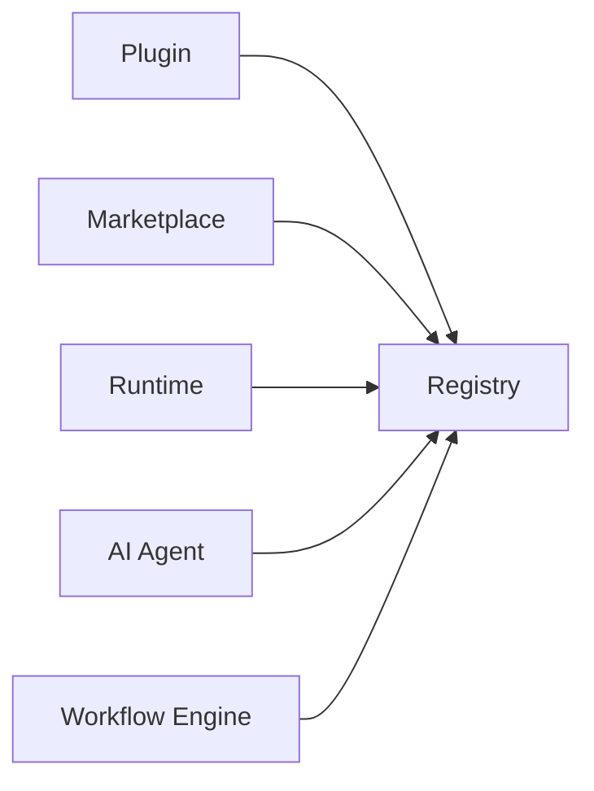
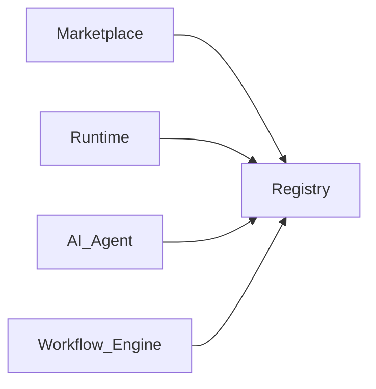

# Plugin Registry

> AI Social OS Plugin Layer

Version: 2.0.0

Status: Stable

Last Updated: 2026-07-25

---

# Table of Contents

- Overview
- Objectives
- Registry Architecture
- Plugin Metadata
- Registration
- Discovery


---

# Registry Architecture



---

# Plugin Metadata

Mỗi Plugin được lưu dưới dạng.

```yaml
id:
name:
version:
author:
publisher:
runtime:
status:
health:
capabilities:
permissions:
dependencies:
createdAt:
updatedAt:
```

---

# Registration

Quy trình đăng ký.

```mermaid
flowchart LR
```

---

# Discovery

Plugin được tìm kiếm theo.

- Plugin ID
- Capability
- Category
- Author
- Runtime
- Version
- Tags

---

# Version Management

Registry hỗ trợ.

- Semantic Versioning
- Multiple Versions
- Version Pinning
- Compatibility Check

Ví dụ.

```text
Weather Plugin

1.0.0

1.1.0

2.0.0
```

---

# Dependency Management

Plugin có thể phụ thuộc Plugin khác.

```mermaid
flowchart LR
```

Runtime chỉ Load khi Dependency hợp lệ.

---

# Health Status

Registry lưu trạng thái.

```text
Active

Inactive

Deprecated

Disabled

Broken
```

---

# Registry Events

```text
PluginRegistered

PluginUpdated

PluginDeprecated

PluginRemoved

CapabilityRegistered
```

---

# Metrics

Registry theo dõi.

- Installed Plugins
- Active Plugins
- Failed Plugins
- Plugin Downloads
- Capability Count

---

# Design Principles

- Central Registry
- Immutable Metadata
- Version Aware
- Capability Driven
- Observable

---

# Summary

Plugin Registry là nguồn dữ liệu trung tâm quản lý Plugin và Capability của toàn bộ AI Social OS.