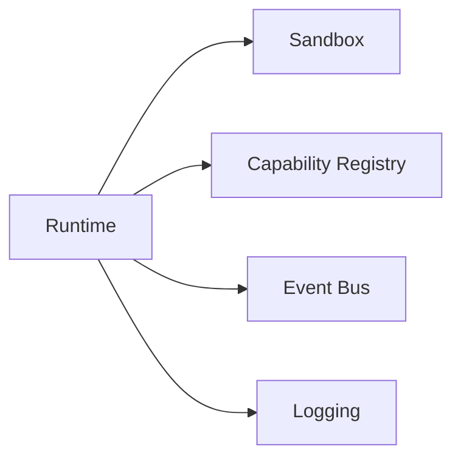
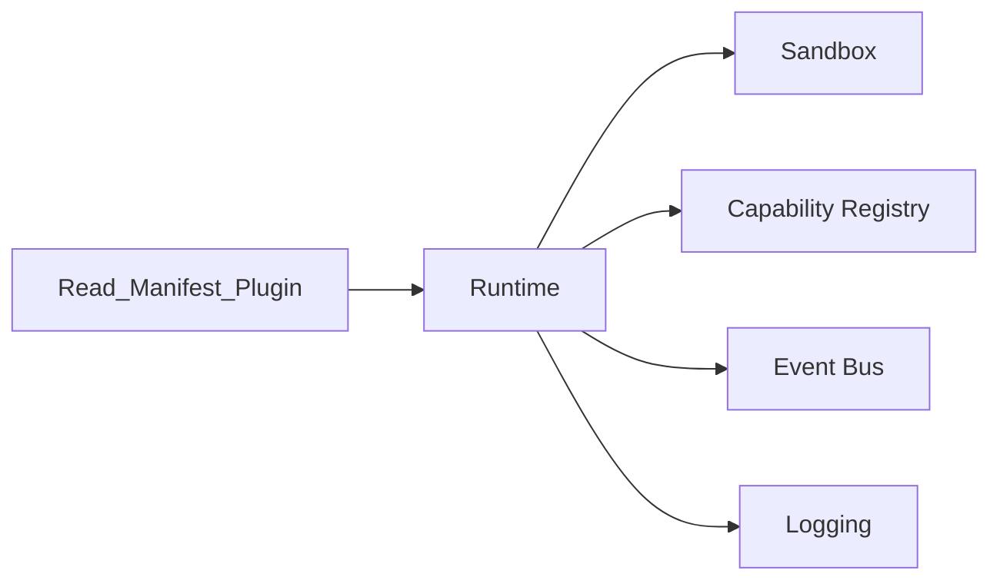

# Plugin Runtime

> AI Social OS Plugin Layer

Version: 2.0.0

Status: Stable

---

# Table of Contents

- Overview
- Objectives
- Runtime Architecture
- Loading
- Execution
- Isolation
- Resource Management
- Monitoring
- Failure Recovery
- Runtime Events
- Summary

---

# Overview

Plugin Runtime là môi trường thực thi Plugin.

Runtime chịu trách nhiệm.

- Load
- Execute
- Monitor
- Restart
- Shutdown

Plugin không chạy trực tiếp trong Core Platform.

---

# Objectives

Runtime hướng tới.

- Isolation
- Security
- Reliability
- Performance
- Hot Reload

---

# Runtime Architecture



---

# Plugin Loading



Plugin không chia sẻ.

- Memory
- File Handle
- Process

---

# Resource Limits

Runtime giới hạn.

- CPU
- Memory
- Network
- Disk
- Execution Time

---

# Monitoring

Plugin Runtime theo dõi.

- CPU
- RAM
- Latency
- Errors
- Health

---

# Failure Recovery


---

# Runtime Events

```text
PluginStarted

PluginStopped

PluginRestarted

PluginCrashed

PluginRecovered
```

---

# Summary

Plugin Runtime là lớp thực thi an toàn cho toàn bộ Plugin trong hệ thống.