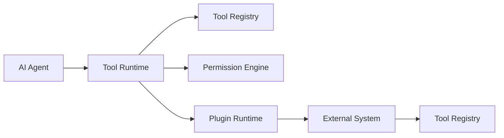
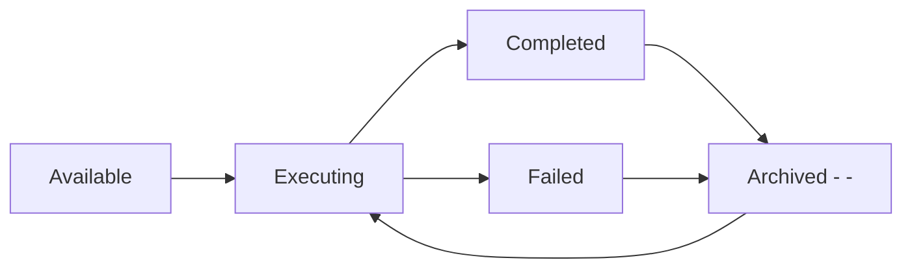
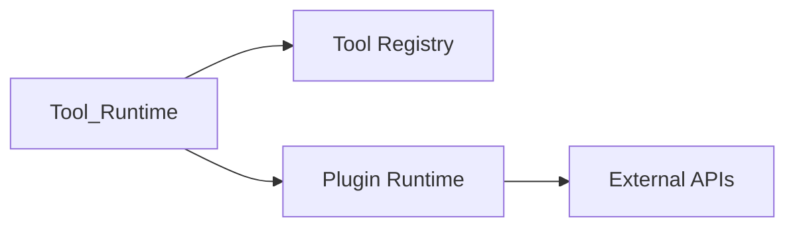

# Tool System

> AI Social OS Plugin Layer

Version: 2.0.0

Status: Stable

Last Updated: 2026-07-25

---

# Table of Contents

- Overview
- Objectives
- Why Tool System
- Tool Architecture
- Tool Lifecycle
- Tool Categories
- Tool Registration
- Tool Discovery
- Tool Invocation
- Tool Result
- Tool Permissions
- Tool Versioning
- Tool Metrics
- Design Principles
- Design Decisions
- Summary

---

# Overview

Tool System là lớp chuẩn hóa toàn bộ khả năng mà AI Agent có thể sử dụng để tương tác với thế giới bên ngoài.

Trong AI Social OS, mọi hành động như.

- đọc file
- gọi API
- truy vấn Database
- gửi Email
- chạy Workflow
- tìm kiếm Internet

đều được thực hiện thông qua Tool.

AI Agent không được phép gọi trực tiếp External System.

---

# Objectives

Tool System hướng tới.

- Unified Tool Interface
- Secure Execution
- Capability Based
- Observable
- Versioned
- Vendor Neutral
- Enterprise Ready
- Extensible

---

# Why Tool System

Nếu Agent gọi API trực tiếp.

```mermaid
flowchart LR
```

sẽ dẫn tới.

- khó thay thế
- khó kiểm soát
- không Audit
- không Retry




```mermaid
flowchart LR
```

```mermaid
flowchart LR
```

```mermaid
flowchart LR
    ```
```

---

# Tool Categories

## Data Tools

- SQL
- PostgreSQL
- Redis
- MongoDB
- Elasticsearch

---

## Web Tools

- HTTP
- REST
- GraphQL
- Webhook

---

## AI Tools

- LLM
- Embedding
- OCR
- Speech
- Vision

---

## Storage Tools

- S3
- Google Drive
- OneDrive
- Local Storage

---

## Communication Tools

- Email
- Slack
- Discord
- Telegram
- Teams

---

## Automation Tools

- Workflow
- Queue
- Scheduler
- Event Trigger

---

## Developer Tools

- Git
- Docker
- Kubernetes
- Terminal
- CI/CD

---

# Tool Descriptor

Mỗi Tool đều có Metadata.

```
```yaml
id:

name:

version:

description:

permissions:

input:

output:

timeout:

retry:
```

---

# Tool Registration

Tool được đăng ký vào Tool Registry.

```mermaid
flowchart LR
```

---

# Tool Discovery

AI Agent tìm Tool theo.

- Capability
- Category
- Name
- Provider
- Version

---

# Tool Invocation

Luồng thực thi.

```mermaid
flowchart LR
```

Tool Runtime ghi nhận toàn bộ quá trình.

---

# Tool Result

Tool luôn trả về.

```json
{
    "status":"success",
    "data":{},
    "metadata":{},
    "duration":250
}
```

Nếu lỗi.

```json
{
    "status":"failed",
    "error":"..."
}
```

---

# Tool Permissions

Tool có thể yêu cầu.

- Internet
- File System
- Database
- Secrets
- Network
- Workspace

Permission được kiểm tra trước khi thực thi.

---

# Versioning

Tool hỗ trợ.

```text
v1

v2

v3
```

Workflow có thể pin Version.

---

# Tool Metrics

Tool Runtime theo dõi.

- Invocation Count
- Average Latency
- Error Rate
- Retry Count
- Cost
- Availability
- Success Rate

---

# Relationship



---

# Design Principles

Tool System được xây dựng theo.

- Tool First
- Capability Based
- Secure
- Observable
- Versioned
- Stateless
- Retryable
- Extensible

---

# Design Decisions

| Decision | Reason |
|----------|--------|
| Agent không gọi API trực tiếp | Chuẩn hóa |
| Tool Runtime riêng | Tách khỏi AI |
| Registry trung tâm | Discovery |
| Permission Engine | Bảo mật |
| Versioning | Khả năng nâng cấp |
| Metadata chuẩn | Dễ tích hợp |

---

# Summary

Tool System chuẩn hóa toàn bộ khả năng tương tác giữa AI Agent và thế giới bên ngoài.

Thông qua Tool Runtime, Tool Registry và Permission Engine, AI Social OS có thể mở rộng hàng nghìn Tool khác nhau mà vẫn đảm bảo tính bảo mật, khả năng quan sát và khả năng thay thế giữa các nhà cung cấp.