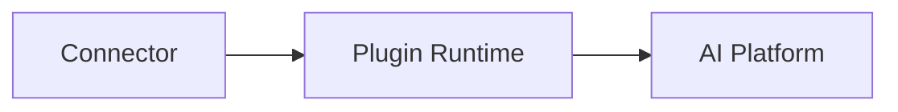

# Connector System

> AI Social OS Plugin Layer

Version: 2.0.0

Status: Stable

Last Updated: 2026-07-25

---

# Table of Contents

- Overview
- Objectives
- Why Connectors
- Connector Architecture
- Connector Categories
- Connector Lifecycle
- Authentication
- Synchronization
- Event Integration
- Failure Recovery
- Metrics
- Design Principles
- Summary

---

# Overview

Connector là lớp tích hợp giữa AI Social OS và các hệ thống bên ngoài.

Khác với Tool.

Tool thực hiện một hành động cụ thể.

Connector duy trì kết nối lâu dài với một nền tảng.

Ví dụ.

- Google Drive
- GitHub
- Slack
- Discord
- Salesforce
- Notion
- PostgreSQL
- n8n
- Jira

---

# Objectives

Connector System hướng tới.

- External Integration
- Long-lived Connection
- Synchronization
- Authentication
- Event Streaming
- Enterprise Integration

---

# Connector Architecture




## Development

- GitHub
- GitLab
- Bitbucket

---

## CRM

- HubSpot
- Salesforce

---

## Storage

- S3
- Google Drive
- Dropbox

---

## Database

- PostgreSQL
- MySQL
- MongoDB
- Redis

---

## Automation

- n8n
- Airflow
- Temporal

---

# Connector Lifecycle

```mermaid
flowchart LR
```

---

# Authentication

Connector hỗ trợ.

- OAuth2
- API Key
- JWT
- Basic Auth
- Service Account

Authentication được lưu trong Secret Manager.

---

# Synchronization

Connector có thể.

- Pull Data
- Push Data
- Two-way Sync
- Real-time Sync

---

# Event Integration

Connector phát Event.

Ví dụ.

```mermaid
flowchart LR
```

---

# Failure Recovery

Nếu kết nối bị lỗi.

```mermaid
flowchart LR
```

---

# Metrics

Theo dõi.

- Active Connections
- Sync Duration
- Sync Errors
- Throughput
- Availability

---

# Design Principles

- Long-lived
- Secure
- Observable
- Retryable
- Event Driven
- Stateless Runtime

---

# Summary

Connector System cung cấp lớp tích hợp bền vững giữa AI Social OS và các hệ thống doanh nghiệp, hỗ trợ đồng bộ dữ liệu, phát sinh sự kiện và xác thực an toàn với các dịch vụ bên ngoài.