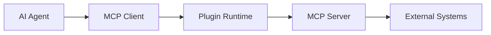
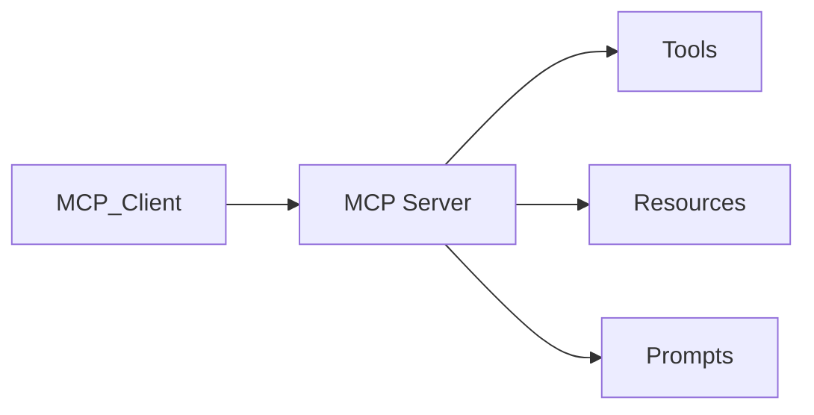
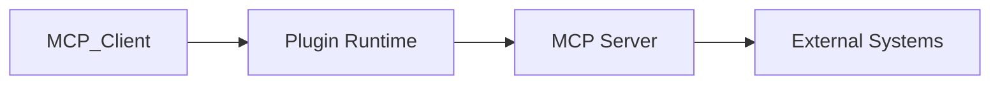

# MCP Integration

> AI Social OS Plugin Layer


---

# Why MCP

Nếu mỗi Tool có API riêng.

```mermaid
flowchart LR
```

AI phải hiểu từng API.

MCP chuẩn hóa thành.

```mermaid
flowchart LR
```

---

# High-Level Architecture



---

# MCP Components

## MCP Client

Được tích hợp trong Agent Runtime.

Chịu trách nhiệm.

- Session
- Requests
- Responses
- Authentication

---

## MCP Server

Plugin hoặc External Service.

Cung cấp.

- Tool
- Resource
- Prompt

---

## Transport

Các giao thức hỗ trợ.

- stdio
- HTTP
- WebSocket
- SSE

---

# MCP Session

Mỗi Agent tạo Session.

```mermaid
flowchart LR
```

---

# Tool Integration

Tool được công bố qua MCP.

Ví dụ.

```text
filesystem.read

database.query

github.search

weather.query
```

Agent không cần biết Tool được viết bằng ngôn ngữ nào.

---

# Resource Integration

Resource đại diện dữ liệu.

Ví dụ.

```text
File

Folder

Database

Knowledge Base

Document
```

Resource có thể được đọc nhiều lần.

---

# Prompt Integration

Prompt có thể được chia sẻ.

Ví dụ.

```text
Translate Prompt

Reviewer Prompt

Planner Prompt
```

Prompt được quản lý giống Resource.

---

# Capability Discovery

Agent khám phá.

```mermaid
flowchart LR
```

Runtime lưu Cache.

---

# Authentication

MCP hỗ trợ.

- OAuth2
- API Key
- JWT
- Enterprise Token

Thông tin xác thực được lấy từ Secret Manager.

---

# Security

Runtime kiểm tra.

- Identity
- Permissions
- Workspace
- Allowed Tools

---

# Observability

Theo dõi.

- Sessions
- Requests
- Errors
- Latency
- Tool Calls
- Resources Used

---

# Relationship



---

# Design Principles

- MCP Native
- Vendor Neutral
- Secure
- Discoverable
- Observable
- Extensible

---

# Design Decisions

| Decision | Reason |
|----------|--------|
| MCP là chuẩn mặc định | Chuẩn hóa tích hợp |
| MCP Client trong Runtime | Giảm phụ thuộc |
| Discovery động | Không cần cấu hình cứng |
| Session riêng | Quản lý kết nối |
| Secret Manager | Bảo mật |

---

# Summary

MCP Integration cung cấp lớp tích hợp chuẩn giữa AI Social OS và hệ sinh thái Tool hiện đại.

Thông qua MCP Client, MCP Server và Capability Discovery, AI Agent có thể truy cập Tool, Resource và Prompt từ nhiều hệ thống khác nhau bằng một giao thức thống nhất.