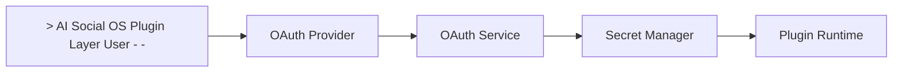
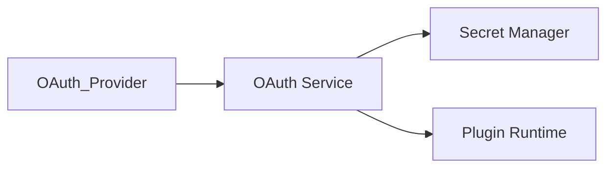

# OAuth System

> AI Social OS Plugin Layer


OAuth System quản lý toàn bộ quá trình xác thực và cấp quyền cho Plugin và Connector.

Mọi Access Token đều được quản lý tập trung.

Plugin không được tự lưu Token.

---

# Objectives

OAuth System hướng tới.

- Centralized Authentication
- Secure Token Storage
- Automatic Refresh
- Multi-provider Support
- Enterprise Security

---

# Architecture



---

# Supported Providers

- Google
- Microsoft
- GitHub
- Slack
- Discord
- Dropbox
- Salesforce
- Custom OAuth2

---

# OAuth Flows

- Authorization Code
- Authorization Code + PKCE
- Client Credentials
- Device Flow
- Refresh Token

---

# Token Lifecycle

```mermaid
flowchart LR
```

---

# Secret Storage

Token được lưu trong.

- Secret Manager
- Vault
- Encrypted Database

Không lưu trong Plugin.

---

# Authorization

Plugin yêu cầu Scope.

Ví dụ.

```text
drive.read

drive.write

gmail.send
```

Runtime kiểm tra Scope trước khi gọi API.

---

# Revocation

Nếu người dùng thu hồi quyền.

```mermaid
flowchart LR
```

---

# Security

- Token Encryption
- Rotation
- Least Privilege
- Audit Logs
- Scope Validation

---

# Summary

OAuth System cung cấp cơ chế xác thực và cấp quyền tập trung cho toàn bộ Plugin, Connector và MCP Server trong AI Social OS.