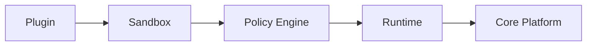
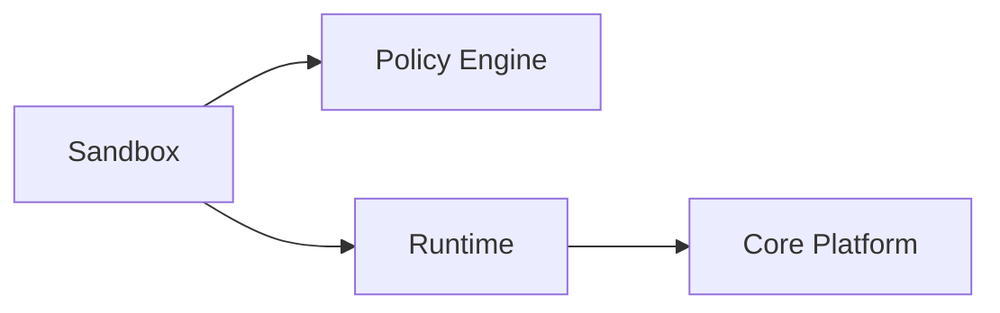

# Plugin Sandbox

> AI Social OS Plugin Layer


---

# Overview

Plugin Sandbox là môi trường thực thi cô lập dành cho Plugin.

Sandbox đảm bảo Plugin không thể ảnh hưởng đến Core Platform hoặc Plugin khác.

Mọi Plugin đều phải chạy bên trong Sandbox.

---

# Objectives

Sandbox hướng tới.

- Isolation
- Security
- Resource Protection
- Fault Containment
- Safe Execution
- Enterprise Ready

---

# Why Sandbox

Không có Sandbox.

```mermaid
flowchart LR
```

Plugin có thể.

- đọc toàn bộ File
- truy cập Secret
- gây Memory Leak
- làm Crash hệ thống

Sandbox giới hạn toàn bộ quyền truy cập.

---

# High-Level Architecture



---

# Isolation Levels

Sandbox hỗ trợ nhiều mức.

```text
Process

Container

VM

WASM

Remote Runtime
```

Runtime lựa chọn mức phù hợp.

---

# Resource Limits

Sandbox giới hạn.

- CPU
- Memory
- Disk
- Network
- Execution Time
- Concurrent Tasks

Ví dụ.

```yaml
cpu:
    2 cores

memory:
    512MB

timeout:
    30s
```

---

# Filesystem Isolation

Plugin chỉ được truy cập.

```text
/workspace

/tmp/plugin

/cache/plugin
```

Không được phép.

```text
/etc

/root

/system

/runtime
```

---

# Network Isolation

Plugin mặc định.

```text
No Internet
```

Nếu được cấp quyền.

```mermaid
flowchart LR
```

---

# Secret Isolation

Plugin không bao giờ nhìn thấy Secret gốc.

Luồng.

```mermaid
flowchart LR
```

---

# Process Isolation

Plugin không được.

- kill process khác
- inject process
- debug runtime
- attach memory

---

# Runtime Policies

Policy Engine kiểm tra.

- Permission
- CPU
- Memory
- Network
- File Access
- Secret Access

---

# Monitoring

Sandbox theo dõi.

- Memory
- CPU
- Network
- Disk
- Errors
- Security Violations

---

# Security Events

```text
PermissionDenied

NetworkBlocked

FilesystemDenied

SecretDenied

Timeout

SandboxKilled
```

---

# Design Principles

- Secure by Default
- Least Privilege
- Resource Isolation
- Observable
- Recoverable

---

# Design Decisions

| Decision | Reason |
|----------|--------|
| Sandbox bắt buộc | Bảo vệ Core |
| Không chia sẻ Memory | Isolation |
| Secret Manager | Không lộ Secret |
| Resource Quotas | Chống lạm dụng |
| Policy Engine | Kiểm soát truy cập |

---

# Summary

Plugin Sandbox là lớp bảo vệ cốt lõi của Plugin Layer, đảm bảo mọi Plugin được thực thi trong môi trường cô lập với tài nguyên, quyền truy cập và chính sách được kiểm soát chặt chẽ.