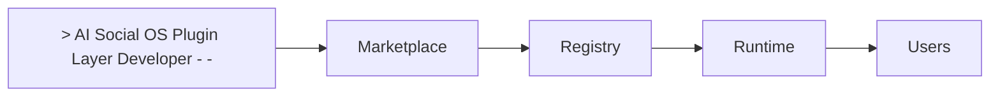

# Plugin Marketplace

> AI Social OS Plugin Layer


Marketplace cho phép.

- Publish
- Discover
- Install
- Upgrade
- Remove

Plugin.

---

# Objectives

Marketplace hướng tới.

- Open Ecosystem
- Trusted Distribution
- Easy Installation
- Version Management
- Enterprise Governance

---

# Architecture


---

# Plugin Publishing

Quy trình.

```mermaid
flowchart LR
```

---

# Discovery

Người dùng tìm Plugin theo.

- Category
- Capability
- Author
- Rating
- Downloads
- Tags

---

# Installation

```mermaid
flowchart LR
```

---

# Updates

Marketplace thông báo.

- Patch
- Minor
- Major
- Security Update

Runtime hỗ trợ Auto Update.

---

# Verification

Plugin được đánh dấu.

```text
Verified

Community

Enterprise

Official
```

---

# Enterprise Marketplace

Doanh nghiệp có thể xây Marketplace riêng.

Ví dụ.

- Internal Plugins
- Approved Plugins
- Private Distribution

---

# Metrics

Theo dõi.

- Downloads
- Active Installs
- Ratings
- Reviews
- Update Rate

---

# Summary

Plugin Marketplace là hệ sinh thái phân phối Plugin giúp AI Social OS mở rộng thông qua cộng đồng và doanh nghiệp.