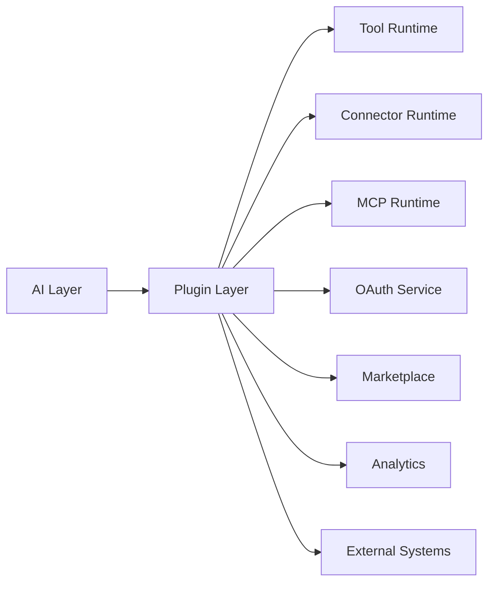
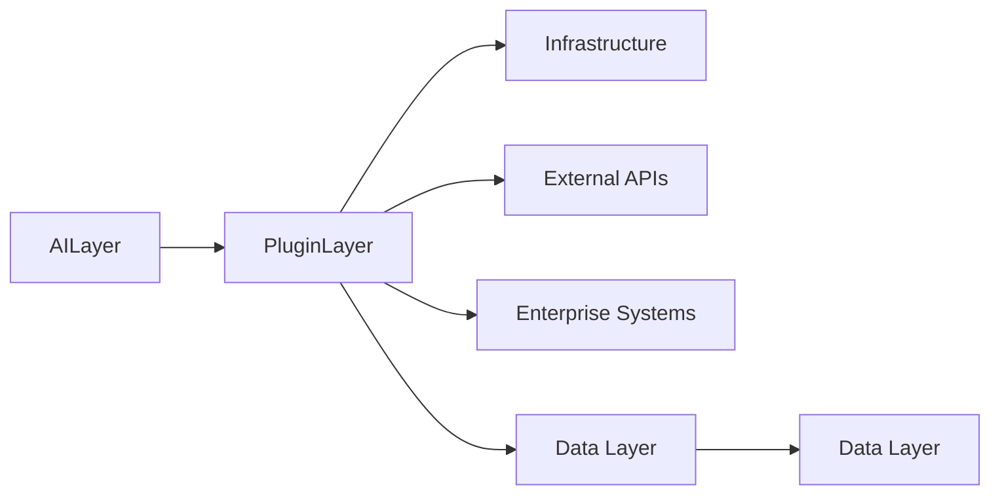

# Plugin Layer Summary

> AI Social OS Plugin Layer

Version: 2.0.0

Status: Stable

---

# Components

## Core

- Plugin Architecture
- Plugin Lifecycle


MCP Runtime

```mermaid
flowchart LR
```

```mermaid
flowchart LR
```

```mermaid
flowchart LR
```

```mermaid
flowchart LR
```

---

# Responsibilities

Plugin Layer chịu trách nhiệm.

- Mở rộng khả năng của nền tảng
- Quản lý Tool
- Quản lý Connector
- Tích hợp MCP
- Xác thực OAuth
- Thực thi Plugin
- Sandbox
- Marketplace
- Analytics

---

# Design Principles

Plugin Layer được xây dựng theo.

- Extensible
- Secure
- Observable
- Vendor Neutral
- Event Driven
- Capability Based



---

# Summary

Plugin Layer là cầu nối giữa AI Social OS và thế giới bên ngoài.

Thông qua Plugin Runtime, Tool System, Connector System, MCP Integration và Marketplace, nền tảng có thể tích hợp hàng nghìn dịch vụ, công cụ và hệ thống doanh nghiệp mà vẫn đảm bảo tính bảo mật, khả năng mở rộng và quản trị tập trung.

Plugin Layer là nền tảng để xây dựng một AI Operating System mở, nơi mọi khả năng mới đều có thể được bổ sung dưới dạng Plugin mà không cần thay đổi Core Platform.