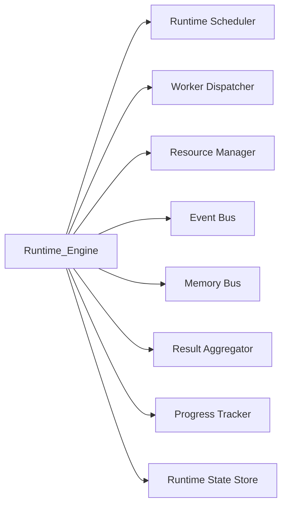
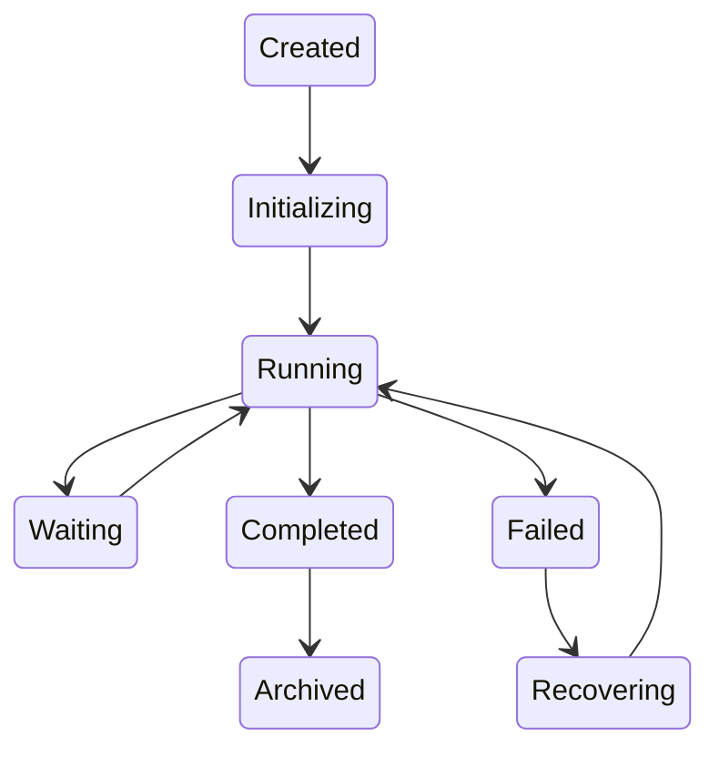
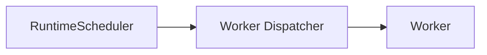
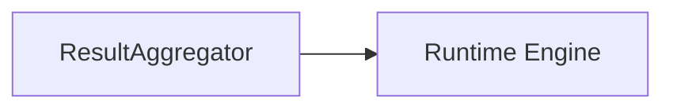
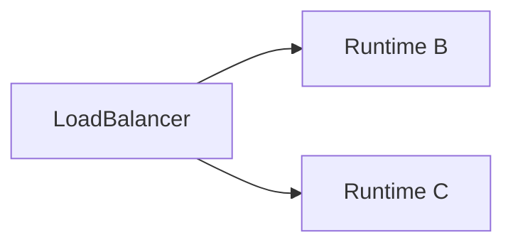

# Runtime Engine

> AI Social OS Runtime Layer

Version: 2.0.0

Status: Draft

Last Updated: 2026-07-25

---

# Table of Contents

- Overview
- Responsibilities
- Design Principles
- Runtime Architecture
- Runtime Lifecycle
- Execution Pipeline
- Runtime Components
- Execution Context
- Runtime State
- Checkpoint
- Recovery
- Scaling
- Design Decisions

---

# Overview

Runtime Engine là trung tâm thực thi của AI Social OS.

Nếu Kernel chịu trách nhiệm:

- hiểu Goal
- lập kế hoạch
- quản lý Policy
- lập lịch

thì Runtime Engine chịu trách nhiệm:

- thực thi Execution Plan
- điều phối Worker
- quản lý vòng đời Execution
- đồng bộ Runtime State
- thu thập kết quả
- phát Event

Runtime Engine không chứa Business Logic.

Runtime Engine chỉ điều phối quá trình thực thi.

---

# Responsibilities

Runtime Engine chịu trách nhiệm:

- Receive Execution
- Initialize Runtime
- Dispatch Tasks
- Track Progress
- Synchronize State
- Manage Workers
- Handle Retry
- Handle Recovery
- Publish Events
- Aggregate Results
- Complete Execution

---

# Runtime Architecture



---

# Runtime Lifecycle



---

# Execution Pipeline


---

# Runtime Components

```text
Runtime Engine

├── Runtime Scheduler

├── Worker Dispatcher

├── Task Executor

├── Result Aggregator

├── Progress Tracker

├── Runtime Cache

├── Runtime Metrics

├── Runtime State

└── Recovery Manager
```

---

# Receive Execution

Kernel gửi Execution Plan.

Ví dụ

```yaml
execution:

ex-001

plan:

plan-001
```

Runtime Engine tạo Runtime Instance mới.

---

# Initialize Runtime

Runtime Engine khởi tạo:

- Runtime Context
- Runtime State
- Worker Session
- Event Channel
- Memory Session

Sau khi khởi tạo thành công.

Execution chuyển sang trạng thái Running.

---

# Runtime Context

Runtime Context bao gồm:

```text
Execution Context

├── Goal

├── Workspace

├── User

├── Policy

├── Capability

├── Resources

├── Memory

└── Variables
```

Context tồn tại trong toàn bộ vòng đời Execution.

---

# Runtime State

Runtime State lưu trạng thái hiện tại.

```yaml
execution:

RUNNING

completed_tasks:

12

failed_tasks:

0

progress:

45%
```

Runtime State được cập nhật sau mỗi Task.

---

# Task Dispatch

Runtime Engine không tự chạy Task.



---

# Result Collection

Sau khi Worker hoàn thành.



Runtime Engine không xử lý Output.

Chỉ lưu và cập nhật State.

---

# Progress Tracking

Progress được cập nhật theo số lượng Task.

Ví dụ

```mermaid
flowchart LR
```

Ngoài ra Runtime có thể tính theo:

- Estimated Weight
- Execution Time
- Custom Metric

---

# Runtime Checkpoint

Sau mỗi bước quan trọng.

Runtime lưu Checkpoint.

```text
Checkpoint

├── Execution State

├── Completed Tasks

├── Variables

├── Outputs

└── Metadata
```

Checkpoint dùng để Resume.

---

# Recovery

Nếu Runtime bị lỗi.


Không cần thực thi lại toàn bộ Execution.

---

# State Synchronization

Runtime đồng bộ:

- Memory
- Event
- Metrics
- Progress
- Execution State

Sau mỗi Task.

---

# Execution Completion

Execution hoàn thành khi:

- Tất cả Task Completed
- Không còn Retry
- Không còn Dependency chờ

Runtime Engine phát:

```
ExecutionCompleted
```

---

# Failure Handling

Nếu Task lỗi.

Runtime Engine:

- cập nhật State
- phát Event
- Retry nếu cần
- Fallback nếu có
- chuyển Dead Letter nếu thất bại

Execution không bị hủy ngay lập tức.

---

# Runtime Scaling

Runtime Engine là Stateless.



Runtime State được lưu bên ngoài.

Do đó có thể Scale Horizontal.

---

# Runtime Metrics

Theo dõi:

- Running Executions
- Completed Executions
- Failed Executions
- Average Runtime
- Throughput
- Queue Latency
- Worker Utilization

---

# Runtime Events

Ví dụ

- RuntimeStarted
- RuntimeRecovered
- RuntimePaused
- RuntimeResumed
- RuntimeCompleted
- RuntimeStopped

---

# Design Decisions

| Decision | Reason |
|-----------|--------|
| Runtime Stateless | Horizontal Scaling |
| Checkpoint Recovery | Resume nhanh |
| Context độc lập | Không phụ thuộc Worker |
| State ngoài Runtime | Dễ Scale |
| Dispatcher tách riêng | Single Responsibility |
| Aggregator riêng | Dễ mở rộng |

---

# Runtime Flow


---

# Summary

Runtime Engine là thành phần trung tâm của tầng Runtime.

Nó chịu trách nhiệm quản lý toàn bộ vòng đời của một Execution, từ khi nhận Execution Plan cho đến khi hoàn thành hoặc phục hồi sau lỗi.

Runtime Engine không trực tiếp xử lý Business Logic mà đóng vai trò điều phối, đảm bảo các Worker, Scheduler, Memory và Event hoạt động đồng bộ, giúp AI Social OS đạt khả năng mở rộng, phục hồi và vận hành ổn định ở quy mô lớn.