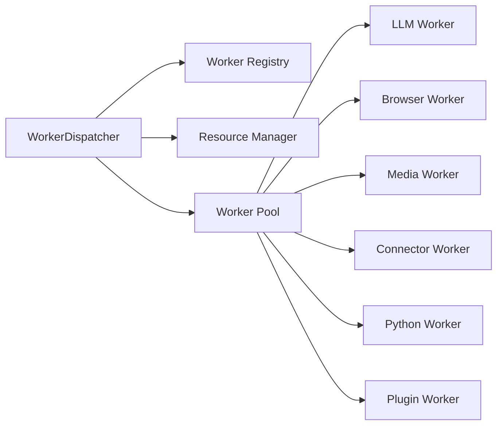
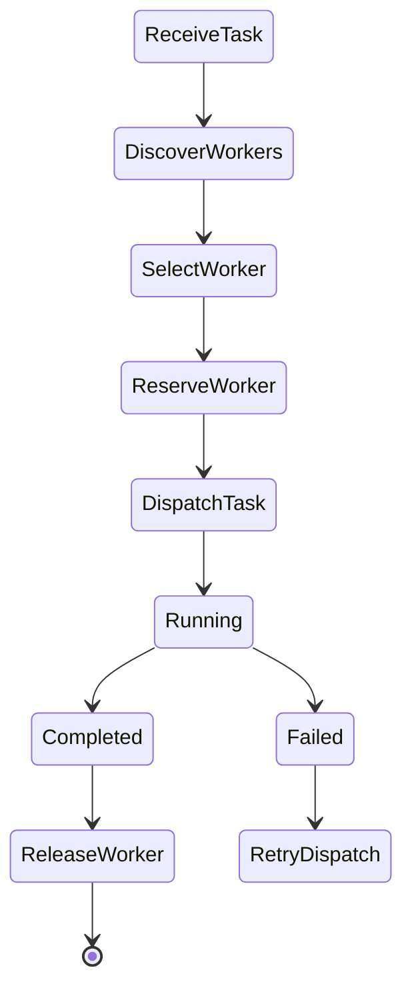
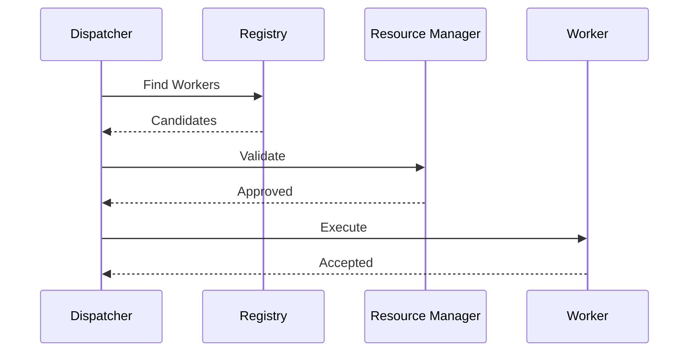
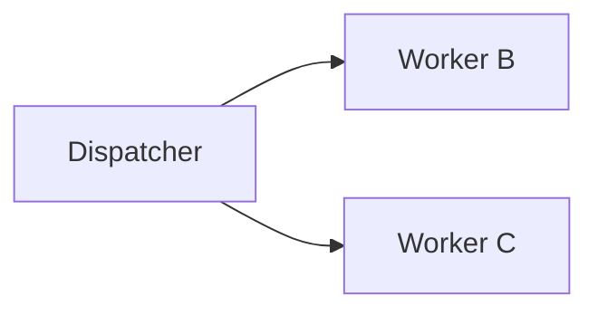
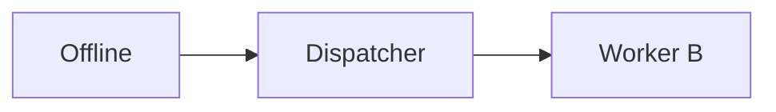
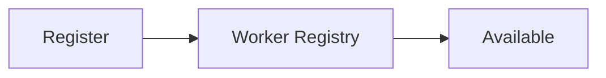
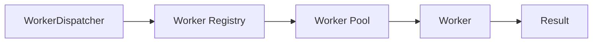

# Worker Dispatcher

> AI Social OS Runtime Layer

Version: 2.0.0

Status: Draft

Last Updated: 2026-07-25

---

# Table of Contents

- Overview
- Why Worker Dispatcher
- Responsibilities
- Architecture
- Dispatch Lifecycle
- Worker Selection
- Worker Affinity
- Load Balancing
- Dispatch Strategy
- Failover
- Health Check
- Worker Registration
- Worker Discovery
- Design Decisions

---

# Overview

Worker Dispatcher là thành phần chịu trách nhiệm phân phối Task từ Runtime Scheduler đến Worker phù hợp.

Dispatcher không thực thi Task.

Dispatcher cũng không biết Business Logic.

Nhiệm vụ duy nhất của Dispatcher là:

- chọn Worker
- phân phối Task
- theo dõi trạng thái Dispatch
- xử lý Failover

---

# Why Worker Dispatcher

Nếu Scheduler gọi trực tiếp Worker.

```mermaid
flowchart LR
```

Scheduler sẽ phải biết:

- Worker nào đang hoạt động
- Worker nào hỗ trợ Capability
- Worker nào đang quá tải
- Worker nào đang lỗi

Điều này tạo Coupling rất lớn.

Thay vào đó.

```mermaid
flowchart LR
```

Scheduler hoàn toàn độc lập với Worker.

---

# Responsibilities

Worker Dispatcher chịu trách nhiệm:

- Worker Discovery
- Worker Selection
- Task Dispatch
- Worker Reservation
- Load Balancing
- Failover
- Health Validation
- Dispatch Metrics

---

# Architecture



---

# Dispatch Lifecycle



---

# Worker Registry

Dispatcher không quét Worker trực tiếp.

Tất cả Worker đều được đăng ký trong Registry.

```text
Worker Registry

├── Worker ID

├── Worker Type

├── Capabilities

├── Health

├── Load

├── Version

├── Labels

└── Metadata
```

---

# Worker Discovery

Dispatcher tìm Worker theo Capability.

Ví dụ.

```mermaid
flowchart LR
```
flowchart TB
    ``` --> Candidates
```

```
Worker A

Worker B

Worker C
```

Dispatcher không quan tâm Worker được triển khai ở đâu.

---

# Worker Selection

Sau khi tìm được Candidate.

Dispatcher đánh giá:

- Capability
- Health
- Availability
- Current Load
- Priority
- Affinity
- Policy

Worker có điểm cao nhất sẽ được chọn.

---

# Dispatch Flow



---

# Worker Affinity

Một số Task nên tiếp tục chạy trên cùng Worker.

Ví dụ.

```mermaid
flowchart LR
```

Các lượt tiếp theo ưu tiên Worker #3 để:

- giữ Session
- giảm Cache Miss
- tối ưu Context

---

# Dispatch Strategies

Runtime hỗ trợ nhiều chiến lược.

## Round Robin

```mermaid
flowchart LR
```

---

## Least Load

Luôn chọn Worker có tải thấp nhất.

---

## Capability Score

Chọn Worker có khả năng phù hợp nhất.

Ví dụ.

```
Claude Worker

Score

98
```

```
Gemini Worker

Score

87
```

Dispatcher chọn Claude Worker.

---

## Locality

Ưu tiên Worker gần Resource.

Ví dụ.

```mermaid
flowchart LR
```

Không gửi sang CPU Node.

---

# Load Balancing

Dispatcher cân bằng tải.



Không để một Worker xử lý toàn bộ Task.

---

# Worker Reservation

Task quan trọng có thể giữ trước Worker.

Ví dụ.

```mermaid
flowchart LR
```

Sau khi Reservation thành công.

Worker sẽ không nhận Task khác.

---

# Health Check

Dispatcher chỉ gửi Task đến Worker khỏe mạnh.

Health được lấy từ:

- Heartbeat
- Resource Manager
- Monitoring
- Metrics

Ví dụ.

```yaml
worker:

media-01

health:

99%

status:

READY
```

---

# Failover

Nếu Worker mất kết nối.



Task sẽ được Dispatch lại nếu Policy cho phép.

---

# Worker Timeout

Nếu Worker không phản hồi.

```mermaid
flowchart LR
```

Không giữ Worker vô thời hạn.

---

# Worker Labels

Worker có thể được gắn Label.

Ví dụ.

```yaml
labels:

gpu

asia

high-memory

claude
```

Dispatcher có thể lọc theo Label.

---

# Dispatch Policies

Ví dụ.

```yaml
max_tasks_per_worker:

10

max_dispatch_latency:

100ms

worker_affinity:

true
```

Dispatcher luôn tuân thủ Policy Engine.

---

# Worker Registration

Khi Worker khởi động.



Khi Worker tắt.

```
Deregister
```

Worker sẽ bị loại khỏi Registry.

---

# Dispatch Metrics

Theo dõi:

- Dispatch Latency
- Dispatch Success Rate
- Worker Utilization
- Active Workers
- Busy Workers
- Failed Dispatches
- Reservation Count

---

# Dispatch Events

Ví dụ.

- WorkerRegistered
- WorkerDeregistered
- TaskDispatched
- WorkerReserved
- WorkerReleased
- DispatchFailed
- WorkerUnavailable

---

# Design Decisions

| Decision | Reason |
|-----------|--------|
| Dispatcher độc lập Scheduler | Giảm Coupling |
| Registry tập trung | Discovery nhanh |
| Capability-based Dispatch | Linh hoạt |
| Health-aware Dispatch | Tăng độ ổn định |
| Worker Affinity | Tối ưu Context |
| Load Balancing | Tăng Throughput |
| Reservation | Hỗ trợ Task dài |

---

# Runtime Flow



---

# Summary

Worker Dispatcher là lớp điều phối giữa Runtime Scheduler và Worker Pool.

Thành phần này chịu trách nhiệm tìm kiếm, lựa chọn và phân phối Task đến Worker phù hợp dựa trên Capability, Health, Load và Policy mà không để Scheduler phụ thuộc trực tiếp vào Worker.

Thiết kế này giúp AI Social OS có thể mở rộng Worker theo chiều ngang, thay thế Worker linh hoạt và tối ưu hiệu năng thông qua Load Balancing, Worker Affinity và Failover tự động.