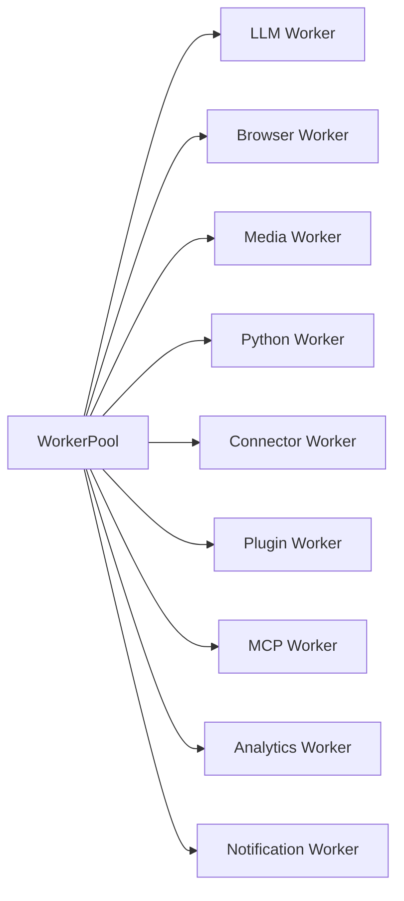
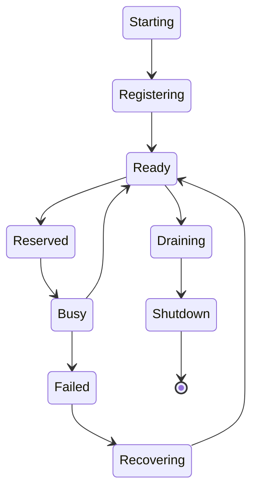
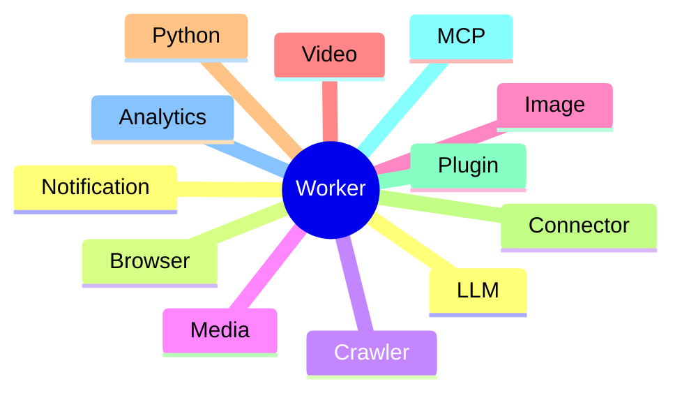
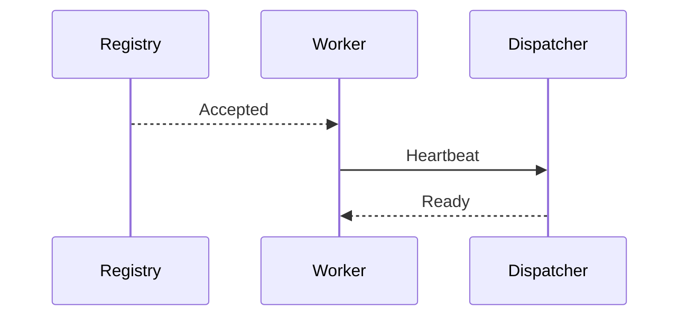
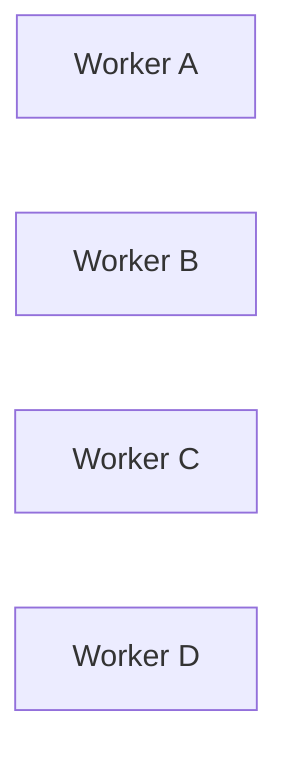
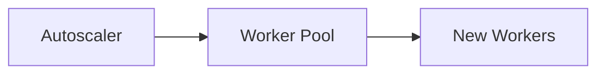
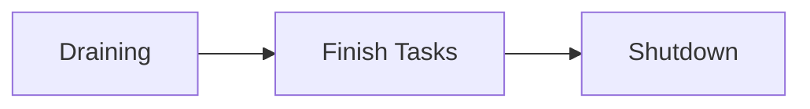
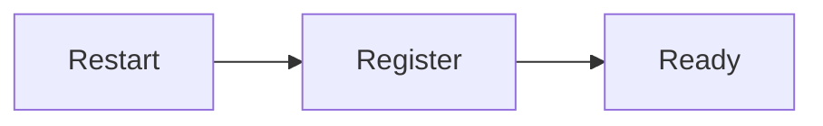
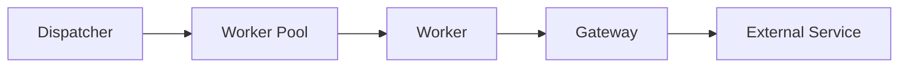

# Worker Pool

> AI Social OS Runtime Layer

Version: 2.0.0

Status: Draft

Last Updated: 2026-07-25

---

# Table of Contents

- Overview
- Why Worker Pool
- Responsibilities
- Worker Architecture
- Worker Lifecycle
- Worker Categories
- Worker Registration
- Worker State
- Worker Session
- Worker Isolation
- Worker Scaling
- Worker Health
- Worker Shutdown
- Design Decisions

---

# Overview

Worker Pool là tập hợp tất cả Worker đang hoạt động trong Runtime.

Worker là đơn vị thực thi nhỏ nhất trong hệ thống.

Mỗi Worker chỉ thực hiện một loại công việc chuyên biệt và không chứa Business Logic của Runtime.

Worker Pool giúp Runtime:

- mở rộng theo chiều ngang
- tái sử dụng Worker
- cân bằng tải
- quản lý tài nguyên hiệu quả

---

# Why Worker Pool

Nếu Runtime tạo Worker mới cho mỗi Task.

```mermaid
flowchart LR
```

sẽ gây:

- Tốn CPU
- Tốn Memory
- Tăng Latency
- Không tận dụng Cache
- Khó Scale

Thay vào đó.

```mermaid
flowchart LR
```

---

# Responsibilities

Worker Pool chịu trách nhiệm:

- Worker Registration
- Worker Lifecycle
- Worker State
- Worker Isolation
- Session Management
- Health Reporting
- Capacity Reporting
- Graceful Shutdown

---

# Architecture



---

# Worker Lifecycle



---

# Worker Categories



---

# LLM Worker

Thực hiện các tác vụ liên quan đến Large Language Model.

Ví dụ:

- Chat Completion
- Summarization
- Translation
- Classification
- Prompt Execution

LLM Worker không quan tâm Provider nào được sử dụng.

Provider Gateway sẽ xử lý việc đó.

---

# Browser Worker

Chạy các tác vụ cần trình duyệt.

Ví dụ:

- Playwright
- Puppeteer
- Web Automation
- Screenshot
- Login
- Form Filling

---

# Crawler Worker

Thu thập dữ liệu.

Ví dụ:

- Website Crawl
- RSS
- Sitemap
- SEO Crawl
- Product Crawl
- Trend Crawl

---

# Media Worker

Thực hiện xử lý Media.

Ví dụ:

- Generate Image
- Generate Video
- Image Editing
- Video Rendering
- OCR
- Speech Synthesis

---

# Python Worker

Thực hiện Python Script.

Ví dụ:

- Data Processing
- AI Pipeline
- Pandas
- NumPy
- OpenCV
- Machine Learning

---

# Connector Worker

Thực hiện giao tiếp với hệ thống bên ngoài.

Ví dụ:

- Facebook
- YouTube
- Telegram
- Lark
- Gmail
- Notion

---

# Plugin Worker

Chạy Plugin của bên thứ ba.

Plugin được chạy trong môi trường cô lập.

Plugin không truy cập trực tiếp Runtime Kernel.

---

# MCP Worker

Worker chuyên thực thi MCP Tool.

Ví dụ:

- GitHub MCP
- Filesystem MCP
- PostgreSQL MCP
- Slack MCP
- Google Drive MCP

---

# Analytics Worker

Thực hiện:

- KPI Calculation
- Dashboard Metrics
- Reporting
- Trend Analysis

---

# Notification Worker

Thực hiện:

- Email
- Telegram
- Slack
- Discord
- Lark
- Push Notification

---

# Worker Registration

Khi khởi động.



---

# Worker Metadata

```yaml
worker:

worker-001

type:

llm

version:

2.0.0

capabilities:

- chat
- summarize
- translate

labels:

- gpu
- asia

status:

READY
```

---

# Worker State

| State | Description |
|---------|-------------|
| STARTING | Đang khởi động |
| READY | Sẵn sàng |
| RESERVED | Đã được giữ trước |
| BUSY | Đang thực thi |
| DRAINING | Không nhận Task mới |
| FAILED | Lỗi |
| SHUTDOWN | Đã dừng |

---

# Worker Session

Một số Worker duy trì Session.

Ví dụ.

```mermaid
flowchart LR
```

Điều này giúp:

- giảm Context Loading
- tăng tốc độ phản hồi
- tận dụng Cache

---

# Worker Isolation

Mỗi Worker hoạt động độc lập.



Nếu Worker A bị Crash.

Các Worker khác vẫn tiếp tục hoạt động.

---

# Worker Health

Worker gửi Heartbeat định kỳ.

Ví dụ.

```yaml
heartbeat:

10s

cpu:

45%

memory:

38%

queue:

2

health:

98%
```

Nếu mất Heartbeat.

Worker sẽ bị đánh dấu Offline.

---

# Worker Capacity

Mỗi Worker khai báo khả năng xử lý.

Ví dụ.

```yaml
max_concurrent_tasks:

8

current_tasks:

3
```

Dispatcher sử dụng thông tin này khi phân phối Task.

---

# Worker Scaling



Worker Pool có thể mở rộng tự động bằng Kubernetes hoặc Docker.

---

# Graceful Shutdown

Khi cần cập nhật hoặc Scale Down.



Worker không nhận Task mới nhưng vẫn hoàn thành Task đang chạy.

---

# Worker Recovery

Nếu Worker gặp lỗi.



Nếu không thể khởi động lại.

Dispatcher sẽ loại Worker khỏi Pool.

---

# Worker Metrics

Theo dõi:

- Active Workers
- Idle Workers
- Busy Workers
- Failed Workers
- CPU Usage
- Memory Usage
- Task Throughput
- Average Task Duration

---

# Worker Events

Ví dụ:

- WorkerStarted
- WorkerRegistered
- WorkerReady
- WorkerBusy
- WorkerRecovered
- WorkerFailed
- WorkerShutdown

---

# Design Decisions

| Decision | Reason |
|-----------|--------|
| Stateless Worker | Scale dễ dàng |
| Chuyên biệt theo loại | Dễ tối ưu |
| Worker Pool | Tái sử dụng tài nguyên |
| Session tùy chọn | Giảm Latency |
| Graceful Shutdown | Không mất Task |
| Heartbeat | Giám sát liên tục |
| Worker Isolation | Tăng độ ổn định |

---

# Runtime Flow



---

# Summary

Worker Pool là tập hợp các Worker chuyên biệt chịu trách nhiệm thực thi Task trong AI Social OS Runtime.

Mỗi Worker đảm nhiệm một nhóm Capability riêng, được quản lý tập trung thông qua Registry và Dispatcher, hỗ trợ Session, Health Check, Graceful Shutdown và Autoscaling.

Thiết kế này giúp Runtime có khả năng mở rộng theo chiều ngang, tái sử dụng tài nguyên hiệu quả và đảm bảo hệ thống vẫn hoạt động ổn định ngay cả khi một hoặc nhiều Worker gặp sự cố.