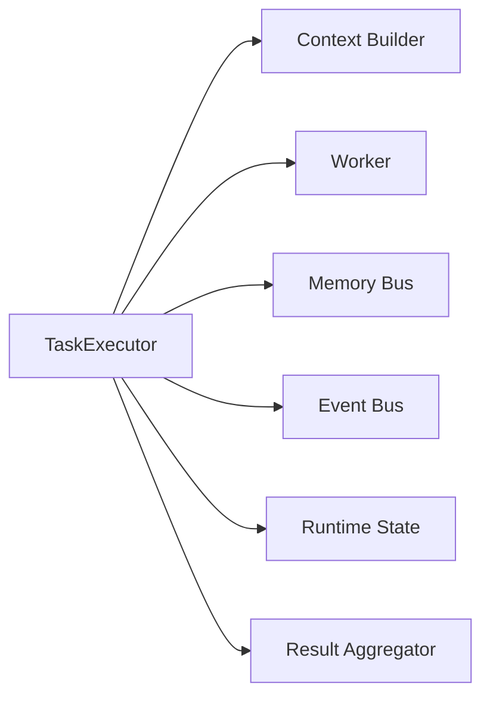
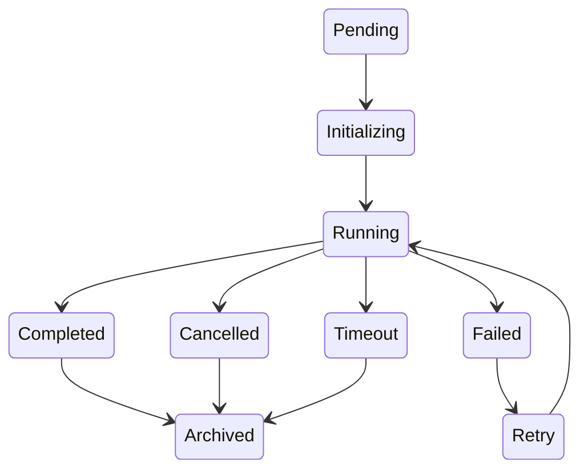
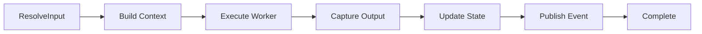
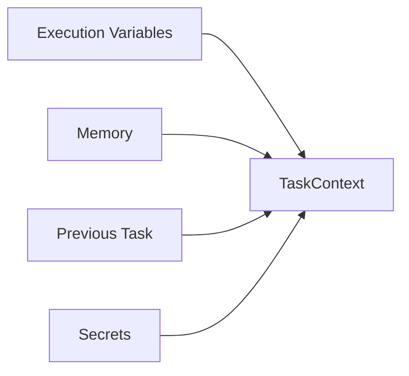
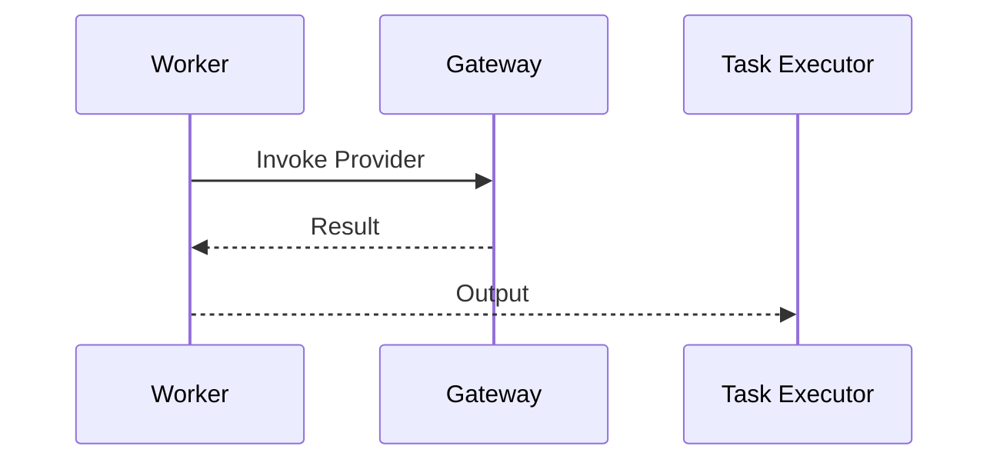
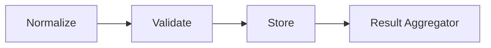
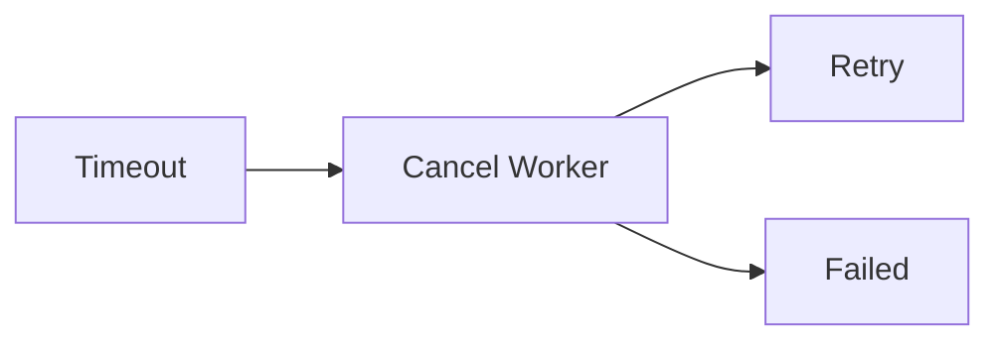
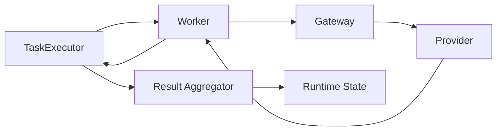

# Task Executor

> AI Social OS Runtime Layer

Version: 2.0.0

Status: Draft

Last Updated: 2026-07-25

---

# Table of Contents

- Overview
- Why Task Executor
- Responsibilities
- Architecture
- Task Lifecycle
- Task Model
- Task Context
- Task Execution Flow
- Input Resolution
- Output Resolution
- Dependency Injection
- Task Retry
- Task Timeout
- Task Cancellation
- Task Checkpoint
- Design Decisions

---

# Overview

Task Executor là thành phần trực tiếp thực thi một Task trong Runtime.

Task Executor nhận Task từ Worker Dispatcher, chuẩn bị môi trường thực thi, gọi Worker tương ứng, xử lý kết quả và cập nhật Runtime State.

Task Executor không quyết định:

- Task nào chạy
- Worker nào được chọn
- Policy nào được áp dụng

Các quyết định đó đã được Runtime Scheduler, Worker Dispatcher và Policy Engine xử lý trước đó.

---

# Responsibilities

Task Executor chịu trách nhiệm:

- Initialize Task
- Resolve Inputs
- Build Task Context
- Execute Worker
- Handle Timeout
- Handle Retry
- Capture Output
- Update Runtime State
- Publish Events
- Release Resources

---

# Architecture



---

# Task Lifecycle



---

# Task Model

```typescript
Task

├── id

├── executionId

├── capability

├── workerType

├── inputs

├── outputs

├── dependencies

├── timeout

├── retryPolicy

├── priority

├── metadata

└── status
```

---

# Task Context

Mỗi Task có Context riêng.

```text
Task Context

├── Execution Context

├── Runtime Variables

├── Memory

├── Previous Outputs

├── Workspace

├── User

├── Capability Config

└── Secrets
```

Task Context chỉ tồn tại trong vòng đời của Task.

---

# Execution Flow



---

# Input Resolution

Input của Task có thể đến từ nhiều nguồn.



Ví dụ.

```yaml
title:

{{ previous.title }}

image:

{{ memory.brand.logo }}

language:

vi
```

---

# Dependency Injection

Task Executor tự động Inject Dependency.

Ví dụ.

```
Generate Image
```

được Inject.

```
Article Content

Brand Guideline

Logo

Color Palette
```

Worker chỉ nhận Context đã hoàn chỉnh.

---

# Worker Invocation



Task Executor không gọi AI Provider trực tiếp.

---

# Output Resolution

Output sau khi Worker hoàn thành.



Nếu Output không hợp lệ.

Task sẽ Failed.

---

# Output Model

```typescript
Task Output

├── result

├── artifacts

├── logs

├── metrics

├── metadata

└── status
```

---

# Task Variables

Task có thể sinh Runtime Variable.

Ví dụ.

```
generated_title

generated_image

hashtags

video_url
```

Các Task phía sau có thể sử dụng.

---

# Task Checkpoint

Sau khi hoàn thành.

Task Executor lưu Snapshot.

```text
Checkpoint

├── Inputs

├── Outputs

├── Variables

├── Runtime State

└── Timestamp
```

Checkpoint phục vụ Recovery.

---

# Task Timeout

Ví dụ.

```yaml
timeout:

120s
```

Nếu vượt quá.



---

# Task Retry

Retry tuân theo Retry Policy.

Ví dụ.

```yaml
max_attempts:

3

strategy:

exponential_backoff
```

Retry không tạo Task mới.

Task ID được giữ nguyên.

---

# Task Cancellation

Task có thể bị hủy bởi:

- User
- Policy Engine
- Runtime Shutdown
- Dependency Failure


---

# Runtime State Update

Sau mỗi Task.

Task Executor cập nhật.

```text
Execution Progress

Completed Tasks

Variables

Outputs

Metrics

Runtime State
```

---

# Event Publishing

Task Executor phát Event.

Ví dụ.

- TaskStarted
- TaskCompleted
- TaskFailed
- TaskTimeout
- TaskCancelled
- TaskRetried

Các Event được gửi tới Event Bus.

---

# Failure Handling

Nếu Worker trả lỗi.

Task Executor.

- ghi Log
- cập nhật Runtime State
- phát Event
- Retry nếu cần
- Fallback nếu Policy cho phép

---

# Metrics

Theo dõi.

- Task Duration
- Task Success Rate
- Retry Count
- Timeout Count
- Average Execution Time
- Input Size
- Output Size

---

# Design Decisions

| Decision | Reason |
|-----------|--------|
| Executor không chọn Worker | Single Responsibility |
| Context Build riêng | Dễ mở rộng |
| Output Normalize | Chuẩn hóa Runtime |
| Checkpoint sau mỗi Task | Recovery |
| Retry giữ nguyên Task ID | Dễ Trace |
| Event sau mỗi trạng thái | Quan sát hệ thống |

---

# Runtime Flow



---

# Summary

Task Executor là thành phần trực tiếp điều khiển quá trình thực thi của từng Task trong AI Social OS Runtime.

Task Executor chịu trách nhiệm chuẩn bị Context, gọi Worker, xử lý kết quả, cập nhật Runtime State và phát Event mà không tham gia vào việc lập kế hoạch hay lựa chọn Worker.

Thiết kế này giúp Runtime có thể thực thi hàng triệu Task một cách nhất quán, hỗ trợ Retry, Timeout, Checkpoint và Recovery, đồng thời giữ cho các Worker luôn đơn giản, độc lập và dễ mở rộng.