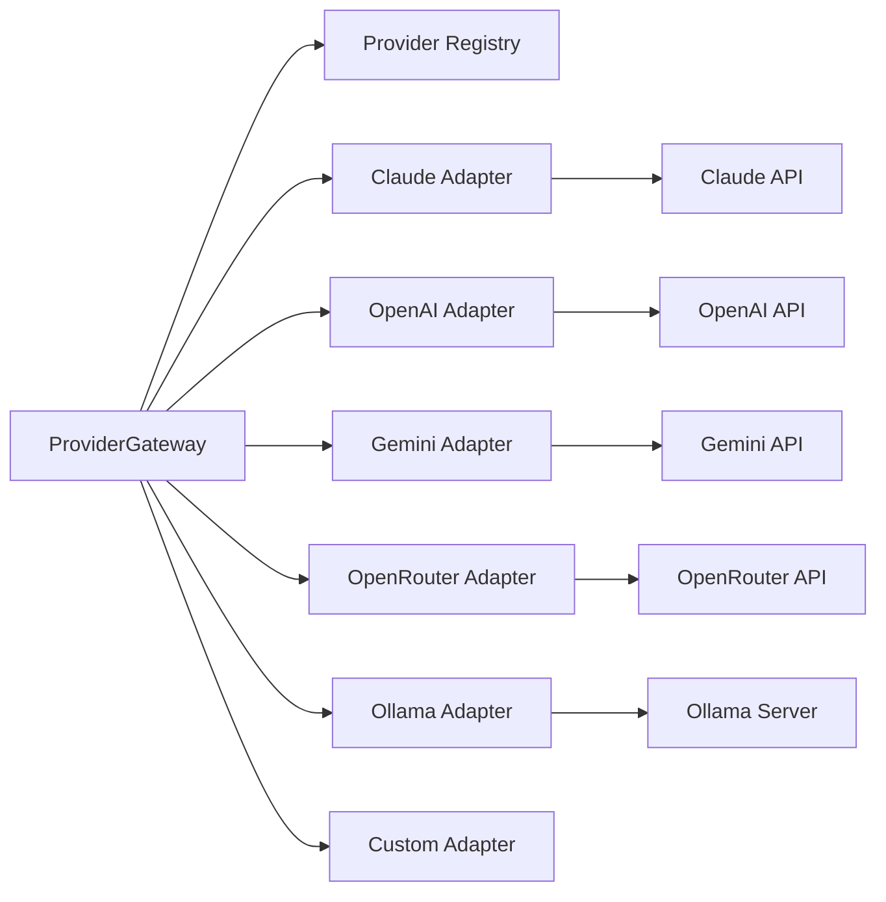
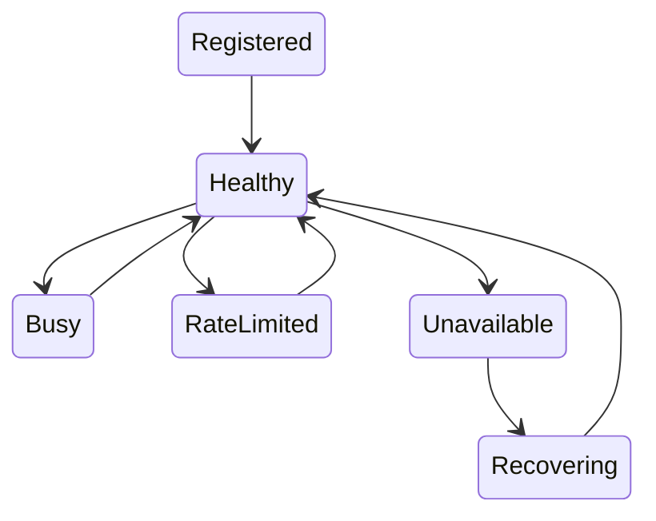
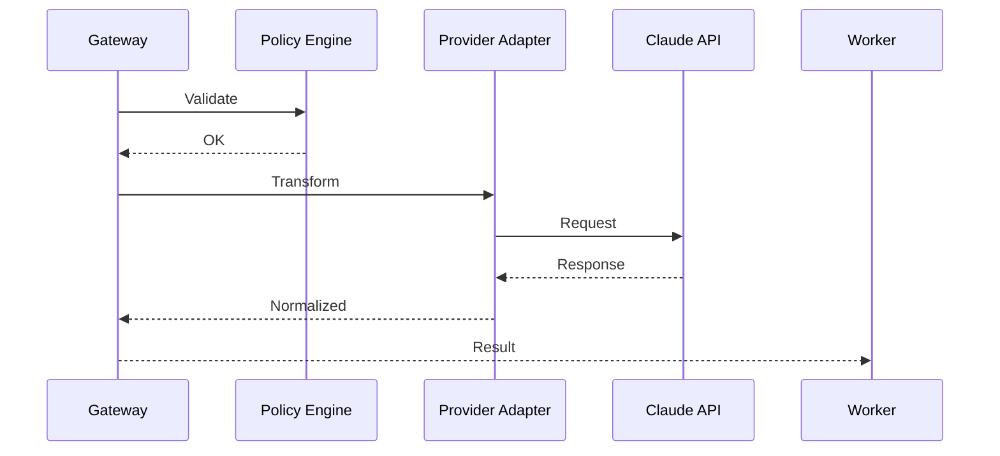
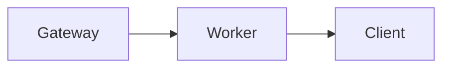
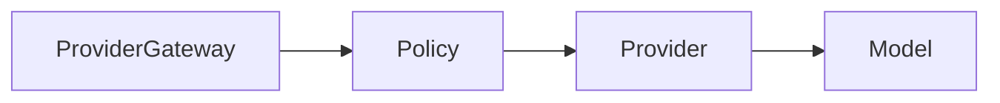
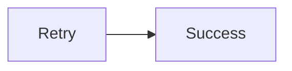
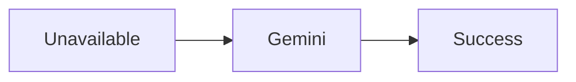
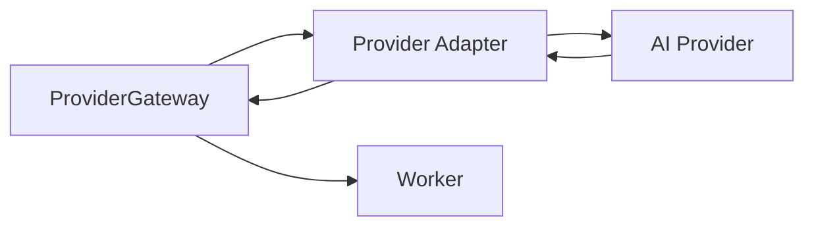

# Provider Gateway

> AI Social OS Runtime Layer

Version: 2.0.0

Status: Draft

Last Updated: 2026-07-25

---

# Table of Contents

- Overview
- Why Provider Gateway
- Responsibilities
- Architecture
- Supported Providers
- Provider Lifecycle
- Provider Registry
- Request Flow
- Response Normalization
- Streaming
- Model Routing
- Fallback
- Rate Limiting
- Cost Tracking
- Security
- Design Decisions

---

# Overview

Provider Gateway là lớp trung gian giữa Runtime và tất cả AI Provider.

Worker không được phép gọi trực tiếp:

- Claude API
- OpenAI API
- Gemini API
- OpenRouter
- Ollama

Thay vào đó.

```mermaid
flowchart LR
```

Nhờ đó toàn bộ Runtime không phụ thuộc vào bất kỳ AI Vendor nào.

---

# Why Provider Gateway

Nếu Worker gọi trực tiếp API.

```mermaid
flowchart LR
```

thì:

- khó đổi Provider
- phải sửa nhiều Worker
- khó theo dõi chi phí
- khó Retry
- khó Fallback
- khó quản lý API Key

Provider Gateway giải quyết toàn bộ vấn đề này.

---

# Responsibilities

Provider Gateway chịu trách nhiệm:

- Provider Routing
- Authentication
- Model Mapping
- Request Normalization
- Response Normalization
- Streaming
- Retry
- Fallback
- Rate Limiting
- Cost Tracking
- Token Tracking
- Logging

---

# Architecture



---

# Supported Providers

Provider Gateway được thiết kế theo kiến trúc Adapter.

Ví dụ.

```
Claude

OpenAI

Gemini

DeepSeek

Qwen

OpenRouter

Ollama

Groq

Mistral

xAI

Azure OpenAI

Vertex AI

AWS Bedrock

Together AI

Cohere
```

Có thể bổ sung Provider mới mà không ảnh hưởng Runtime.

---

# Provider Lifecycle



---

# Provider Registry

Mỗi Provider được đăng ký với Metadata.

```yaml
provider:

claude

models:

- sonnet
- opus

streaming:

true

vision:

true

tools:

true

status:

healthy
```

---

# Request Flow



---

# Unified Request Model

Toàn bộ Runtime sử dụng chung một Request Model.

```typescript
ProviderRequest

├── provider

├── model

├── messages

├── tools

├── temperature

├── maxTokens

├── responseFormat

├── metadata
```

Mỗi Adapter sẽ tự chuyển đổi sang định dạng của Provider tương ứng.

---

# Unified Response Model

Tất cả phản hồi đều được chuẩn hóa.

```typescript
ProviderResponse

├── text

├── toolCalls

├── usage

├── finishReason

├── latency

├── cost

├── metadata
```

Worker không cần biết phản hồi đến từ Provider nào.

---

# Streaming

Gateway hỗ trợ Streaming.



Hỗ trợ:

- Server Sent Events
- WebSocket
- HTTP Streaming

---

# Model Routing

Một Provider có thể có nhiều Model.

Ví dụ.

```mermaid
flowchart LR
```

Gateway chọn Model dựa trên:

- Policy
- Capability
- Cost
- User Preference

---

# Provider Selection


---

# Response Normalization

Ví dụ.

Claude.

```json
{
  "content": []
}
```

OpenAI.

```json
{
  "choices": []
}
```

Sau khi Normalize.

```json
{
  "text": "...",
  "usage": {},
  "cost": 0.02
}
```

Worker luôn nhận cùng một định dạng.

---

# Retry

Nếu Provider gặp lỗi tạm thời.



Retry tuân theo Policy Engine.

---

# Fallback

Nếu Retry thất bại.



Worker không cần thay đổi.

---

# Rate Limiting

Gateway theo dõi:

- RPM
- TPM
- RPD
- Concurrent Requests

Nếu vượt giới hạn.

Gateway sẽ:

- Delay
- Queue
- Retry
- Chọn Provider khác

---

# Cost Tracking

Gateway tính toán chi phí.

Ví dụ.

| Provider | Tokens | Cost |
|-----------|--------|------|
| Claude | 8,500 | $0.14 |
| GPT | 6,300 | $0.11 |
| Gemini | 5,900 | $0.05 |

Dữ liệu được gửi tới Analytics.

---

# API Key Management

Gateway không lưu API Key trong Worker.

API Key được lấy từ:

- Workspace Settings
- Secret Manager
- Vault
- Environment Variables

Worker không bao giờ truy cập trực tiếp Secret.

---

# Security

Provider Gateway hỗ trợ:

- Secret Rotation
- Request Signing
- TLS
- Audit Logging
- Workspace Isolation
- API Key Encryption

---

# Metrics

Theo dõi:

- Request Count
- Success Rate
- Error Rate
- Latency
- Token Usage
- Cost
- Retry Count
- Fallback Count

---

# Events

Ví dụ.

- ProviderSelected
- ProviderRequestSent
- ProviderResponseReceived
- ProviderRateLimited
- ProviderFallback
- ProviderRecovered

---

# Design Decisions

| Decision | Reason |
|-----------|--------|
| Adapter Pattern | Dễ mở rộng Provider |
| Unified Request/Response | Worker độc lập Provider |
| API Key tập trung | Tăng bảo mật |
| Response Normalize | Runtime đơn giản |
| Retry & Fallback | Tăng độ ổn định |
| Cost Tracking | Kiểm soát Budget |
| Streaming Native | Hỗ trợ Chat Realtime |

---

# Runtime Flow



---

# Summary

Provider Gateway là lớp trừu tượng giữa Runtime và các AI Provider.

Thành phần này chịu trách nhiệm chuẩn hóa giao tiếp với mọi mô hình AI thông qua Adapter, quản lý API Key, Routing, Streaming, Retry, Fallback và Cost Tracking.

Nhờ Provider Gateway, AI Social OS có thể tích hợp đồng thời nhiều AI Provider như Claude, OpenAI, Gemini, OpenRouter, Ollama và các nền tảng khác mà không cần thay đổi Worker hoặc Runtime Kernel, giúp hệ thống linh hoạt, dễ mở rộng và không bị khóa vào một nhà cung cấp AI cụ thể.